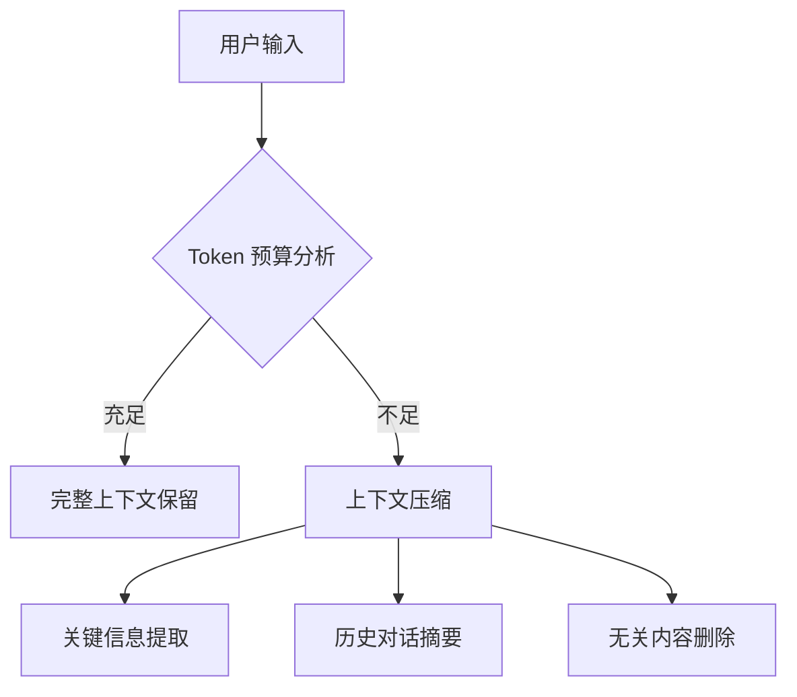

# 大语言模型（LLM）基础

大语言模型（Large Language Models, LLMs）是构建智能 Agent 的核心引擎。理解 LLM 的工作原理、能力边界和使用技巧是开发高质量 Agent 应用的基础。

## LLM 工作原理

### Transformer 架构
现代 LLM 主要基于 Transformer 架构，其核心组件包括：

| 组件 | 功能 | 对 Agent 开发的意义 |
|------|------|-------------------|
| Self-Attention | 捕捉序列中不同位置的依赖关系 | 理解上下文中的关键信息 |
| Positional Encoding | 为输入添加位置信息 | 处理有序任务和步骤 |
| Feed-Forward Networks | 非线性特征转换 | 增强模型的表达能力 |
| Layer Normalization | 稳定训练过程 | 提高推理的一致性 |

### Token 化与上下文窗口
- **Token 化**：将文本分割为模型可处理的基本单元
- **上下文窗口**：模型一次能处理的最大 token 数量
- **实际限制**：通常 2K-32K tokens，影响 Agent 的记忆和推理能力

## 能力边界认知

### LLM 能做什么
✅ **文本生成**：创作连贯、相关的文本内容  
✅ **模式识别**：从示例中学习并应用模式  
✅ **推理能力**：进行逻辑推理和问题分解  
✅ **工具调用**：通过结构化输出调用外部工具  

### LLM 不能做什么
❌ **实时知识**：无法获取训练后的新信息（除非通过工具）  
❌ **精确计算**：数学计算容易出错  
❌ **长期记忆**：无法记住超出上下文的信息  
❌ **真实世界感知**：缺乏对物理世界的直接感知  

## 提示工程（Prompt Engineering）

### 基础提示技巧
```python
# 好的提示结构
system_prompt = """
你是一个专业的 AI Agent 开发助手。
请按照以下步骤处理用户请求：
1. 理解用户需求
2. 分析可用工具
3. 制定执行计划
4. 执行并返回结果
"""
```

### 高级提示策略
- **Few-shot Learning**：提供少量示例引导模型行为
- **Chain-of-Thought**：引导模型展示推理过程
- **Role-playing**：为模型分配特定角色和职责
- **Constraint Setting**：明确限制条件和输出格式

## Token 管理策略

### 上下文优化


### 实用管理技巧
1. **优先级排序**：保留最近和最重要的信息
2. **摘要生成**：定期将历史对话压缩为摘要
3. **分块处理**：将长文档分块处理
4. **缓存机制**：缓存常用信息减少重复传输

## 模型选择指南

### 开源 vs 闭源
| 类型 | 优势 | 劣势 | 适用场景 |
|------|------|------|----------|
| 开源模型 | 可本地部署、隐私安全 | 性能相对较弱 | 敏感数据处理、离线应用 |
| 闭源模型 | 性能强大、持续更新 | 依赖网络、成本较高 | 通用应用、高性能需求 |

### 主流模型对比
- **GPT 系列**：综合能力强，工具调用支持好
- **Claude 系列**：长上下文处理优秀，推理能力强  
- **Llama 系列**：开源生态完善，可定制性强
- **国产模型**：中文优化好，本地化服务佳

## 最佳实践建议

### 开发原则
1. **了解你的模型**：测试不同模型在具体任务上的表现
2. **设计容错机制**：处理模型可能的错误输出
3. **监控性能指标**：跟踪 token 使用、响应时间等
4. **持续优化提示**：根据实际效果迭代改进

### 调试技巧
- **输出可视化**：查看完整的 prompt 和 response
- **逐步验证**：分步骤测试每个功能模块
- **边界测试**：测试极端情况下的模型行为
- **A/B 测试**：比较不同提示策略的效果

掌握这些 LLM 基础知识，你就能为构建强大的 Agent 应用打下坚实的基础。记住，理解模型的能力和限制比盲目追求复杂功能更重要。