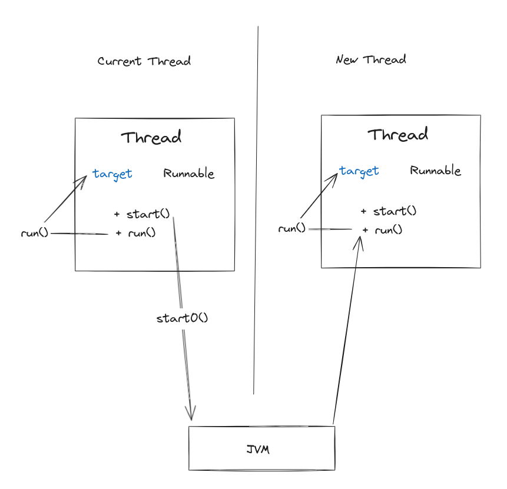

# Q&A

## 为什么双重检测还需要加`volatile`？

```Java
public class Singleton {
    private volatile static Singleton instance;
    private Singleton() {}
    public static Singleton getInstance() {
        if (instance == null) {
            synchronized (Singleton.class) {
                if (instance == null) {
                    instance = new Singleton();
                }
            }
        }
        return instance;
    }
}
```

- synchronized 是因为块与块之间看起来是原子操作，块与块之间有序可见（synchronized 块里的非原子操作依旧可能发生指令重排）
- volatile 是在底层通过内存屏障防止指令重排的，变量前后之间的指令与指令之间有序可见

`instance = new Singleton();` 并非原子操作，底层可能分多个指令来执行，有可能 instance 只是被赋一个引用，但是引用的对象
还没有完全构建成功（指令优化导致乱序，引用赋值被提前执行）。

## `Thread` 中的 `start()` 和 `run()` 又何区别？

- `start()` 才会真正的启动一个新线程，JVM 会在新线程中调用线程的 `run()` 方法。
- `run()` 方法只是在当前线程中调用自己的成员 `target` 的 `run()` 方法，如果 `target` 为空，就直接返回，没有做任何事情

