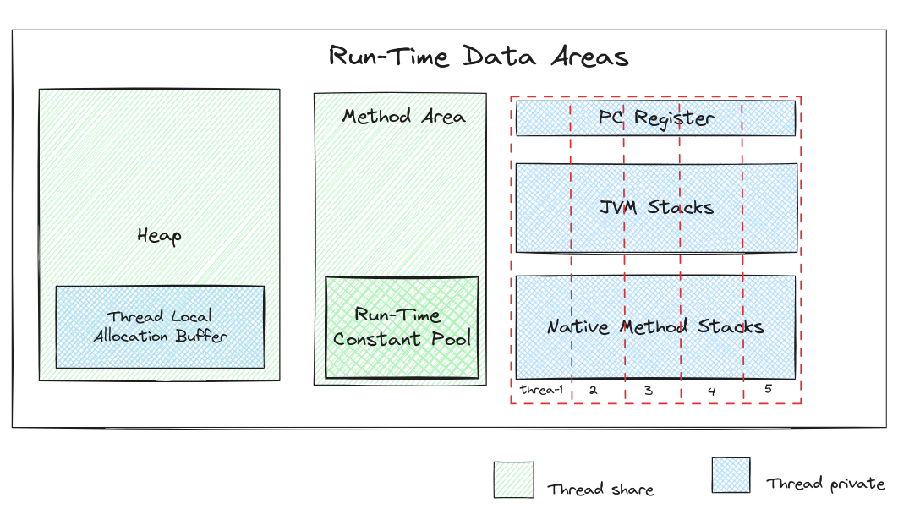
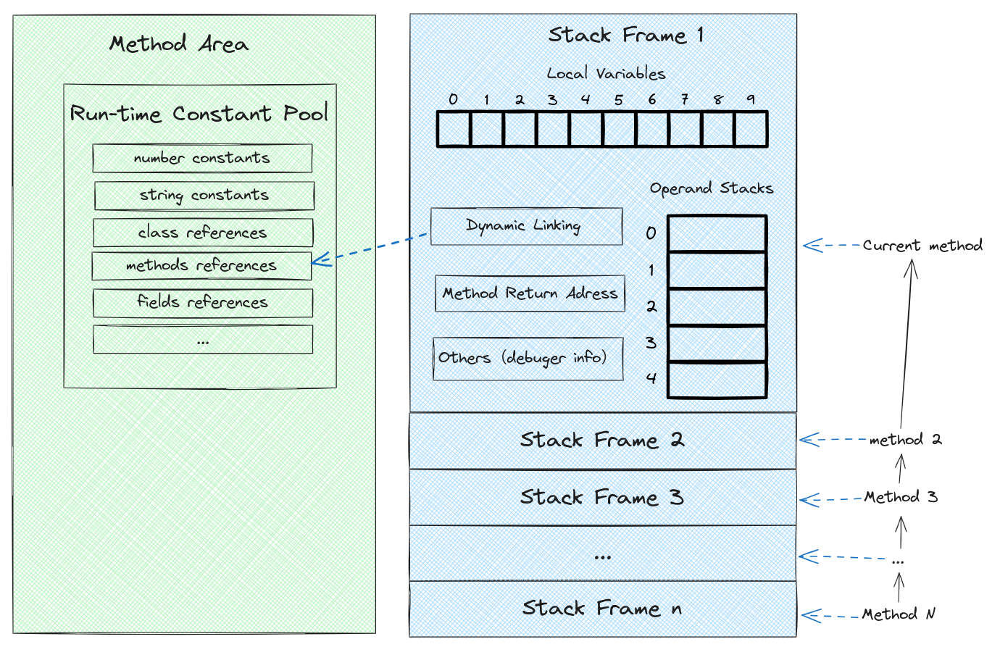

# JVM 运行时内存区域

## 0.概述
Java 虚拟机定义了程序执行期间使用的各种运行时数据区域。其中一些数据区域是在 Java 虚拟机启动时创建的，
并且仅在 Java 虚拟机终止时才被销毁。其他数据区域是每个线程的。每个线程的数据区域在创建线程时创建，
并在线程终止时销毁[^1]。



## 1.The PC Register
Java 虚拟机可以同时支持多个执行线程。因此，每个Java虚拟机线程都有自己的 pc （程序计数器）寄存器。
如果该方法不是 `native` ，则 pc 寄存器包含当前正在执行的 Java 虚拟机指令的地址。如果线程当前正在执行
的方法是 `native` ，则 Java 虚拟机的 pc 寄存器的值是未定义的。 Java 虚拟机的 pc 寄存器足够宽，
可以容纳 `returnAddress` 或特定平台上的本机指针。

**作用**
- PC 寄存器用来存储指向下一条指令的地址，即将要执行的指令代码。由执行引擎读取下一条指令。
- 它是程序控制流的指示器，分支、循环、跳转、异常处理、线程恢复等基础功能都需要依赖这个计数器来完成。

## 2.JVM Stacks
每个线程在创建的时候都会创建一个虚拟机栈，其内部保存一个个的栈帧(Stack Frame)，对应着一次次 Java 方法调用，
是线程私有的，生命周期和线程一致[^2]。

**作用**
主管 Java 程序的运行，它保存方法的局部变量、部分结果，并参与方法的调用和返回。

**设置参数**
可以通过参数-Xss来设置线程的最大栈空间

### Stack Frame
在 Java 虚拟机（JVM）中，栈帧（Stack Frame）是用于支持方法调用和方法执行的数据结构，每个方法调用
都会创建一个对应的栈帧。栈帧中包含了多种信息，主要有以下几个部分：

1. **局部变量表（Local Variable Table）**：<br>
    - 局部变量表用于存储方法中的局部变量，包括方法参数和方法内部定义的局部变量。
    - 局部变量表中的变量可以是各种基本数据类型、对象引用或者 returnAddress 类型。
    - 局部变量表的大小在编译期间就确定了，并且在方法调用时被分配。
    - 在栈帧中，与性能调优关系最为密切的就是局部变量表。在方法执行时，虚拟机使用局部变量表完成方法的传递。
    - 局部变量表中的变量也是重要的垃圾回收根节点，只要被局部变量表中直接或间接引用的对象都不会被回收。
    - HotSpot JVM 设计者们提出了栈顶缓存技术，将栈顶元素全部缓存在物理 CPU 的寄存器中，以此降低对内存的读/写次数，提升执行引擎的执行效率。
2. **操作数栈（Operand Stack）**：<br>
    - 操作数栈用于存储方法执行过程中的操作数，如方法参数、临时变量和中间计算结果等。
    - 操作数栈的大小是动态的，在方法执行过程中根据实际需要动态调整。
3. **动态链接（Dynamic Linking）**：<br>
    - 动态链接用于指向当前方法所属的类的常量池中的方法符号引用（Method Reference）。
    - 在方法调用时，动态链接被解析为实际的方法入口地址，用于方法的动态分派。
4. **方法返回地址（Return Address）**：<br>
    方法返回地址用于存储方法调用完成后的返回地址，用于返回到方法调用点继续执行。
    在方法调用时，返回地址被压入栈帧的操作数栈中，在方法执行完毕后被弹出并返回到方法调用点。
5. **额外的一些信息**：<br>
    栈帧中可能还包含了一些额外的信息，如方法所属的类、方法的访问标志、异常处理表、调试信息等。

## 3.Native Method stacks
Java虚拟机的实现可以使用传统的堆栈（通俗地称为“C堆栈”）来支持 native 方法（以除Java编程语言之外的语言编写的方法）。

- 在 Hotspot JVM 中，直接将本地方法栈和虚拟机栈合二为一。
- 如果线程中的计算需要比允许的更大的本机方法堆栈，Java 虚拟机将抛出 `StackOverflowError` 。
- 如果本机方法堆栈可以动态扩展并且尝试本机方法堆栈扩展但可用内存不足，或者没有足够的内存来为新线程
- 创建初始本机方法堆栈，则 Java 虚拟机将抛出 `StackOverflowError` 。

## 4.Heap
Java 虚拟机有一个在所有 Java 虚拟机线程之间共享的堆。堆是运行时数据区域，“几乎”所有类实例和数组的
内存都从这里分配。堆是在虚拟机启动时创建的。对象的堆存储由 GC（称为垃圾收集器）回收。

```{note}
“几乎”所有的对象实例以及数组都应当在堆上分配
“几乎”是指从实现角度来看，随着Java语言的发展，现在已经能看到些许迹象表明日后可能出现值类型的支持，
即使只考虑现在，由于即时编译技术的进步，尤其是逃逸分析技术的日渐强大，栈上分配、标量替换优化手段
已经导致一些微妙的变化悄然发生，所以说Java对象实例都分配在堆上也渐渐变得不是那么绝对.[^3]
```
Java堆既可以被实现成固定大小的，也可以是可扩展的，不过当前主流的 Java 虚拟机都是按照可扩展来实现的。
- `-Xms` 用来表示堆的起始内存，等价于 `-XX:InitialHeapSize`
- `-Xmx` 用来表示堆的最大内存，等价于 `-XX:MaxHeapSize`

### 堆区域划分

JVM 规范中并没有进一步划分堆区域。由于常见 GC 都是基于分代收集理论设计的，因此经常看到 Eden 空间、From Survivor空间、To Survivor空间、新生代、老年代、永久代）等名词，其是都是这些 GC 的对 Heap 
的区域划分。

```{warning}
**永久代**<br>
实际是Java7 及以前版本的 HotSpot 方法区，Java 8 后 HotSpot 使用 Native Memory来替代它，
并称为 Metaspace。
```


### Thread Local Allocation Buffer
Thread Local Allocation Buffer（TLAB）是一种用于提高线程私有对象分配效率的技术，它是 Java 虚拟机内存管理的一部分。TLAB 主要用于优化并发环境下的对象分配，尤其是针对多线程同时分配对象时的性能问题。

TLAB 的主要思想是为每个线程预分配一块私有的内存空间，用于线程独立地进行对象分配。每个线程都有自己的 TLAB 区域，这样可以避免不同线程之间频繁地竞争分配内存的锁，从而提高了对象分配的效率和并发性能。


## 5.Methods Area
Java 虚拟机有一个在所有 Java 虚拟机线程之间共享的方法区。方法区类似于传统语言的编译代码的存储区或者
类似于操作系统进程中的“文本”段。它存储每个类的结构，例如运行时常量池、字段和方法数据，以及方法和构造函数
的代码，包括类和接口初始化以及实例初始化中使用的特殊方法。

方法区是在虚拟机启动时创建的。尽管方法区在逻辑上是堆的一部分，但简单的实现可以选择不进行垃圾收集或压缩它。

## 6.Run-Time Constant Pool
运行时常量池是 `class` 文件中每个类和接口的 `constant_pool` 表的运行时表示。它包含多种常量，
从编译时已知的数字、文字到必须在运行时解析的方法和字段引用。运行时常量池的功能类似于传统编程语言的符号表，
但它包含比典型符号表更广泛的数据。

每个运行时常量池都是从 Java 虚拟机的方法区分配的。类或接口的运行时常量池是在 Java 虚拟机创建类或接口时构造的。


[^1]: [The Java Virtual Machine Specification, Java SE 21 Edition](https://docs.oracle.com/javase/specs/jvms/se21/html/jvms-2.html#jvms-2.5)
[^2]: [JVM 基础 - JVM 内存结构](https://pdai.tech/md/java/jvm/java-jvm-struct.html#%E5%9B%9B%E3%80%81%E5%A0%86%E5%86%85%E5%AD%98)
[^3]: [深入理解Java虚拟机（第3版）](https://book.douban.com/subject/34907497). 周志明 2019.
