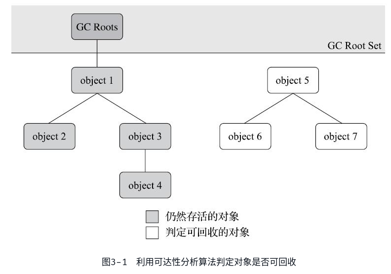
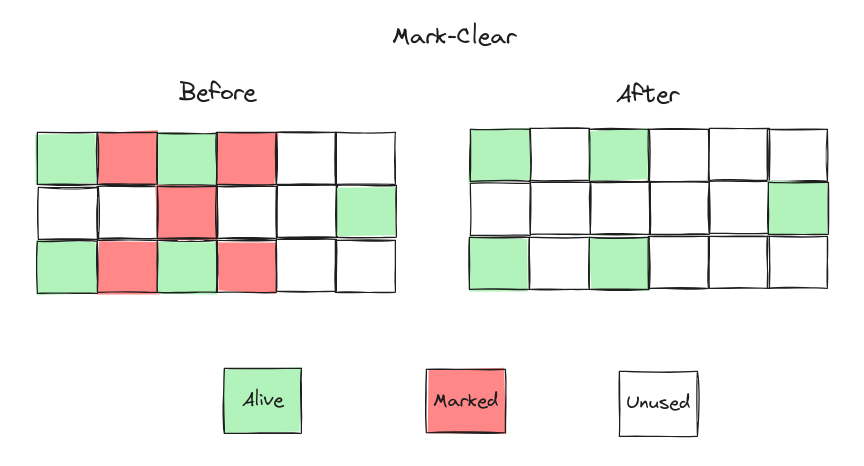
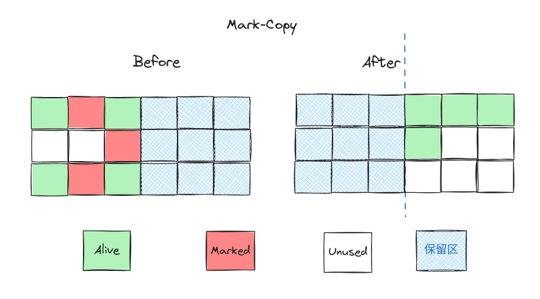

# 垃圾收集与内存非配策略

## 0.对象已死？
垃圾回收之前需要先确定对象是否存活，只有“死去”的对象才可以被垃圾回收器清除，那如何判断对象“已死”？
目前主流的判定方式有：
- 引用计数法
- 可达性分析法

### 引用计数算法
引用计数法的基本原理是在程序运行过程中，每当有一个指针指向某个对象时，该对象的引用计数加一；
当指针不再指向该对象时，引用计数减一。当引用计数为零时，即表示该对象不再被引用，可以被垃圾回收器回收。
一些使用的例子：
- Netty 的 `ByteBuf`
- Rust 中的 `RefCell`

引用计数使用简单，实时性好，但是会面临一些问题：

1. **循环引用问题**：引用计数法无法处理循环引用的情况，即两个对象相互引用，导致它们的引用计数永远不会为零，
    即使它们已经不再被程序所需要，也无法被回收，会导致内存泄漏。（Rust 使用 `Weak` 来解决，`Weak` 不增加引用次数）。
2. **引用计数更新开销大**：在多线程环境下，更新引用计数会存在竞争，需要使用锁来保护引用计数的更新，增加了额外的开销。
3. **难以处理跨平台指针**：引用计数法通常难以处理跨平台指针的情况，比如 C/C++ 中的指针可能会指向堆中的对象，也可能
    指向栈中的对象，这会导致引用计数不准确，可能会造成错误的回收行为。

### 可达性分析算法
当前主流的商用程序语言（Java、C#，上溯至前面提到的古老的Lisp）的内存管理子系统，都是通过可达性分析
（Reachability Analysis）算法来判定对象是否存活的。这个算法的基本思路就是通过一系列称为“GC Roots”的根对象
作为起始节点集，从这些节点开始，根据引用关系向下搜索，搜索过程所走过的路径称为“引用链”（Reference Chain），
如果某个对象到GC Roots间没有任何引用链相连，或者用图论的话来说就是 从GC Roots到这个对象不可达时，
则证明此对象是不可能再被使用的。

可作位 GC Roots 的对象包括：
- 虚拟机栈中引用的对象
- 本地方法栈中引用的对象
- 方法区的类静态属性引用的对象
- 方法区的常量引用的对象
- 所有被同步锁（`synchronized`关键字）持有的对象（避免被回收）

### 方法区的回收
方法区回收的性价比一般不高，但针对那些在运行时动态加载和卸载大量类的应用来说还很重要的。包括：

1. **动态加载类的应用程序**： 一些框架和应用程序需要在运行时动态加载和卸载类，如基于插件的系统、热部署系统等。
   - 这些应用程序可能会在运行过程中频繁地加载和卸载类，导致方法区内存的不断增长。
   - 为了避免方法区溢出或内存泄漏，需要定期清理方法区中的无用类和元数据信息。
2. **长时间运行的应用程序**：一些长时间运行的应用程序可能会在运行过程中加载大量的类和元数据信息，导致方法区内存的不断增长。
   - 为了防止方法区溢出，需要定期清理方法区中的无用数据，释放内存空间。
3. **大型应用服务器**：一些大型的应用服务器（如 Tomcat、Jetty 等）可能会部署大量的 Web 应用程序，每个应用程序都有自己的类加载器和方法区。
   - 在这种情况下，如果不定期清理方法区，可能会导致整个服务器的内存空间被耗尽，影响到其他应用程序的正常运行。
4. **使用大量动态代理和反射的应用程序**：一些应用程序可能会使用大量的动态代理和反射技术，动态生成和加载类。
   - 这些动态生成的类和元数据信息可能会占用大量的方法区内存空间，导致方法区溢出。
   - 为了避免这种情况发生，需要定期清理方法区中的无用数据。

## 1.垃圾收集算法
当前商业虚拟机的垃圾收集器，大多数都遵循了“分代收集”（Generational Collection）的理论进行设计，
分代收集名为理论，实质是一套符合大多数程序运行实际情况的经验法则，它建立在两个分代假说之上：

- 1）弱分代假说（Weak Generational Hypothesis）：绝大多数对象都是朝生夕灭的。
- 2）强分代假说（Strong Generational Hypothesis）：熬过越多次垃圾收集过程的对象就越难以消亡。

分代收集算法一般至少将 Java 堆划分新生代（Young Generation）和老年代（Old Generation）两个区域。
但是对象不是孤立的，对象之间会存在跨代引用。为了解决这个问题，就需要对分代收集理论添加第三条经验法则：

- 3）跨代引用假说（Intergenerational Reference Hypothesis）：跨代引用相对于同代引用来说仅占极少数。

对于不同代的收集性为，一般定义：
- 部分收集（Partial GC）：指目标不是完整收集整个Java堆的垃圾收集，其中又分为：
  - 新生代收集（Minor GC/Young GC）：指目标只是新生代的垃圾收集。
  - 老年代收集（Major GC/Old GC）：指目标只是老年代的垃圾收集。目前只有CMS收集器会有单独收集老年代的行为。
- 混合收集（Mixed GC）：指目标是收集整个新生代以及部分老年代的垃圾收集。目前只有G1收集器会有这种行为。
- 整堆收集（Full GC）：收集整个Java堆和方法区的垃圾收集。

### 标记-清除
将存活的对象进行标记，然后清理掉未被标记的对象。

不足:
- 执行效率不稳定，因为标记和清除两个过程的执行效率都随对象数量增长而降低。
- 会产生大量不连续的内存碎片，导致无法给大对象分配内存。

### 标记-整理
让所有存活的对象都向一端移动，然后直接清理掉端边界以外的内存。

不足：
- 主要不足是只使用了内存的一半。
- 需要依赖其他内存区域（实际上大多就是老年代）进行分配担保。

### 标记-复制
将内存划分为大小相等的两块，每次只使用其中一块，当这一块内存用完了就将还存活的对象复制到另一块上面，然后再把使用过的内存空间进行一次清理。

不足：
- 移动对象涉及的操作负担大，尤其是老年代
- 需要 “Stop The World”

## 2.HotSpot 的算法细节

### 根节点枚举
根节点枚举就是要找到所有的 GC Root，迄今为止，所有收集器在根节点枚举这一步骤时都会存在
“Stop The World”，现在可达性分析算法在查找引用链时，已经可以做到与用户线程一起并发执行。

HotSpot 使用一组称为`OopMap`（Ordinary Object Pointer，OOP）的数据结构来查找对象引用。
一个栈帧中可能有一组或多组`OopMap`。

### 安全点
在OopMap的协助下，HotSpot可以快速准确地完成 GC Roots 枚举。但是引用关系在不断变化，
为每一个指令都生成一个`OopMap`的代价又太大，于是，HotSpot 只在“特定的位置”记录了这些信息，
这些位置被称为**安全点**（Safepoint）。

**安全点位置的选取标准**： 
基本上是以“是否具有让程序长时间执行的特征”为标准, 例如方法调用、循环跳转、异常跳转。

如何让线程在安全点停下来？
- 抢占式中断：GC 时，系统首先把所有用户线程中断，如果有用户线程不在安全点上，就让其继续，过一会而再中断，直到其运行到安全点。
- 主动中断：主流方式，GC 需要中断所有用户线程时，简单设置一个标志位，

### 安全区