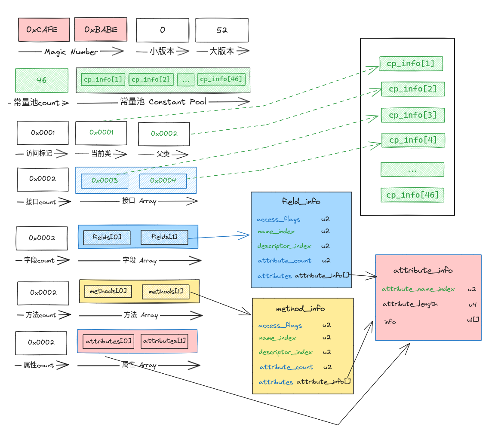
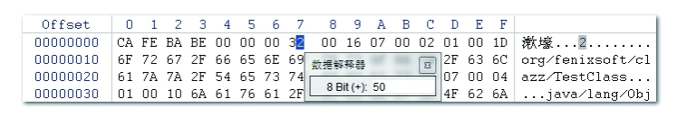
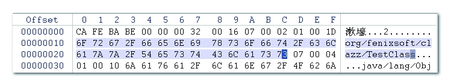
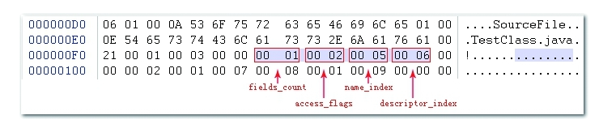
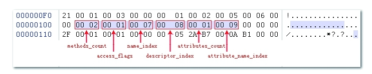

# Class 文件结构

## 概览[^1]


```java
ClassFile {
    u4               magic; // 魔数 0xCAFEBABE
    u2               minor_version; // 小版本 0
    u2               major_version; // 大版本 52 [1.8]
    u2               constant_pool_count; //常量池大小
    cp_info[]        constant_pool[constant_pool_count-1]; // 常量池
    u2               access_flags; // 访问标记 0x0021 [public]
    u2               this_class; // 当前类 cp_info #8  <lighk/springdemo/classformat/WuKong>
    u2               super_class; // 父类 cp_info #2  <java/lang/Object>
    u2               interfaces_count; // 接口数量
    u2[]             interfaces[interfaces_count]; // 接口信息
    u2               fields_count;  // 字段数量
    field_info[]     fields[fields_count]; // 字段信息 
    u2               methods_count; // 方法数量
    method_info[]    methods[methods_count]; //方法信息
    u2               attributes_count; // 属性数量
    attribute_info[] attributes[attributes_count]; // 属性信息
}
```

## 魔数



每个 class 文件开始的 4 个字节 `0xCAFE BABE` 被成为魔数（Magic Number）,主要用来确认当前文件是否为 JVM 可解析的 class 文件。

## 版本

魔数后的四个字节是 class 文件的版本号。5、6 字节是次版本号，7、8 字节是主版本号（Java 8 的 class 版本是 52）。

## 常量池

版本之后是 2 个字节的常量池的容量，这两个字节之后就是常量池，它包含了类、接口、字段和方法中使用的常量。

```{note}
常量池的索引是从 1 开始，所以容量为 23 代表有 22 个常量
```

常量池的定义如下：

```C++
cp_info {
    u1 tag; // 常量类型
    u1 info[];
}
```

### 常量分类

tag 代表常量类型，不同的常量类型，其 info 结构的第一个字节又是 tag，具体的常量类型如下：

| 类  型 | 标  志 | 描  述 |
| :-----| :----: | :----: |
| CONSTANT_Utf8_info | 1 | UTF-8编码的字符串 |
| CONSTANT_Integer_info | 3 | 整型字面量 |
| CONSTANT_Float_info | 4 | 浮点型字面量 |
| CONSTANT_Long_info | 5 | 长整型字面量 |
| CONSTANT_Double_info | 6 | 双精度浮点型字面量 |
| CONSTANT_Class_info | 7 | 类或接口的符号引用 |
| CONSTANT_String_info | 8 | 字符串类型字面量 |
| CONSTANT_Fieldref_info | 9 | 字段的符号引用 |
| CONSTANT_Methodref_info | 10 | 类中方法的符号引用 |
| CONSTANT_InterfaceMethodref_info | 11 | 接口中方法的符号引用 |
| CONSTANT_NameAndType_info | 12 | 字段或方法的部分符号引用 |
| CONSTANT_MethodHandle_info | 15 | 表示方法句柄 |
| CONSTANT_MethodType_info | 16 | 表示方法类型 |
| CONSTANT_Dynamic_info | 17 | 表示一个动态计算常量 |
| CONSTANT_InvokeDynamic_info | 18 | 表示一个动态方法调用点 |
| CONSTANT_Module_info | 19 | 表示一个模块 |
| CONSTANT_Package_info | 20 | 表示一个模块中开放或者导出的包 |

这些类型可以分为两类：

- 原子类型：不需要其他子类型来表示，CONSTANT_Utf8_info
- 复杂类型：需要其他复杂类型或原子类型来表示

比如 CONSTANT_Class_info --> CONSTANT_Utf8_info

```c++
CONSTANT_Class_info {
    u1 tag;
    u2 name_index; // name_index 为常量池的索引，指向的常量为 tag CONSTANT_Utf8_info
}
CONSTANT_Utf8_info {
    u1 tag;
    u2 length;
    u1 bytes[length];
}
```

### 实例



从 8 个字节开始[^2]：

- `0x0016`：常量池容量，常量池最大索引为 23，总共有 22 个常量
- `0x07`：  查表发现 tag 为 7 代表当前常量为 `CONSTANT_Class_info` 类型，那么接下来 2 个字节为 `name_index`
- `0x0002`：`CONSTANT_Class_info` 的 `name_index` 值为 2, 代表类名称在类名称在常量池中的索引为 2
- `0x01`：  查表发现 tag 为 7 代表当前常量为 `CONSTANT_Utf8_info` 类型，那么接下来 2 个字节为 `length`
- `0x001D`： `CONSTANT_Utf8_info` 的`length` 值为 29，那么接下来 29 个字节都是`CONSTANT_Utf8_info`的`bytes`字段值，也就是 UTF8 字符串`org/fenixsoft/clazz/TestClass`

## 访问标记

在常量池结束之后，紧接着的2个字节代表访问标志（access_flags），这个标志用于识别一些类或者接口层次的访问信息，包括：

- 这个Class是类还是接口；
- 是否定义为public类型；
- 是否定义为abstract类型；
- 如果是类的话，是否被声明为final；

|Flag Name |	Value	| Interpretation|
| :-----| :----: | :----: |
|ACC_PUBLIC	|0x0001	|Declared public; may be accessed from outside its package.|
|ACC_FINAL	|0x0010	|Declared final; no subclasses allowed.|
|ACC_SUPER	|0x0020	|Treat superclass methods specially when invoked by the invokespecial instruction.|
|ACC_INTERFACE|	0x0200	|Is an interface, not a class.|
|ACC_ABSTRACT|	0x0400	|Declared abstract; must not be instantiated.|
|ACC_SYNTHETIC|	0x1000	|Declared synthetic; not present in the source code.|
|ACC_ANNOTATION|	0x2000	|Declared as an annotation interface.|
|ACC_ENUM|	0x4000|	Declared as an enum class.|
|ACC_MODULE| 0x8000	|Is a module, not a class or interface.|

## 当前类

u2 类型，即两个字节，存储的就是常量池的索引

u2 --> `CONSTANT_Class_info` --> `CONSTANT_Utf8_info`  

## 父类

u2 类型，即两个字节，存储的就是常量池的索引

u2 --> `CONSTANT_Class_info` --> `CONSTANT_Utf8_info`

## 接口

首先是一个 u2 类型，代表接口表大小，即接口数量，然后就是一个 u2 的接口数组，元素的值直接就是常量池的索引。

## 字段

首先是一个 u2 类型，代表字段表大小，即字段数量，然后就是一个 `field_info` 的数组，其中 `field_info` 定义如下：



```C++
field_info {
    u2             access_flags; // 字段访问标记
    u2             name_index;   // 字段名称在常量池的索引
    u2             descriptor_index; // 字段描述符在常量池的索引
    u2             attributes_count; // 此字段的属性表大小
    attribute_info attributes[attributes_count]; // 此字段的属性表
}
```

字段访问标记定义：
| Flag Name | Value | Interpretation |
| --- | --- | --- |
| `ACC_PUBLIC` | 0x0001 | Declared `public`; may be accessed from outside its package. |
| `ACC_PRIVATE` | 0x0002 | Declared `private`; accessible only within the defining class and other classes belonging to the same nest ([§5.4.4](https://docs.oracle.com/javase/specs/jvms/se19/html/jvms-5.html#jvms-5.4.4 "5.4.4. Access Control")). |
| `ACC_PROTECTED` | 0x0004 | Declared `protected`; may be accessed within subclasses. |
| `ACC_STATIC` | 0x0008 | Declared `static`. |
| `ACC_FINAL` | 0x0010 | Declared `final`; never directly assigned to after object construction (JLS §17.5). |
| `ACC_VOLATILE` | 0x0040 | Declared `volatile`; cannot be cached. |
| `ACC_TRANSIENT` | 0x0080 | Declared `transient`; not written or read by a persistent object manager. |
| `ACC_SYNTHETIC` | 0x1000 | Declared synthetic; not present in the source code. |
| `ACC_ENUM` | 0x4000 | Declared as an element of an `enum` class. |

如果将字段的声明改为`final static int m=123；`，那就可能会存在一项名称为 ConstantValue 的属性，其值指向常量123

## 方法

首先是一个 u2 类型，代表方法表大小，即方法数量，然后就是一个 `method_info` 的数组，其中 `method_info` 定义如下：



```C++
method_info {
    u2             access_flags; // 方法访问标记
    u2             name_index;   // 方法名称在常量池的索引
    u2             descriptor_index; // 方法描述符在常量池的索引
    u2             attributes_count; // 此方法的属性表大小
    attribute_info attributes[attributes_count]; // 此方法的属性表
}
```

方法访问标记定义如下：
| Flag Name          | Value  | Interpretation                                                                                                                                                                                                             |
| ------------------ | ------ | -------------------------------------------------------------------------------------------------------------------------------------------------------------------------------------------------------------------------- |
| `ACC_PUBLIC`       | 0x0001 | Declared `public`; may be accessed from outside its package.                                                                                                                                                               |
| `ACC_PRIVATE`      | 0x0002 | Declared `private`; accessible only within the defining class and other classes belonging to the same nest ([§5.4.4](https://docs.oracle.com/javase/specs/jvms/se19/html/jvms-5.html#jvms-5.4.4 "5.4.4. Access Control")). |
| `ACC_PROTECTED`    | 0x0004 | Declared `protected`; may be accessed within subclasses.                                                                                                                                                                   |
| `ACC_STATIC`       | 0x0008 | Declared `static`.                                                                                                                                                                                                         |
| `ACC_FINAL`        | 0x0010 | Declared `final`; must not be overridden ([§5.4.5](https://docs.oracle.com/javase/specs/jvms/se19/html/jvms-5.html#jvms-5.4.5 "5.4.5. Method Overriding")).                                                                |
| `ACC_SYNCHRONIZED` | 0x0020 | Declared `synchronized`; invocation is wrapped by a monitor use.                                                                                                                                                           |
| `ACC_BRIDGE`       | 0x0040 | A bridge method, generated by the compiler.                                                                                                                                                                                |
| `ACC_VARARGS`      | 0x0080 | Declared with variable number of arguments.                                                                                                                                                                                |
| `ACC_NATIVE`       | 0x0100 | Declared `native`; implemented in a language other than the Java programming language.                                                                                                                                     |
| `ACC_ABSTRACT`     | 0x0400 | Declared `abstract`; no implementation is provided.                                                                                                                                                                        |
| `ACC_STRICT`       | 0x0800 | In a `class` file whose major version number is at least 46 and at most 60: Declared `strictfp`.                                                                                                                           |
| `ACC_SYNTHETIC`    | 0x1000 | Declared synthetic; not present in the source code.                                                                                                                                                                        |

```{note}
Java 语言的特征签名和字节码的特征签名定义不同，具体如下：
- `Java`：方法名称、参数顺序、参数类型
- 字节码：方法名称、参数顺序、参数类型、方法返回值、受查异常表
```

## 属性

Class文件、字段表、方法表都可以携带自己的属性表集合，以描述某些场景专有的信息。
首先是一个 u2 类型，代表属性表大小，即属性数量，然后就是一个 `attribute_info` 的数组，其中 `attribute_info` 定义如下：

```C++
attribute_info {
    u2 attribute_name_index; // 属性名称在常量池的索引
    u4 attribute_length;     // 属性长度
    u1 info[attribute_length]; // 属性内容，不同属性，其 info 结构不同
}
```

属性表中的属性名称是一个字符串，它指定了属性的类型和作用。常见的属性类型包括：

- ConstantValue：用于描述字段的常量值。
- Code：用于描述方法的字节码指令和异常处理器信息。
- LineNumberTable：用于描述代码行号和字节码指令之间的映射关系。
- SourceFile：用于描述源文件名称。
- InnerClasses：用于描述内部类的信息。
- Signature：用于描述泛型类型参数的签名信息。
- RuntimeVisibleAnnotations 和 RuntimeInvisibleAnnotations：用于描述注解信息。

这里列举一些常见属性

### Code 属性

```C++
Code_attribute {
    u2 attribute_name_index;
    u4 attribute_length;
    u2 max_stack;
    u2 max_locals;
    u4 code_length;
    u1 code[code_length];
    u2 exception_table_length;
    {   u2 start_pc;
        u2 end_pc;
        u2 handler_pc;
        u2 catch_type;
    } exception_table[exception_table_length];
    u2 attributes_count;
    attribute_info attributes[attributes_count];
}
```

### Exceptions 属性

这是 方法表中`method_info`中的属性，代表方法可能引发的已检查异常，与 Code 属性 中的异常表不是一个概念。

```C++
Exceptions_attribute {
    u2 attribute_name_index;
    u4 attribute_length;
    u2 number_of_exceptions;
    u2 exception_index_table[number_of_exceptions];
}
```

### LineNumberTable 属性

```C++
LineNumberTable_attribute {
    u2 attribute_name_index;
    u4 attribute_length;
    u2 line_number_table_length;
    {   u2 start_pc;
        u2 line_number;	
    } line_number_table[line_number_table_length];
}
```

### LocalVariableTable 属性

调试器可以使用它来确定方法执行期间给定局部变量的值，描述栈帧中局部变量表的变量与Java源码中定义的变量之间的关系。

```C++
LocalVariableTable_attribute {
    u2 attribute_name_index;
    u4 attribute_length;
    u2 local_variable_table_length;
    {   u2 start_pc;
        u2 length;
        u2 name_index;
        u2 descriptor_index;
        u2 index;
    } local_variable_table[local_variable_table_length];
}
```

相似的 LocalVariableTypeTable 属性的作用是为编译器和调试器提供局部变量的类型信息，以便在编译和调试时进行类型检查和类型推断。

### ConstantValue

ConstantValue属性的作用是通知虚拟机自动为静态变量赋值。只有被static关键字修饰的变量（类变量）才可以使用这项属性。

```C++
ConstantValue_attribute {
    u2 attribute_name_index;
    u4 attribute_length; // 固定为 2
    u2 constantvalue_index; // constant_pool 的索引
}
```

常量值属性类型：

| Field Type 字段类型                        | Entry Type 条目类型    |
| ----------------------------------------- | ------------------ |
| `int`, `short`, `char`, `byte`, `boolean` | `CONSTANT_Integer` |
| `float`                                   | `CONSTANT_Float`   |
| `long`                                    | `CONSTANT_Long`    |
| `double`                                  | `CONSTANT_Double`  |
| `String`                                  | `CONSTANT_String`  |


[^1]: [Java Virtual Machine Specification. Chapter 4. The class File Format](https://docs.oracle.com/javase/specs/jvms/se19/html/jvms-4.html#jvms-4.7.2-300-C.1)
[^2]: [深入理解Java虚拟机（第3版）. 第6章　类文件结构](https://book.douban.com/subject/34907497//)