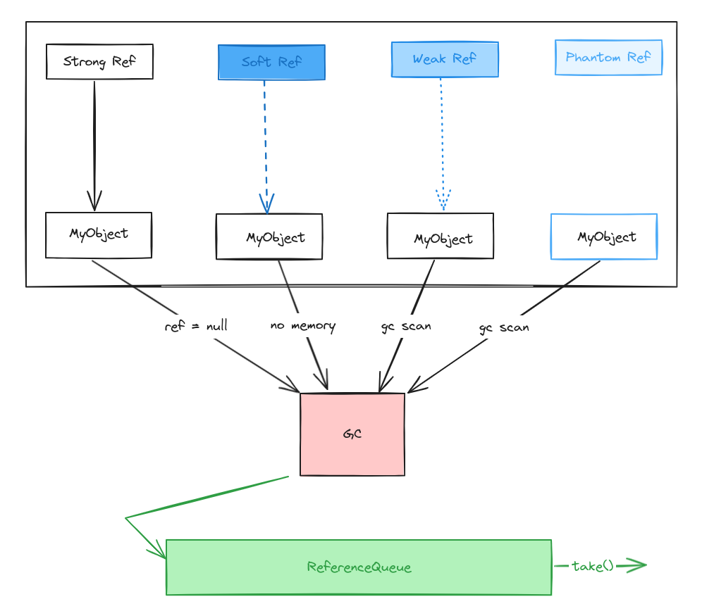

# Java 四种引用



## 1. 强引用 Strong

### 声明

最常见的引用类型，没有特别标记的引用都是强引用。

```Java
String strongRef1 = new Sting();
String strongRef2 = "123";
```

### 特性

垃圾收集器绝不会回收它。当内存空间不足时，Java 宁愿抛出 OutOfMemoryError 也不会回收这些对象。

如果要让垃圾回收器尽早的回收它，可以显式的将 `null` 赋给它，比如 `ArrayList.remove()。

```Java
    elementData[--size] = null; // clear to let GC do its work
```

### 使用场景

普通对象的创建，一般引用开发中，大部分情况下都是使用强引用。

## 2. 软引用 Soft

### 声明

使用 `SoftReference` 定义的引用，可选择性指定`ReferenceQueue`。

```Java
SoftReference<String> softReference = new SoftReference<>(new Object());
```

### 特性

- 如果一个对象只有弱引用，被 GC 扫描到时，内存空间不足，才将其视为垃圾进行回收。

### 使用场景

描述一些还有用但并非必需的对象，如内存敏感的缓存

```{caution}
并不建议直接使用软引用或弱引用实现缓存，因为：
- 增加了复杂度和维护成本。需要额外考虑对象的生命周期和引用使用方式。
- 可能影响缓存性能。由于软引用和弱引用的特性，垃圾回收器需要更频繁地扫描内存，以查找可以回收的对象。
- 会导致缓存的不确定性。由于软引用和弱引用的特性，缓存值可能会被过早回收，导致缓存失效。
```

## 3. 弱引用 Weak

### 声明

使用 `WeakReference` 定义的引用，可选择性指定`ReferenceQueue`。

```Java
WeakReference<String> weakReference = new WeakReference<>(new Object());
```

### 特性

- 如果一个对象只有弱引用，被 GC 扫描到就回收（不管当前内存空间足够与否）。
- 真正回收前会先执行下对象的 `finalize()` 方法，所以有一次复活的机会。
- 对象被垃圾回收时，会先将其放入`ReferenceQueue`

### 使用场景

容易内存泄漏的地方。

- WeakHashMap Entry 的 key
- ThreadLocalMap Entry 的 key（ThreadLocal）

```Java
/**
 * The entries in this hash map extend WeakReference, using
 * its main ref field as the key (which is always a
 * ThreadLocal object).  Note that null keys (i.e. entry.get()
 * == null) mean that the key is no longer referenced, so the
 * entry can be expunged from table.  Such entries are referred to
 * as "stale entries" in the code that follows.
 */
static class Entry extends WeakReference<ThreadLocal<?>> {
    /** The value associated with this ThreadLocal. */
    Object value;

    Entry(ThreadLocal<?> k, Object v) {
        super(k);
        value = v;
    }
}        
```

## 4. 虚引用 Phantom

### 声明

使用 `PhantomReference` 定义的引用，而且必须指定`ReferenceQueue`。

```Java
ReferenceQueue<String> queue = new ReferenceQueue<>();
PhantomReference<String> phantomReference = new PhantomReference<>(new Object(), queue);
```

### 特性

- 如果一个对象只有虚引用，被 GC 扫描到就回收。
- 当垃圾收集器决定回收对象时，虚引用会被添加到与之关联的引用队列中。
- 它不能单独使用，必须和引用队列（ReferenceQueue）联合使用。虚引用主要用于跟踪对象被垃圾回收的活动。

### 使用场景

 PhantomReference 的主要作用是在对象被垃圾回收前，执行一些清理操作。例如，在使用DirectByteBuffer时，需要手动释放 ByteBuffer 占用的内存。可以使用 PhantomReference 来跟踪DirectByteBuffer 对象是否已经被垃圾回收，如果已经被垃圾回收，则可以在 PhantomReference 的回调方法中释放 ByteBuffer 占用的内存。

 ```Java
import java.lang.ref.PhantomReference;
import java.lang.ref.ReferenceQueue;
import java.nio.ByteBuffer;

public class DirectByteBufferCleaner extends PhantomReference<ByteBuffer> implements Runnable {
    private static final ReferenceQueue<ByteBuffer> QUEUE = new ReferenceQueue<>();

    private long address;

    public DirectByteBufferCleaner(ByteBuffer buffer, long address) {
        super(buffer, QUEUE);
        this.address = address;
    }

    @Override
    public void run() {
        // 释放ByteBuffer占用的内存
        unsafe.freeMemory(address);
    }

    // 启动清理线程
    public static void startCleanerThread() {
        Thread cleanerThread = new Thread(() -> {
            while (true) {
                try {
                    DirectByteBufferCleaner cleaner = (DirectByteBufferCleaner) QUEUE.remove();
                    cleaner.run();
                } catch (InterruptedException e) {
                    // ignore
                }
            }
        });
        cleanerThread.setDaemon(true);
        cleanerThread.start();
    }
}
 ```

## 代码示例

```Java
    /**
     * strongRef: reference=hello, pollResult=Optional.empty
     * before gc: reference=hello, pollResult=Optional.empty
     * [0.524s][info][gc] GC(1) Pause Full (System.gc()) 9M->4M(40M) 8.716ms
     * after  gc: reference=hello, pollResult=Optional.empty
     */
    @Test
    public void softReference() throws InterruptedException {
        MyObject hello = new MyObject("hello");
        ReferenceQueue<MyObject> queue = new ReferenceQueue<>();
        SoftReference<MyObject> reference = new SoftReference<>(hello, queue);

        System.out.printf("strongRef: reference=%s, pollResult=%s%n",
                reference.get(), Optional.ofNullable(queue.poll()));

        hello = null;
        System.out.printf("before gc: reference=%s, pollResult=%s%n",
                reference.get(), Optional.ofNullable(queue.poll()));
        System.gc();
        Thread.sleep(1000);
        System.out.printf("after  gc: reference=%s, pollResult=%s%n",
                reference.get(), Optional.ofNullable(queue.poll()));
    }

    /**
     * strongRef: reference=hello, pollResult=Optional.empty
     * before gc: reference=hello, pollResult=Optional.empty
     * [0.524s][info][gc] GC(1) Pause Full (System.gc()) 9M->4M(40M) 7.889ms
     * after  gc: reference=null, pollResult=Optional[java.lang.ref.WeakReference@4450d156]
     */
    @Test
    public void weakReference() throws InterruptedException {
        MyObject hello = new MyObject("hello");
        ReferenceQueue<MyObject> queue = new ReferenceQueue<>();
        WeakReference<MyObject> reference = new WeakReference<>(hello, queue);

        System.out.printf("strongRef: reference=%s, pollResult=%s%n",
                reference.get(), Optional.ofNullable(queue.poll()));

        hello = null;
        System.out.printf("before gc: reference=%s, pollResult=%s%n",
                reference.get(), Optional.ofNullable(queue.poll()));
        System.gc();
        Thread.sleep(1000);
        System.out.printf("after  gc: reference=%s, pollResult=%s%n",
                reference.get(), Optional.ofNullable(queue.poll()));
    }

    /**
     * strongRef: reference=null, pollResult=Optional.empty
     * before gc: reference=null, pollResult=Optional.empty
     * [0.510s][info][gc] GC(1) Pause Full (System.gc()) 9M->4M(40M) 7.955ms
     * after  gc: reference=null, pollResult=Optional[java.lang.ref.PhantomReference@4450d156]
     */
    @Test
    public void phantomReference() throws InterruptedException {
        MyObject hello = new MyObject("hello");
        ReferenceQueue<MyObject> queue = new ReferenceQueue<>();
        PhantomReference<MyObject> reference = new PhantomReference<>(hello, queue);

        System.out.printf("strongRef: reference=%s, pollResult=%s%n",
                reference.get(), Optional.ofNullable(queue.poll()));

        hello = null;
        System.out.printf("before gc: reference=%s, pollResult=%s%n",
                reference.get(), Optional.ofNullable(queue.poll()));
        System.gc();
        Thread.sleep(1000);
        System.out.printf("after  gc: reference=%s, pollResult=%s%n",
                reference.get(), Optional.ofNullable(queue.poll()));
    }
```
