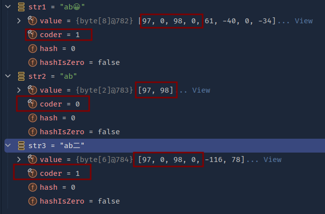

# String 实现

## 字符编码说起

### Unicode
Unicode 是一种字符集，它定义了各种符号和字符的编码方式，包括 ASCII、拉丁文、中文、日文、韩文等等，目前已经定义了超过 13 万个字符。Unicode 中的每个字符都有一个唯一的编号，称为码点（code point），用十六进制表示。

### UTF-16
UTF-16 是一种字符编码方式，它将 Unicode 中的字符编码为 16 位无符号整数（即两个字节），其中大部分字符可以用一个 16 位的编码表示，少部分字符需要使用两个 16 位的编码表示。UTF-16 中的每个编码单元称为代码单元（code unit），用十六进制表示。

Java 选择使用 UTF-16 在内存中存储字符，所以大多数 Unicode 符号可以用一个 char 值表示，但也存在另外一些 Unicode 符号则需要两个 char 值。比如 `A` 用一个 char 即可表示，😀 需要用两个 char 才能表示。 

## char 与 String
- Java 9 以前，String 使用 char[] 来存储字符串，字符串的长度就是 char[] 的大小；
- Java 9 及以后，String 使用 byte[] 来存储字符串，并且新增`COMPACT_STRINGS`
代表当前是否采用压缩存储，`coder`代表当前存储方式（`LATIN1` 或 `UTF16`），具体一个字符占用多少个字节还是取决于字符编码和字符本身的码值。

```java
    static final byte LATIN1 = 0;
    static final byte UTF16  = 1;

    static final boolean COMPACT_STRINGS;
    private final byte coder;

    public String(int[] codePoints, int offset, int count) {
         // ...
        if (COMPACT_STRINGS) {
            this.coder = LATIN1;
            return;
        }
        this.coder = UTF16;
        // ...
    }

    public int length() {
        return value.length >> coder();
    }
```

## 为什么改为 byte[]

采用更节省空间的字符串内部表示形式。参考 [JEP254](https://openjdk.org/jeps/254) 。

String 类将字符存储在 char 数组中，每个字符使用两个字节（十六位）。从许多不同应用程序收集的数据表明字符串是堆使用的主要组成部分，
而大多数 String 对象仅包含 Latin-1 字符。此类字符仅需要一个字节的存储空间，因此此 String 对象的内部 char 数组中的一半空间未使用,存在浪费。所以 Java 9 及以后，String 使用 byte[] 来存储字符串，如果字符串中只存在 Latin-1 字符，就使用压缩存储（`coder=1`）。



coder 目前有两种取值：
```Java
    @Native static final byte LATIN1 = 0;
    @Native static final byte UTF16  = 1;
```
如果字符串只含有 Latin-1 ，那么每个字符都只占用一个字节，可以节省一半空间

参考：
1. [Java 9为什么要将String的底层实现由char数组改成了byte数组?](https://javabetter.cn/basic-extra-meal/jdk9-char-byte-string.html)
2. [Java一个汉字占几个字节（详解与原理）](https://www.cnblogs.com/lslk89/p/6898526.html)

