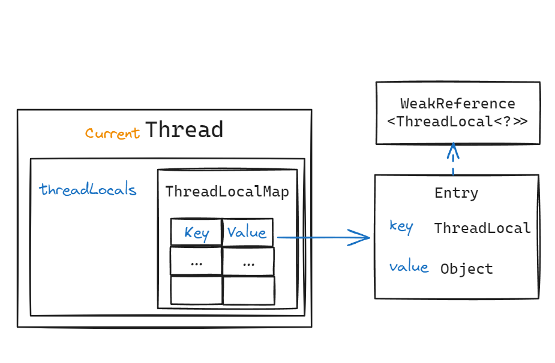

# ThreadLcoal 概述

`ThreadLocal` 为线程提供了私有状态存放位置，可以简单的看作每个线程独享一个对象。


## 使用方式

```Java
// ThreadLocal<String> threadLocal = ThreadLocal.withInitial(() -> "nobody");=
ThreadLocal<String> threadLocal = new ThreadLocal<>();
threadLocal.set("zhangsan");
String name = threadLocal.get();
threadLocal.remove();
```

## 使用场景

`ThreadLocal` 其实是保证线程安全的一种设计思路，让状态保持在线程自己内部，避免发生线程安全问题。

因此经常用来作为环境上下文（Context）使用，比如：

- SpringMVC 中的 HttpServletRequest、HttpServletResponse
- Spring 中的事务
- JDBC Connection

## 内部结构

操作 ThreadLocal 中的状态（变量） 本质上是操作当前线程的 `threadLocals`（`ThreadLocal.ThreadLocalMap`） 属性,  `threadLocals` 是 `ThreadLocal` 类中定义的一个哈希表，**使用线性探测**处理哈希冲突[^1]，ThreadLocal 对象作为 Key, ThreadLocal 里存储的状态（变量）作为 Value。



```java
    // ThreadLocal.set()
    public void set(T value) {
        Thread t = Thread.currentThread();
        ThreadLocalMap map = getMap(t);
        if (map != null) {
            map.set(this, value);
        } else {
            createMap(t, value);
        }
    }
    
    // // ThreadLocal.remove()
    public void remove() {
         ThreadLocalMap m = getMap(Thread.currentThread());
         if (m != null) {
             m.remove(this);
         }
    }

    // Entry
    static class Entry extends WeakReference<ThreadLocal<?>> {
        /** The value associated with this ThreadLocal. */
        Object value;

        Entry(ThreadLocal<?> k, Object v) {
            super(k);
            value = v;
        }
    }
```

## 内存泄漏

内存泄漏的根本原因是在一个声明周期很长的 Thread 中，总是定义新的 ThreadLocal （不断产生新的 Entry 对象，且不会被回收），并存放状态，但是没有进行手动 remove()。


```{note}
ThreadLocal 内存泄漏是因为 Entry Key 使用了弱引用吗？

网上流传如是说，但是仔细分析后，就会发现这种说法难以自圆其说，实际上：

- Entry 的 key（ThreadLocal实例） 使用了弱引用，在没有其他强引用时，就可以被 GC 回收，反而减轻了内存泄漏的程度（如果正在发生ThreadLocal内存泄漏）。
- Entry 的 Value 是强引用，只要 Thread 实例还存活着，其属性 threadLocals 是 ThreadLocalMap 的强引用， ThreadLocalMap 实例中又包含指向 Entry 的强引用，Entry 又包含指向 Value 的强引用，Value 对象就不会被 GC 回收，所以不手动调用 remove()，才是发生内存泄漏的根本原因。
```

[^1]: 哈希表处理冲突. [zh.wikipedia.org](https://zh.wikipedia.org/zh-cn/哈希表#处理冲突)
