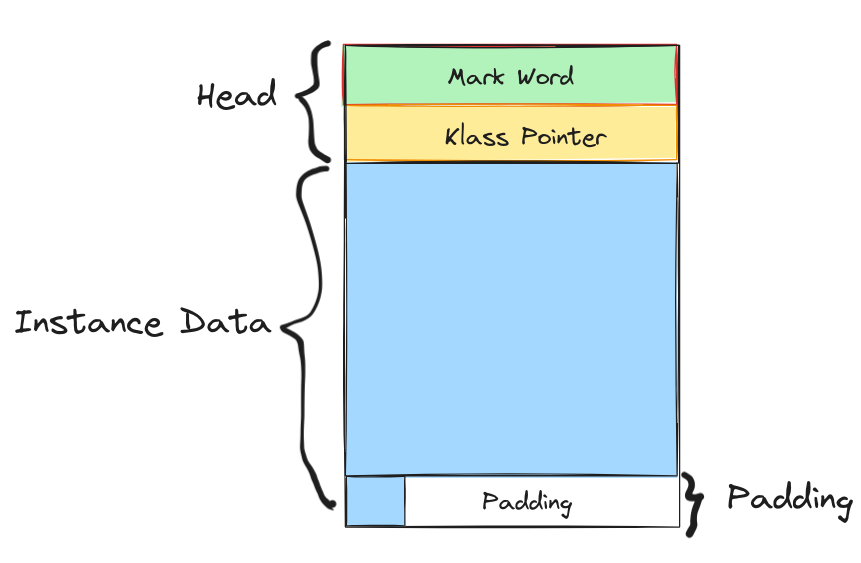
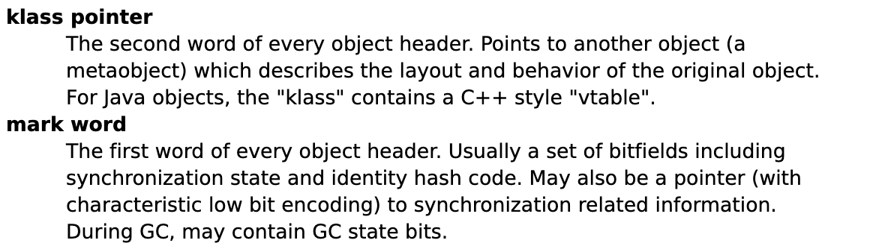
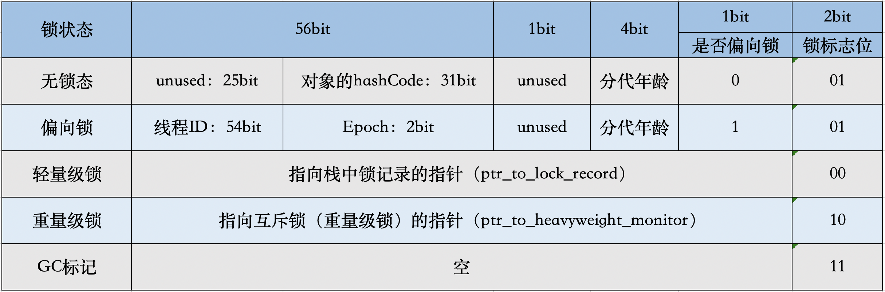

# 对象内存布局

## 概览

## 对象头

- mark word： 存储对象自身的运行时数据，如
  - 哈希码（HashCode）
  - GC分代年龄
  - 锁状态标志
  - 线程持有的锁
  - 偏向线程ID
  - 偏向时间戳
  - 锁指针
- Klass Pointer
  - 即类型指针，是对象指向它的类元数据的指针，虚拟机通过这个指针来确定这个对象是哪个类的实例 、

### Mark Word 

- 锁标志位（lock）：区分锁状态，11时表示对象待GC回收状态, 只有最后2位锁标识(11)有效。
biased_lock：是否偏向锁，由于无锁和偏向锁的锁标识都是 01，没办法区分，这里引入一位的偏向锁标识位。
- 分代年龄（age）：表示对象被GC的次数，当该次数到达阈值的时候，对象就会转移到老年代。
- 对象的hashcode（hash）：运行期间调用System.identityHashCode()来计算，延迟计算，并把结果赋值到这里。当对象加锁后，计算的结果31位不够表示，在偏向锁，轻量锁，重量锁，hashcode会被转移到Monitor中。
- 偏向锁的线程ID（JavaThread）：偏向模式的时候，当某个线程持有对象的时候，对象这里就会被置为该线程的ID。 在后面的操作中，就无需再进行尝试获取锁的动作。
- epoch：偏向锁在CAS锁操作过程中，偏向性标识，表示对象更偏向哪个锁。
- ptr_to_lock_record：轻量级锁状态下，指向栈中锁记录的指针。当锁获取是无竞争的时，JVM使用原子操作而不是OS互斥。这种技术称为轻量级锁定。在轻量级锁定的情况下，JVM通过CAS操作在对象的标题字中设置指向锁记录的指针。
- ptr_to_heavyweight_monitor：重量级锁状态下，指向对象监视器Monitor的指针。如果两个不同的线程同时在同一个对象上竞争，则必须将轻量级锁定升级到Monitor以管理等待的线程。在重量级锁定的情况下，JVM在对象的ptr_to_heavyweight_monitor设置指向Monitor的指针。

## 对象实例

如果对象有属性字段，则这里会有数据信息。如果对象无属性字段，则这里就不会有数据。根据字段类型的不同占不同的字节，例如boolean类型占1个字节，int类型占4个字节等等；

## 对齐填充

为了字节对齐（8字节的整数倍），填充的数据，不是必须的。

## 参考

1. [Java对象的内存布局](https://www.cnblogs.com/jajian/p/13681781.html)