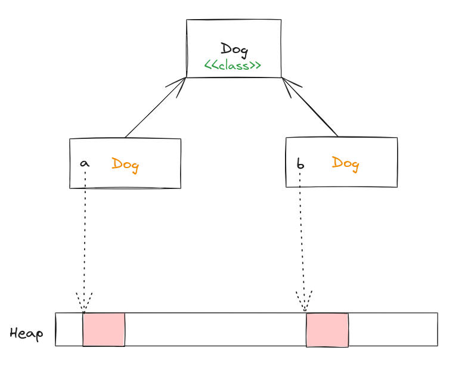

# 面向对象

## 类与对象

在 Java 中，除了基本类型变量，其他都是对象。类是对象的实例。

创建对象时的变量名只是一个引用（指针），这个引用是堆上的一个地址，真正的对象就在这个地址对应的内存区域上。



```{note}
所有的类都是 Class 类的对象，换而言之，我们定义的类在被加载时，本质上都是在创建一个 Class 对象。
```

## 三大特性

### 封装

尽可能地隐藏内部的细节，只保留一些对外接口使之与外部发生联系。用户无需知道对象内部的细节，但可以通过对象对外提供的接口来访问该对象。

### 继承

继承应该遵循里氏替换原则，子类对象必须能够替换掉所有父类对象。

接口实现也可以看作一种继承的继承，所以使用 Spring 写接口时，我们声明的依赖属性一般都是接口。

### 多态

- 编译时多态：
  - 主要指方法的重载
- 运行时多态：
  - 指程序中定义的对象引用所指向的具体类型在运行期间才确定

