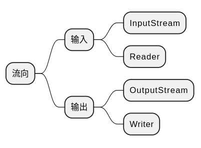
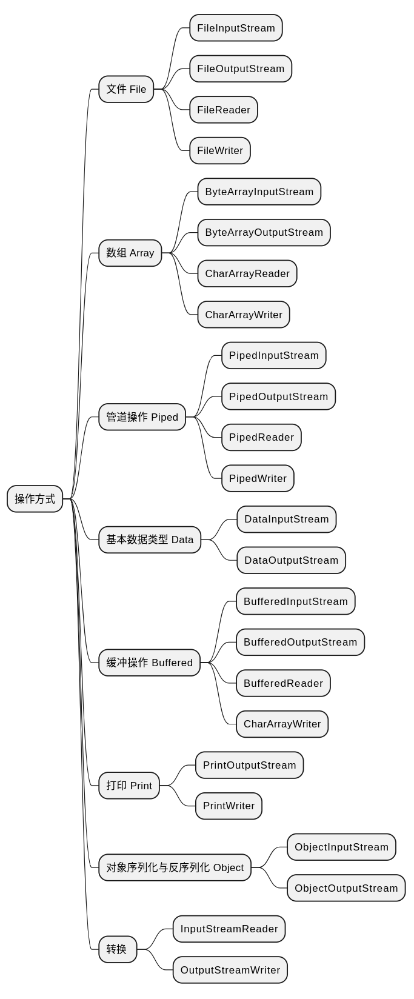
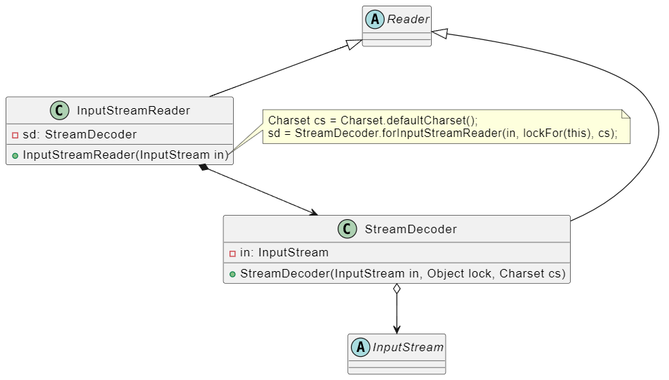

# Java OIO

Java OIO 就是 Java Old IO，也就是 `java.io` 包下定义的哪些类的 IO，是阻塞同步 IO。

## 按流向分类

这里的流向是站在 CPU 的角度进行设计的：



## 按传输方式分类


## 按数据操作分类



### 文件 File

- FileInputStream
- FileOutputStream
- FileReader
- FileWriter

FileInputStream 内部又一个文件描述符，读写本质上都调用 `native` 方法进行文件读写（经过JVM进行文件读写的系统调用），FileOutputStream 类似。
FileReader 本质上是使用装饰器模式，装饰一个FileInputStream，FileWriter 类似。

```Java
    // FileInputStream 构造方法
    public FileInputStream(File file) throws FileNotFoundException {
        String name = (file != null ? file.getPath() : null);
        fd = new FileDescriptor();
        fd.attach(this);
        path = name;
        open(name);
        FileCleanable.register(fd);       // open set the fd, register the cleanup
    }
```

```Java
    // FileReader 构造方法
    public FileReader(String fileName) throws FileNotFoundException {
        super(new FileInputStream(fileName));
    }
```

### 数组 Array

- ByteArrayInputStream
- ByteArrayOutputStream
- CharArrayReader
- CharArrayWriter

本质上都是内部定义了一个数组，读写都是对内部数组进行读写。

```Java
    protected byte[] buf;
    public ByteArrayInputStream(byte[] buf, int offset, int length) {
        this.buf = buf;
        this.pos = offset;
        this.count = Math.min(offset + length, buf.length);
        this.mark = offset;
    }
```

```Java
    protected char[] buf;
    public CharArrayReader(char[] buf) {
        this.buf = buf;
        this.pos = 0;
        this.count = buf.length;
    }
```

### 管道操作 Piped

- PipedInputStream
- PipedOutputStream
- PipedReader
- PipedWriter
这里的管道是进行线程间通信的。一个线程使用 writer 写数据，另外一个线程使用 reader 读取数据。

```Java
PipedWriter writer = new PipedWriter();
PipedReader reader = new PipedReader(writer);
```

### 基本数据类型 Data

- DataInputStream
- DataOutputStream

DataInputStream 本质上是使用装饰器模式，装饰一个 InputStream，然后提供 Java 基本数据类型的读取，DataOutputStream 类似。

```Java
    boolean readBoolean() throws IOException;
    byte readByte() throws IOException;
    int readUnsignedByte() throws IOException;
    short readShort() throws IOException;
    int readUnsignedShort() throws IOException;
    char readChar() throws IOException;
    int readInt() throws IOException;
    long readLong() throws IOException;
    float readFloat() throws IOException;
    double readDouble() throws IOException;
    String readLine() throws IOException;
```

### 缓冲操作 Buffered

- BufferedInputStream
- BufferedOutputStream
- BufferedReader
- BufferedWriter

BufferedInputStream 使用装饰器模式，装饰一个 InputStream，内部维护一个缓存数组（ `volatile byte[] buf`），进行批量读写，避免频繁系统调用，提高性能，其他类似。

```Java
    public int read() throws IOException {
        if (lock != null) {
            lock.lock();
            try {
                return implRead();
            } finally {
                lock.unlock();
            }
        } else {
            synchronized (this) {
                return implRead();
            }
        }
    }

    private int implRead() throws IOException {
        if (pos >= count) {
            fill();
            if (pos >= count)
                return -1;
        }
        return getBufIfOpen()[pos++] & 0xff;
    }
```

### 打印 Print

- PrintOutputStream
- PrintWriter

本质上都是使用装饰器模式，装饰一个其他的 Writer，然后提供了基本类型的输出。

```Java
print(char)
print(int)
print(float)
print(double)
print(long)
print(short)
print(Object)
```

### 对象序列化与反序列化 Object

- ObjectInputStream
- ObjectOutputStream

也是使用装饰器模式，装饰一个其他的流，然后提供了基本类型和`Object`的操作。

### 转换

- InputStreamReader
- OutputStreamWriter

InputStreamReader 继承了 Reader，使用装饰器模式，装饰一个 InputStream ，从而可以使原来的字节流具备字符操作的能力。OutputStreamWriter 同理。


