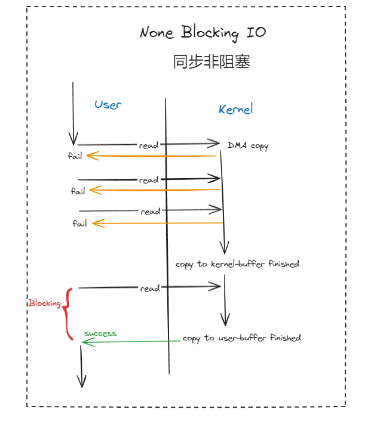
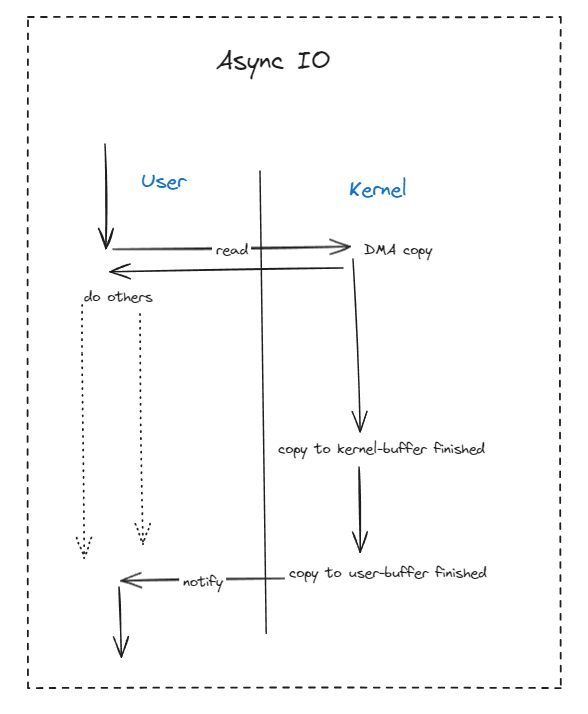

# 常见 IO 模型

## 概念说明

谈及 IO，必然少不了涉及 **阻塞、非阻塞、同步、异步** 这四个术语，到底这些术语代表什么意思？

### 阻塞与非阻塞 IO

其实阻塞和非阻塞是站在用户程序的角度去定义的，当用户程序发起 IO 调用后：
- 用户程序**必须等待** IO 完成，才能执行后续操作，那么就称这个 IO 调用是 **阻塞 IO**
- 用户程序**无须等待** IO 完成就立即返回，用户程序可以执行后续操作，那么就称这个 IO 调

### 同步与异步 IO

同步与异步是站在操作系统的角度去定义的，用户程序发起系统调用（`sysycall`）进行 IO 操作：
- OS 需要完成整个 IO 操作后，才会返回系统调用，这种 IO 就是 **同步 IO**.
- OS 无需完成整个 IO 操作，而是立即返回系统调用，未来完成整个 IO 操作后，再使用某种方式通知用户程序，这种 IO 就是 **异步 IO**.

## 阻塞 IO

Java 的 `java.io` 包下的类都是这种阻塞 IO.


## 同步非阻塞 IO



不断地轮询内核，这将占用大量的CPU时间，效率低下

## IO 多路复用

IO 多路复用技术是目前使用最广泛的 IO 模型，比如：
- select
- poll
- epoll

IO 多路复用其实是一种 **同步非阻塞 IO**，但在系统调用中做了优化，支持一次系统调用，检查多个 IO 文件描述符的状态，上述系统调用的区别主要在于其内部存储多个 IO 文件描述符的结构不同，从而导致检查多个 IO 的状态的时间复杂度不同。

```{note}
- **select** 本质上是扫描`fds`这个 bitmap，逐一检查，是否有需要处理的事件，64位 OS 最多支持 2048 个文件描述符(32位 OS 支持1024个).
- **poll** poll其实内部实现基本跟select一样，区别在于它们底层组织`fd[]`的数据结构不太一样，pollfd 结构没有固定长度的数组.
- **epoll**     

```


## 信号驱动 IO


## 异步 IO

