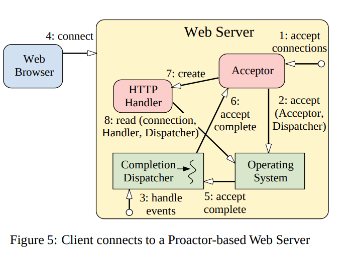
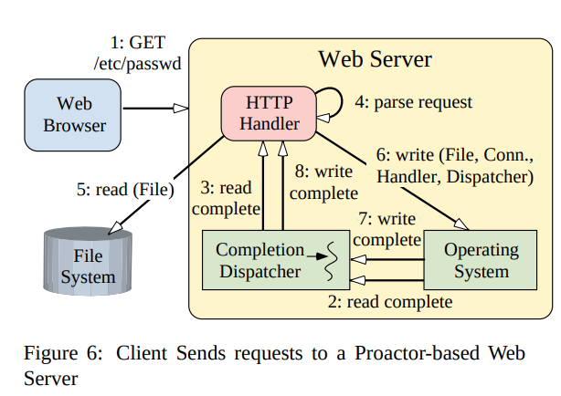

# Proactor[^1]

## 连接

1. The Web Server instructs the Acceptor to initiate an
asynchronous accept;
2. The Acceptor initiates an asynchronous accept with the
OS and passes itself as a Completion Handler
and a reference to the Completion Dispatcher
that will be used to notify the Acceptor upon completion of the asynchronous accept;
3. The Web Server invokes the event loop of the
Completion Dispatcher;
4. The client connects to the Web Server;
5. When the asynchronous accept operation completes,
the Operating System notifies the Completion
Dispatcher;
6. The Completion Dispatcher notifies the Acceptor;
7. The Acceptor creates an HTTP Handler;
8. The HTTP Handler initiates an asynchronous operation to read the request data from the client and passes
itself as a Completion Handler and a reference
to the Completion Dispatcher that will be used
to notify the HTTP Handler upon completion of the
asynchronous read.

## 读写

1. The client sends an HTTP GET request;
2. The read operation completes and the Operating
System notifies the Completion Dispatcher;
3. The Completion Dispatcher notifies the HTTP
Handler (steps 2 and 3 will repeat until the entire request has been received);
4. The HTTP Handler parses the request;
5. The HTTP Handler synchronously reads the requested file;
6. The HTTP Handler initiates an asynchronous operation to write the file data to the client connection and
passes itself as a Completion Handler and a reference to the Completion Dispatcher that will
be used to notify the HTTP Handler upon completion
of the asynchronous write;
7. When the write operation completes, the Operating System notifies the Completion Dispatcher;
8. The Completion Dispatcher then notifies the
Completion Handler (steps 6-8 continue until the
file has been delivered completely).

[^1]: [Proactor An Object Behavioral Pattern for De-multiplexing and Dispatching Handlers for Asynchronous Events. Irfan Pyarali, Tim Harrison, and Douglas C. Schmidt Thomas D. Jordan](https://www.dre.vanderbilt.edu/~schmidt/PDF/proactor.pdf)