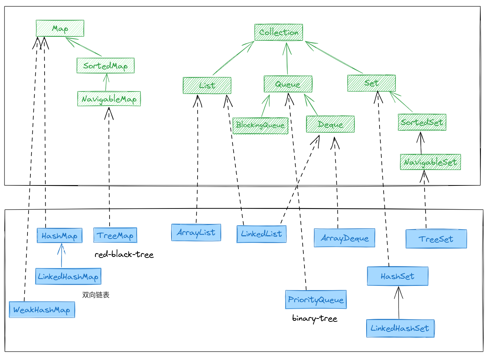
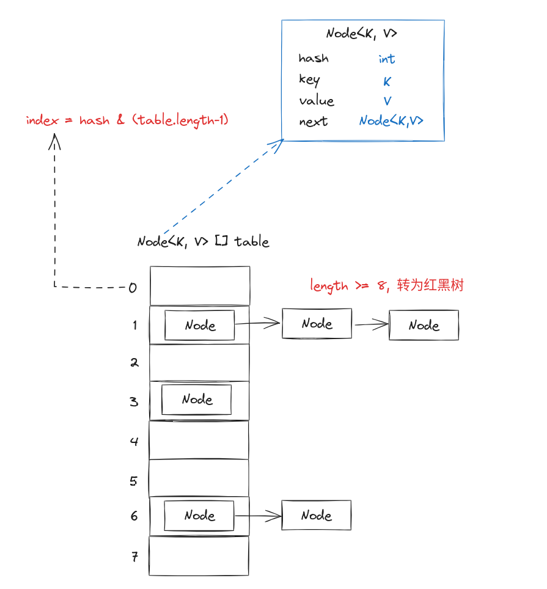

## 集合概述



## Map

### HashMap

基于哈希表实现，使用拉链法解决 hash 冲突问题，当冲突链表数大于 8 （可以调整）时，将链表转为红黑树。


### LinkedHashMap

继承了 HashMap，额外使用双向链表将 HashMap 的节点连接起来。

```Java
static class Entry<K,V> extends HashMap.Node<K,V> {
    Entry<K,V> before, after;
}

Node<K,V> newNode(int hash, K key, V value, Node<K,V> e) {
    LinkedHashMap.Entry<K,V> p = new LinkedHashMap.Entry<>(hash, key, value, e);
    linkNodeAtEnd(p);
    return p;
}
```

### TreeMap

基于红黑树实现，查找、插入、删除等操作的时间复杂度都是 O(log n)，可以按照 key 的大小顺序对 Map 中的元素进行排序。

```{note}
使用红黑树访问最小键的复杂度是 O(log n)， 所以优先级队列 `PriorityQueue` 是基于完全二叉树(complete binary tree)实现的小顶堆，其获取最小值的复杂度是 O(1)。
```

## List

### ArrayList

基于数组实现的集合，可以自动扩容。

### LinkedList

基于链表实现的集合，`LinkedList` 同时实现了 `List` 接口和 `Deque` 接口。

## Queue

### PriorityQueue

基于小顶堆实现的队列，使用完全二叉树(complete binary tree)实现。

### ArrayDeque

基于数组实现的双端队列，LinkedList 其实也是双端队列，但`ArrayDeque`性能更好。

`ArrayDeque` 也被 JDK 推荐为 `Stack` 类的替代选择，主要是`Stack`基于 `Vector` 实现，很多方法都使用了`synchronized`关键字，很多使用场景不会涉及线程安全问题，`ArrayDeque` 性能更好。

```Java
Deque<Integer> stack = new ArrayDeque<Integer>();
```

### BlockingQueue

| 操作  | Thrown exception | Special Value | Blocks | Times out |
| --- | --- | --- | --- | --- |
| Insert | add(e) | offer(e) | put(e) | offer(e, time, unit) |
| Remove | remove() | poll() | take() | poll(time, unit) |
| examine | element() | peek() | -   | -   |

- ArrayBlockingQueue
- LinkedBlockingQueue
- PriorityBlockingQueue
- DelayQueue
- SynchronousQueue

## Set

### HashSet

基于 HashMap 实现的 Set。

```java
public boolean add(E e) {
    return map.put(e, PRESENT)==null;
}
```

### TreeSet

基于 TreeMap 实现的 Set。
