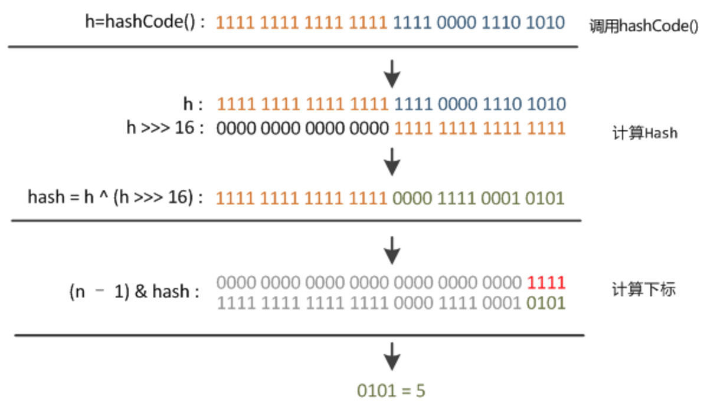

# HashMap实现

## 结构


## 计算 key 在哈希桶中的索引位置

**1.计算 hash 值**

```java
    static final int hash(Object key) {
        int h;
        return (key == null) ? 0 : (h = key.hashCode()) ^ (h >>> 16);
    }
```

其中 `(h = key.hashCode()) ^ (h >>> 16)` 可以高效利用的哈希码高16位和低16位，计算出hash值。

**2. 根据 hash 值和桶长度，计算索引位置。**

```java
table[(table.length - 1) & hash];
```

其中 `table.length` 总是 2^n, 效果等同于 `hash % table.length`，因为二进制表示 `2^n - 1` 时，其低 n
位的值都是`1`，所以与 hash 进行二进制与后，就只保留了 hash 的低 n 位 的 1，也就是索引值。


## 插入

- 哈希桶为空时扩容, 桶大小从 0 扩大为 16
- 根据 key 计算 hash 值，得到哈希桶索引值时 i
  - 此处不存在节点，直接插入
  - 此处存在节点
    - key 相同，直接覆盖
    - key 不同，遍历冲突链进行操作
      - 节点为只 TreeNode，向红黑树中插入键值对
      - 节点为 Node时，遍历链表，链表长度大于8就转为红黑树再插入, 否则将其插入链表中。
- 当前节点数量大于 capacity * loadFactor（默认 0.75）,则进行扩容操作

## 扩容

参考：

1. [Java 8系列之重新认识HashMap](https://tech.meituan.com/2016/06/24/java-hashmap.html)
2. [Map - HashSet & HashMap 源码解析](https://pdai.tech/md/java/collection/java-map-HashMap&HashSet.html)
