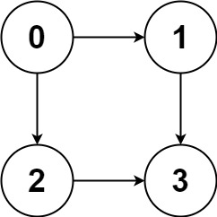
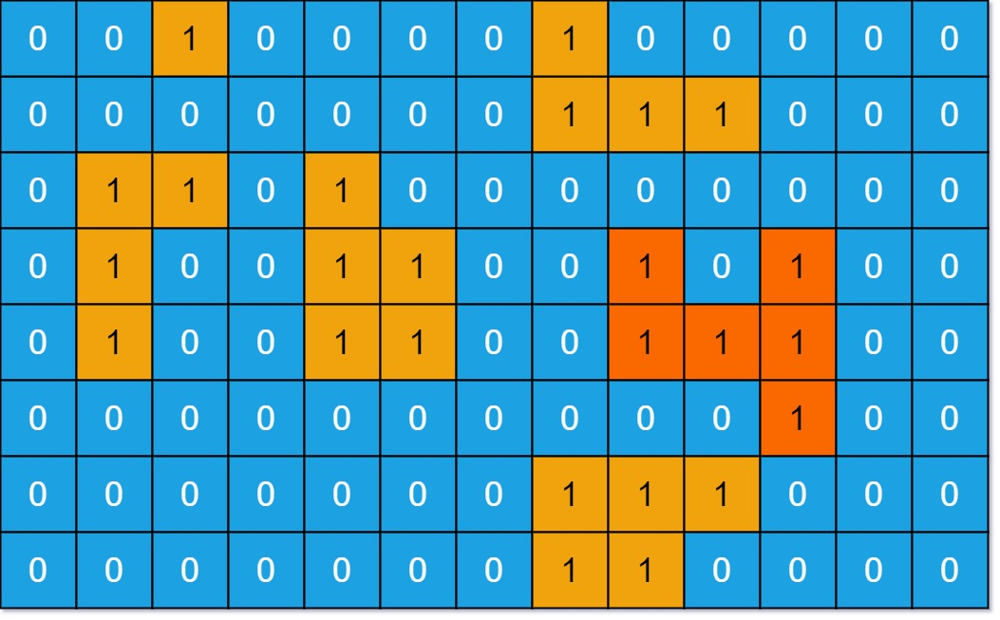

# 图的遍历

## 深度优先 DFS

### DFS 模板


主要是使用回溯的思想，借助递归实现

```Java
void dfs(参数) {
    if (终止条件) {
        存放结果;
        return;
    }

    for (选择：本节点所连接的其他节点) {
        处理节点;
        dfs(图，选择的节点); // 递归
        回溯，撤销处理结果
    }
}
```

### 797. 所有可能的路径

[797. 所有可能的路径](https://leetcode.cn/problems/all-paths-from-source-to-target/submissions/)
给你一个有 n 个节点的 有向无环图（DAG），请你找出所有从节点 0 到节点 n-1 的路径并输出（不要求按特定顺序）

`graph[i]` 是一个从节点 i 可以访问的所有节点的列表（即从节点 i 到节点 graph[i][j]存在一条有向边）。

示例 1：



输入：`graph = [[1,2],[3],[3],[]]`
输出：`[[0,1,3],[0,2,3]]`
解释：有两条路径 `0 -> 1 -> 3` 和 `0 -> 2 -> 3`


```java
class Solution {

    List<List<Integer>> result = new ArrayList<>();
    List<Integer> temp = new ArrayList<>();

    public List<List<Integer>> allPathsSourceTarget(int[][] graph) {
        temp.add(0);
        dfs(graph, 0, graph.length - 1);
        return result;
    }

    private void dfs(int[][] graph, int from, int dst) {
        if (from == dst) {
            result.add(new ArrayList<>(temp));
            return;
        }
        for (int i = 0; i < graph[from].length; i++) {
            // found
            temp.add(graph[from][i]);
            dfs(graph, graph[from][i], dst);
            temp.remove(temp.size() - 1);
        }
    }
}
```

### 200. 岛屿数量

[200. 岛屿数量](https://leetcode.cn/problems/number-of-islands/description/)
给你一个由 '1'（陆地）和 '0'（水）组成的的二维网格，请你计算网格中岛屿的数量。
岛屿总是被水包围，并且每座岛屿只能由水平方向和/或竖直方向上相邻的陆地连接形成。
此外，你可以假设该网格的四条边均被水包围。

示例 1：
输入：
```
grid = [
  ["1","1","1","1","0"],
  ["1","1","0","1","0"],
  ["1","1","0","0","0"],
  ["0","0","0","0","0"]
]
```
输出：1

```java
class Solution {

    int count = 0;
    public int numIslands(char[][] grid) {
        for (int i = 0; i < grid.length; i++) {
            for (int j = 0; j < grid[0].length; j++) {
                if (grid[i][j] == '1') {
                    count++;
                    dfs2(grid, i, j);
                }
            }
        }
        return count;
    }

    public void dfs2(char[][] grid, int row, int col) {
        if (!isValid(grid, col, row)) {
            return;
        }
        if (grid[row][col] != '1') {
            return;
        }
        // accessed
        grid[row][col] = 2;

        dfs2(grid, row, col - 1); // left
        dfs2(grid, row - 1, col); // top
        dfs2(grid, row, col + 1); // right
        dfs2(grid, row + 1, col); // bottom
    }

    private boolean isValid(char[][] grid, int col, int row) {
         return 0 <= col && col < grid[0].length
                && 0 <= row && row < grid.length;
    }
}
```


### 695. 岛屿的最大面积

[695. 岛屿的最大面积](https://leetcode.cn/problems/max-area-of-island/description/)

给你一个大小为 m x n 的二进制矩阵 grid 。

岛屿 是由一些相邻的 1 (代表土地) 构成的组合，这里的「相邻」要求两个 1 必须在 水平或者竖直的四个方向上 相邻。你可以假设 grid 的四个边缘都被 0（代表水）包围着。

岛屿的面积是岛上值为 1 的单元格的数目。

计算并返回 grid 中最大的岛屿面积。如果没有岛屿，则返回面积为 0 。

示例 1：


输入：
```
grid = [
    [0,0,1,0,0,0,0,1,0,0,0,0,0],
    [0,0,0,0,0,0,0,1,1,1,0,0,0],
    [0,1,1,0,1,0,0,0,0,0,0,0,0],
    [0,1,0,0,1,1,0,0,1,0,1,0,0],
    [0,1,0,0,1,1,0,0,1,1,1,0,0],
    [0,0,0,0,0,0,0,0,0,0,1,0,0],
    [0,0,0,0,0,0,0,1,1,1,0,0,0],
    [0,0,0,0,0,0,0,1,1,0,0,0,0]]
```
输出：6
解释：答案不应该是 11 ，因为岛屿只能包含水平或垂直这四个方向上的 1 。

```Java
class Solution {
    public int maxAreaOfIsland(int[][] grid) {
        int max = 0;
        for (int i = 0; i < grid.length; i++) {
            for (int j = 0; j < grid[0].length; j++) {
                if (grid[i][j] == 1) {
                    int area = dfs3(grid, i, j);
                    max = Math.max(area, max);
                }
            }
        }
        return max;
    }

    private int dfs3(int[][] grid, int row, int col) {
        if (!isValid(grid, row, col)) {
            return 0;
        }
        if (grid[row][col] != 1) {
            return 0;
        }
        // mark accessed
        grid[row][col] = 2;
        int left = dfs3(grid, row, col - 1);
        int top = dfs3(grid, row - 1, col);
        int right = dfs3(grid, row, col + 1);
        int bottom = dfs3(grid, row + 1, col);
        return 1 + left + top + right + bottom;
    }

    private static boolean isValid(int[][] grid, int row, int col) {
        return 0 <= row && row < grid.length
                && 0 <= col && col < grid[0].length;
    }
}
```

## 广度优先 BFS


### 广度搜索模板


主要是使用网格化的思想，向外扩张搜索，搜索过程中需要进行标记
```Java
    // grid[i][j] = 0  i-j 无连接
    // grid[i][j] = 1  i-j 有连接
    // grid[i][j] = 2  i-j 已经搜索过
    public void bfs(char[][] grid, int row, int col) {
        Queue<int[]> queue = new ArrayDeque<>();
        queue.add(new int[]{row, col});
        while (!queue.isEmpty()) {
            int[] top = queue.poll();
            row = top[0];
            col = top[1];
            if (isValid(grid, row, col) && grid[row][col] == '1') {
                // accessed
                queue.add(new int[]{row, col - 1}); // left
                queue.add(new int[]{row - 1, col}); // top
                queue.add(new int[]{row, col + 1}); // right
                queue.add(new int[]{row + 1, col}); // bottom
                grid[row][col] = 2; // 标记为已经访问过
            }
        }
    }

    // 网格边界判断
    private boolean isValid(char[][] grid, int row, int col) {
         return 0 <= col && col < grid[0].length
                && 0 <= row && row < grid.length;
    }
```

### 200. 岛屿数量

[200. 岛屿数量](https://leetcode.cn/problems/number-of-islands/description/)

```Java
class Solution {

    int count = 0;
    public int numIslands(char[][] grid) {
        for (int i = 0; i < grid.length; i++) {
            for (int j = 0; j < grid[0].length; j++) {
                if (grid[i][j] == '1') {
                    count++;
                    bfs2(grid, i, j);
                }
            }
        }
        return count;
    }

      public void bfs2(char[][] grid, int row, int col) {
        Queue<int[]> queue = new ArrayDeque<>();
        queue.add(new int[]{row, col});
        while (!queue.isEmpty()) {
            int[] top = queue.poll();
            row = top[0];
            col = top[1];
            if (isValid(grid, row, col) && grid[row][col] == '1') {
                // accessed
                queue.add(new int[]{row, col - 1}); // left
                queue.add(new int[]{row - 1, col}); // top
                queue.add(new int[]{row, col + 1}); // right
                queue.add(new int[]{row + 1, col}); // bottom
                grid[row][col] = 2;
            }
        }
    }

    private boolean isValid(char[][] grid, int row, int col) {
         return 0 <= col && col < grid[0].length
                && 0 <= row && row < grid.length;
    }
}
```

## 参考

1. [深度优先搜索理论基础. 代码随想录](https://programmercarl.com/kamacoder/%E5%9B%BE%E8%AE%BA%E6%B7%B1%E6%90%9C%E7%90%86%E8%AE%BA%E5%9F%BA%E7%A1%80.html)
2. [图论广搜理论基础. 代码随想录](https://programmercarl.com/kamacoder/%E5%9B%BE%E8%AE%BA%E5%B9%BF%E6%90%9C%E7%90%86%E8%AE%BA%E5%9F%BA%E7%A1%80.html)
