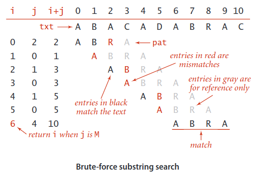
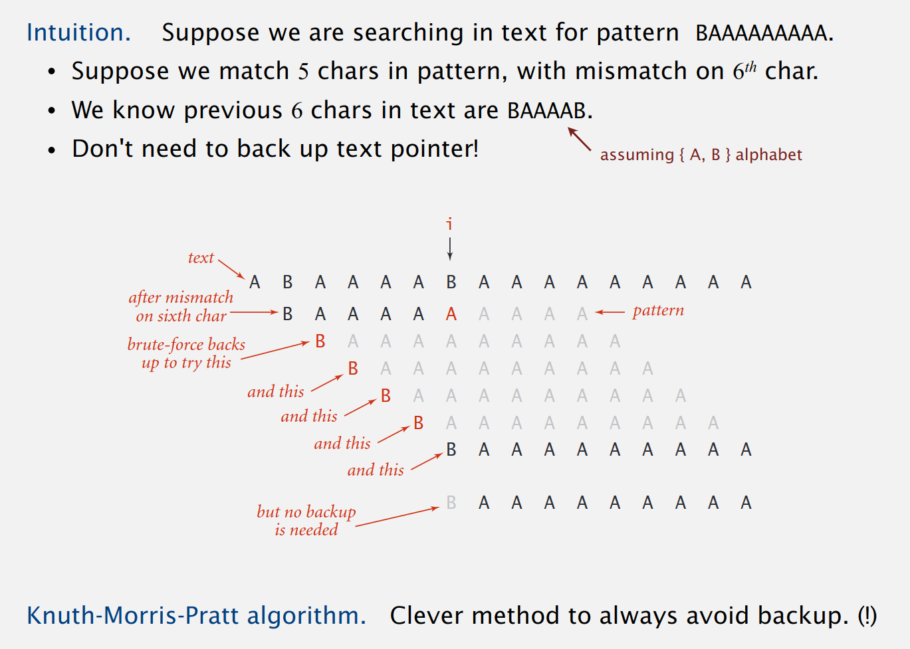
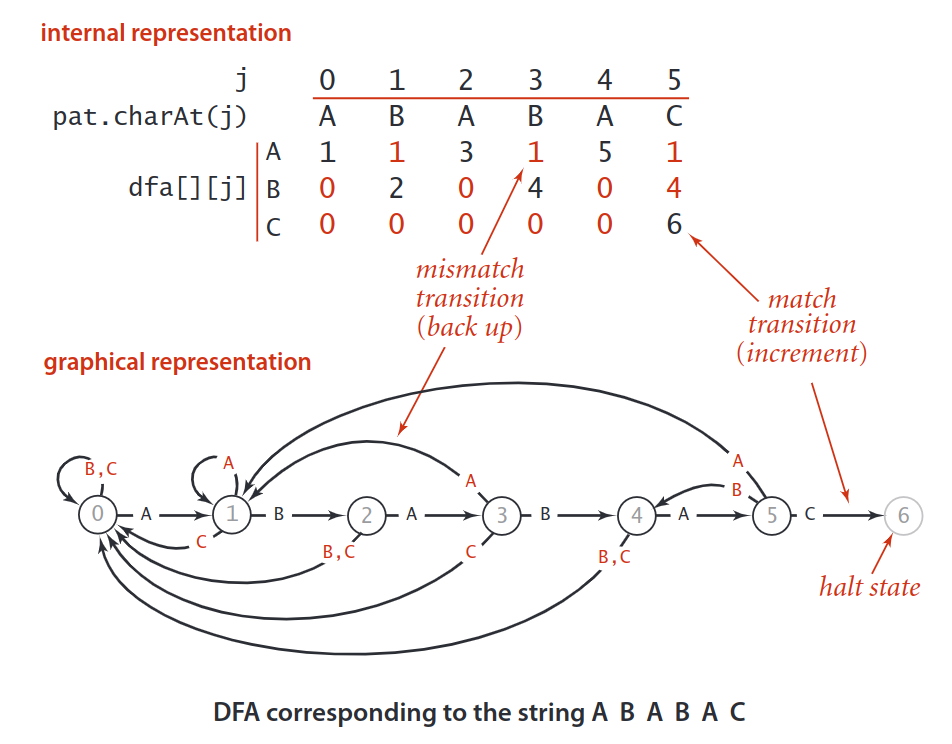

# 字符串搜索

## 暴力搜索



- `i` 是文本串的索引
- `j` 是模式串的索引

```Java
public static int search(String pat, String txt) {
    int M = pat.length(); 
    int N = txt.length(); 
    for (int i = 0; i <= N - M; i++) {
        int j; 
        for (j = 0; j < M; j++) 
            if (txt.charAt(i+j) != pat.charAt(j)) 
                break; 
        if (j == M)
            return i; // found 
    }
    return N; // not found 
}
```

暴力搜索中，需要不断回溯，时间复杂度为 O(M*N), 性能有优化空间，但实际场景中也足够使用了，JDK 使用暴力搜索实现 `indexOf(String str)`。

## KMP 搜索

KMP 的基本思想是：当遇到文本串于模式串不匹配的字符时，我们其实已经得知了文本串的一个子串是什么（就是模式串中不匹配字符之前的字符串）。我们可以利用这些已知子串避免文本串指针不断回溯。



比如上面的文本串和模式串匹配过程中，`i`是文本串的下标，`j` 是模式串的下标，当文本串指针指向图中`i`这个位置时，文本串中的字符`B`和模式串中的字符`A`不匹配了：

- 暴力搜索算法
  - 将文本串指针回溯到下标为`2`的位置，将`j`重置为`0`，继续匹配
  - 发现不匹配，再将文本串指针回溯到下标为`3`的位置，将`j`重置为`0`，继续匹配
  - 发现不匹配，再将文本串指针回溯到下标为`4`的位置，将`j`重置为`0`，继续匹配
  - 发现不匹配，再将文本串指针回溯到下标为`5`的位置，将`j`重置为`0`，继续匹配
  - 发现不匹配，再将文本串指针回溯到下标为`6`的位置，将`j`重置为`0`，继续匹配
  - 发现匹配，继续匹配
- 取巧一下：
  - 其实我们可以让`i`保持不变，将`j`置为`1`，开始继续匹配，因为我们可以通过肉眼看到文本串的前4个字符都是`A`，都与模式串的第一个字符`B`不匹配。

这次取巧仅限于当前这种情况，但是，我们凭借已经匹配的结果得知：**文本串和模式串的前`j-1`个字符是相同的**，利用这个信息，只需要将`j`重置为某个值，就不需要回溯`i`，而 KMP 算法就是提前利用模式串本身，推断出一份`j`的重置表。

### DFA 

使用 **确定有限状态自动机 DFA**（deterministic finite-state automaton）可以有效的说明这个模式匹配的过程。


模式串的长度就是状态机的状态数，模式串的下标`j`就代表相对应的状态，状态`0`就是相当于使用文本串去匹配模式串的第一个字符，状态`1`就相当于使用文本串去匹配模式串的第二个字符，其他类似，状态`6`就相当于使用文本串去匹配模式串的第七个个字符（也就是模式串的最后一个字符），如果状态及能转移到`6`，那就说明文本串和模式串已经匹配成功。

文本串可以不断的输入到状态机，如果当前输入字符和模式串匹配，状态机就可以顺利前进一位（右移，`j+1`），如果不匹配，那状态机就回后退或自旋（左移或不动，`j-[0..j]`）
