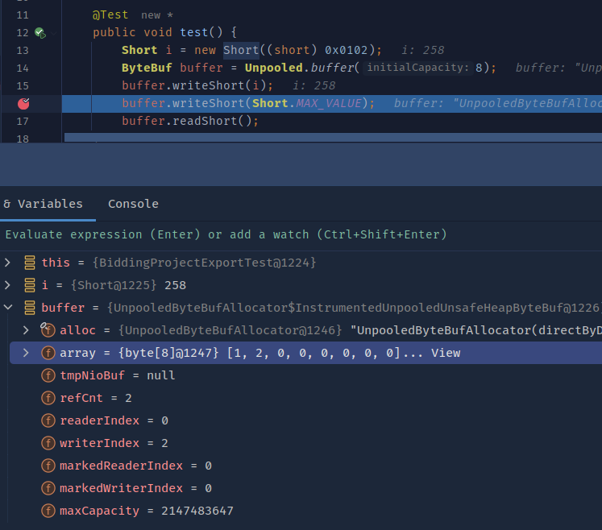
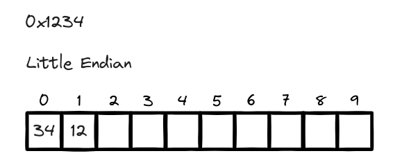

# 字节序列


## 大端模式


```{note}
大端模式和小端模式都是以字节为最小单元的，字节内部**位序列**不区分大小端（但有标记位的高低0-7），因为计算机内部的寄存器都足以一次性将一个字节的所有位加载进来，计算机的总线也足以同时读取一个字节的所有位（真正的并行读写），所以无须区分位顺序，串口的电气通讯协议会定义位顺序，所以上层协议也无须区分位顺序。
```



TCP/IP协议中使用的字节序是大端序，Java 也使用大端序列（X86 架构使用小端序列，JVM 会负责字节序列转换）

- 可读性高，从左到右符合人的阅读习惯
- 判断正负快，符号位在左边第一位（-1234）

## 小端模式



x86 和 ARM 这两种 CPU 架构都采用小端序

- 奇偶检查快，检查第一个位知道奇偶，大端模式必须读到最后一个字节的最后一个位
- 适合比较大小
- 适合乘法运算
- 适合类型转换