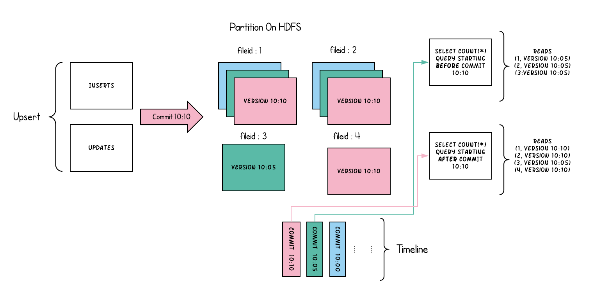

# Hudi 
## What‘s Hudi
通俗说：
- Hudi 是一种表格式
- Hudi 是一个事务层

上述没有错误，但不全面，最好说 Hudi 是一个围绕数据库内核构建的 **流式数据湖平台**。

## 文件布局
- 数据**表**对应分布式文件系统上的**文件夹**
- **表**被划分为不同的**分区（`partitions`）**
- 每个**分区**中包含多个**文件组（`file groups`）**
- 每个**文件组**中包含多个**文件片（`file slices`）**
- 每个**文件片**中包含一个**基文件（`base file`）**和多个**日志文件（`log`）**

需要说明的是，基文件是在`commit/compaction`时产生的，比如`.parquet/.orc`，取决于`hoodie.table.base.file.format`配置，默认为`PARQUET`。日志文件包含了从基文件产生以来，对基文件的所有`inserts/updates`。

## 表类型

### Copy on Write
Copy-On-Write 表中的文件片仅包含基文件，每次提交都会生成新版本的基文件。当数据被写入时：
- 对现有文件组的更新，会为该文件组生成一个带有提交时间标记的新切片
- 插入时分配一个新文件组，并为该文件组写入其第一个切片

### Merge on Read
将每个文件组的 upsert 存储到基于行的增量日志中，以通过在查询期间动态地将增量日志应用到每个文件 ID 的最新版本来支持快照查询.
- 读取优化查询时，只读取已经合并的基文件，不会发生合并操作，但也可能会导致读取不到最新数据。
- 在每个文件 ID 组中，现在都有一个增量日志文件，它包含对基文件中的记录的更新操作日志;
