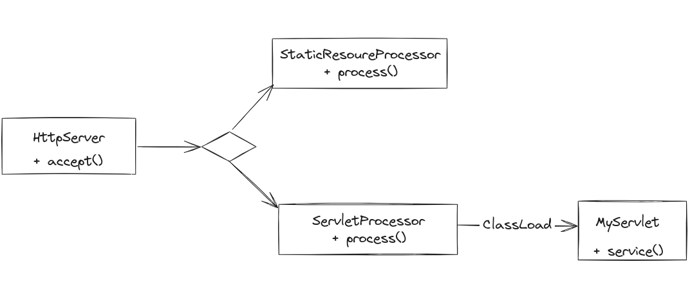
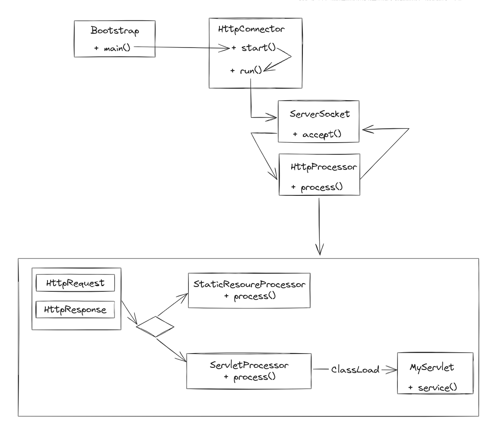
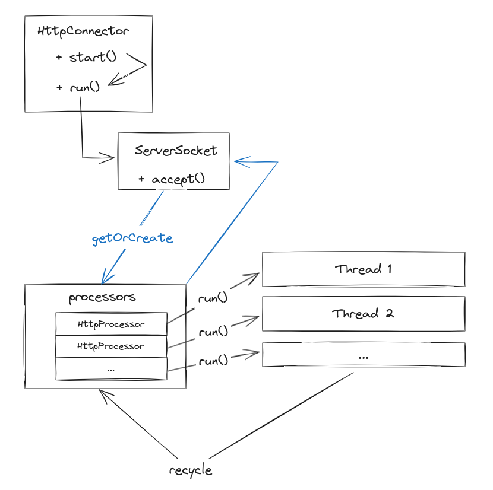

# How-tomcat-works

## 一个简单的请求处理程序


## 引入 `HttpConnector`


## Tomcat 的默认连接器

默认连接器支持 HTTP 1.1 新特性
- 持久连接： `Connection: keep-alive`
- 管道化： 允许客户端发送多个请求到服务器而无需等待之前的响应
- 块编码： 允许服务器将响应分成一系列的块，每个块之间以长度字段进行分隔

默认连接器主要使用了多线程处理请求，每一个 `HttpProcessor` 都在一个独立的线程中运行，
但并不总为每个请求创建新的 `HttpProcessor` 实例，而是使用了池化技术。



## 核心组件

### Servlet

```{uml}
@startuml
skinparam DefaultFontName Source Code Pro
skinparam DefaultFontSize 15
skinparam RankSep 50

package "Commerce" {
  node "High Level Components" {
    component ProductCatalog
  }

  node "Abstractions" {
    component ProductFactory
  }

  node "Low Level Components" {
    component SQLProductRepository
  }

  ProductCatalog ..> ProductFactory: depends on
  ProductFactory ..> SQLProductRepository: depends on
}
@enduml
```


### Container