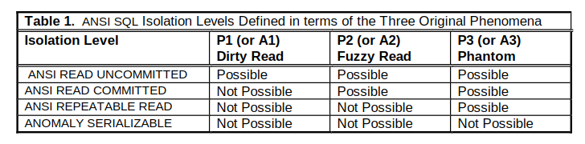
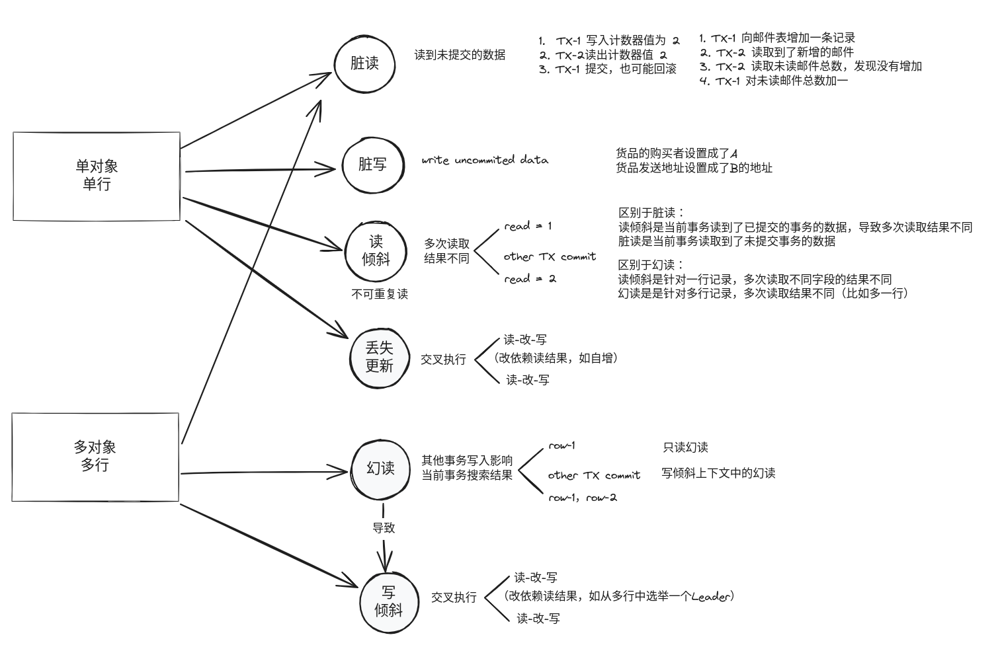
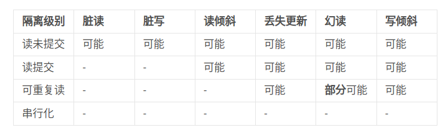

弱隔离级别
================

数据库通过 **事务** 提供安全保障，``ACID`` 具体的描述了这些安全保障包括哪些方面。其中 ``I`` 代表 **隔离性（Isolation）** 意味着同时执行的事务是相互隔离的：它们不能相互冒犯。

传统的数据库教科书甚至将隔离性形式化为 **可串行化（Serializability）**, 但是串行化会大大降低数据库的性能，因此主流数据库又定义了不同级别的 **弱隔离级别**。

反过来描述，在没有事务提供隔离性时，数据库系统面临哪些问题？根据应用对这些问题可容忍的程度，可划分出不同的隔离级别，比如下面这份流性的隔离级别表 [1]_ 提供了不同隔离级别可能遇到的问题：

接下来我们来详细讨论下不同隔离级别可能遇到哪些问题，又如何解决。

.. hint:: 
   1. 读倾斜也叫不可重复读；
   2. 读倾斜是指多次读取同一对象（同一行数据），发现结果可能不同，幻读是指多次读取多个对象，读取的结果可能读取到了不想被读到的对象，也可能没有读到期望被读到数据，从而影响最终结果的一种现象。
   3. 可重复读隔离级别可以解决部分的幻读，是指使用快照技术实现可重复读，可以防止一个事务中多次读取结果不同的问题，但避免不了写入偏差上下文中的幻读。

相关文章
--------
.. toctree::
   :maxdepth: 2

   a1-脏读
   a2-脏写
   a3-读倾斜
   a4-丢失更新
   a5-幻读
   a6-写倾斜

..  [1] Hal Berenson, Philip A. Bernstein, Jim N. Gray, et al.: “`A Critique of ANSI SQL Isolation Levels" <https://www.microsoft.com/en-us/research/wp-content/uploads/2016/02/tr-95-51.pdf>`_ ” at ACM International Conference on Management of Data (SIGMOD), May 1995.