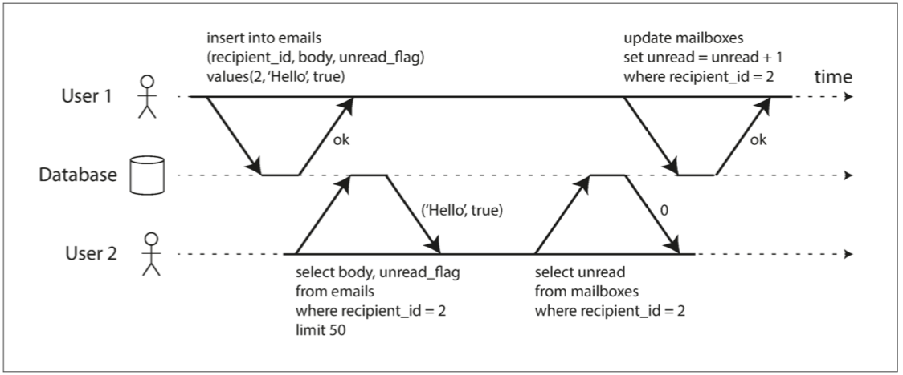
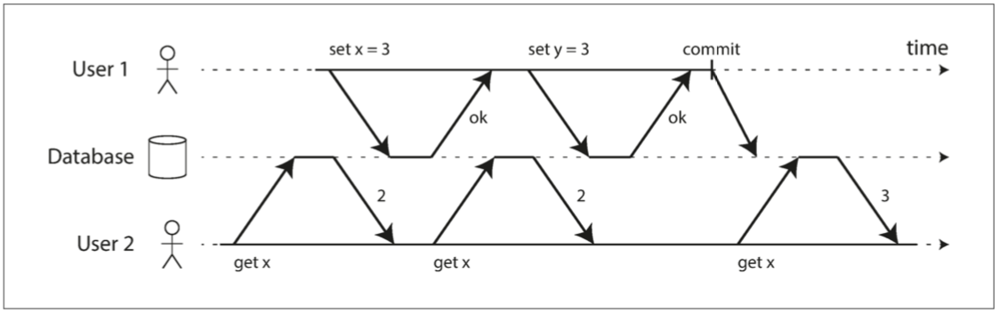

# 弱隔离级别可能出现的问题

## 隔离级别 Isolation

数据库通过**事务**提供安全保障，ACID 具体的描述了这些安全保障包括哪些方面。其中 **Isolation** 意味着同时执行的事务是相互隔离的：它们不能相互冒犯。传统的数据库教科书将隔离性形式化为 **可串行化（Serializability）**。

串行化会大大降低数据库的性能，因此主流数据库又定义了不同级别的**弱隔离级别**。反过来描述，在没有事务提供隔离性时，数据库系统面临哪些问题？根据应用对这些问题可容忍的程度，可划分出不同的隔离级别，比如下面这份流性的隔离级别表[^1]提供了不同隔离级别可能遇到的问题：

| 隔离级别 | Dirty Write | Dirty Read | Fuzzy read（Non-Repeatable Read） | Phantom |
| --- | --- | --- | --- | --- |
| 读未提交 | ✔   | ✔   | ✔   | ✔   |
| 读提交 |     |     | ✔   | ✔   |
| 可重复读 |     |     |     | ✔   |
| 串行化 |     |     |     |     |

接下来我们来详细讨论下不同隔离级别可能遇到哪些问题，又如何解决。

## 脏读

**脏读（Dirty Read）**：一个事务读取另一个事务提交的写入。

用单独的字段存储未读邮件的数量，每当一个新消息写入时，必须也增长未读计数器。

但是如果没有任何隔离措施，上图所示的 User2 就会发生脏读：

- 邮件列表里显示有未读消息，但计数器显示为零未读消息，因为计数器增长还没有发生。

**如何防止脏读？**

- 使用**行锁**，但是对性能影响大
- 对于写入的每个对象，数据库都会记住旧的已提交值，和由当前持有写入锁的事务设置的新值。当事务正在进行时，任何其他读取对象的事务都会拿到旧值。只有当新值提交后，事务才会切换到读取新值。

## 脏写

**脏写（Dirty Write）**： 来自不同事务的冲突写入可能会混淆在一起。（两个事务同时尝试更新数据库中的相同对象的不同部分）

Alice 和 Bob 两个人同时试图购买同一辆车。购买汽车需要两次数据库写入：

1. 网站上的商品列表需要更新，以反映买家的购买
2. 售发票需要发送给买家

如果没有隔离保障，就会发生上面的情况，销售是属于 Bob 的（因为他成功更新了商品列表），但发票却寄送给了 Alice（因为她成功更新了发票表）

**如何防止脏写？**

- 数据库通过使用 行锁（row-level lock） 来防止脏写。

## 不可重复读

## 

[^1]: Hal Berenson, Philip A. Bernstein, Jim N. Gray, et al.: “[A Critique of ANSI SQL Isolation Levels](https://www.microsoft.com/en-us/research/wp-content/uploads/2016/02/tr-95-51.pdf)” at ACM International Conference on Management of Data (SIGMOD), May 1995.