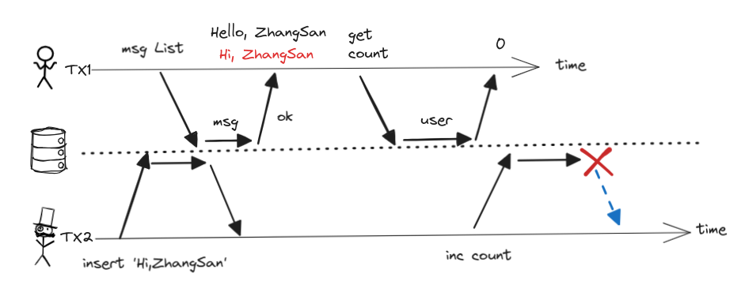

# 脏读

## 什么是脏读

**脏读（Dirty Read）**：一个客户端读取到另一个客户端尚**未提交**的写入。

**读已提交** 或更强的隔离级别可以防止脏读。

## 例子

### 单对象脏读

当事务读取到了其他事务对当前对象（数据库中的同一行记录）未提交的修改。


如上图所示，TX1 读取到了 TX2 未提交的写入 `counter=2`，如果 TX2 事务发生异常回滚，问题就发生了，后续 TX1 发现自己读取到的 `counter` 又变为 1 了。

### 多对象脏读

当一个事务需要对数据库进行多次写入，且涉及多个对象时，当前事务


用单独的字段存储未消息的数量，每当一个新消息写入时，必须也增长未读计数器。

```
+----+----------+------------------+
| id | name     | msg_unread_count |
+----+----------+------------------+
| 1  | ZhangSan | 0                |
| 2  | LiSi     | 0                |
+----+----------+------------------+

+----+---------+-----------------+-----------+
| id | user_id | msg             | read_flag |
+----+---------+-----------------+-----------+
| 1  | 1       | Hello, ZhangSan | 1         |
| 2  | 2       | Hello, SiLi     | 1         |
| 3  | 1       | Hi, ZhangSan    | 0         |
+----+---------+-----------------+-----------+
```



但是如果没有任何隔离措施，上图所示的 User2 就会发生脏读：

- 邮件列表里显示有未读消息，但计数器显示为零未读消息，因为计数器增长还没有发生。

## 脏读产生的问题

为什么要防止脏读，有几个原因：

- 如果事务需要更新多个对象，脏读取意味着另一个事务可能会只看到一部分更新。
  - 用户看到新的未读电子邮件，但看不到更新的计数器，这就是电子邮件的脏读。
  - 看到处于部分更新状态的数据库会让用户感到困惑，并可能导致其他事务做出错误的决定。
- 如果事务中止，则所有写入操作都需要回滚。如果数据库允许脏读，那就意味着一个事务可能会看到稍后需要回滚的数据，即从未实际提交给数据库的数据。想想后果就让人头大。

## 如何避免脏读

### 行锁

- 使用**行锁**，但是对性能影响大

### 多版本

- 对于写入的每个对象，数据库都会记住旧的已提交值，和由当前持有写入锁的事务设置的新值。当事务正在进行时，任何其他读取对象的事务都会拿到旧值。只有当新值提交后，事务才会切换到读取新值（实际上就是多版本并发控制 MVVC）。

用户 1 设置了 x = 3，但用户 2 的 get x 仍旧返回旧值 2 （当用户 1 尚未提交时）。

