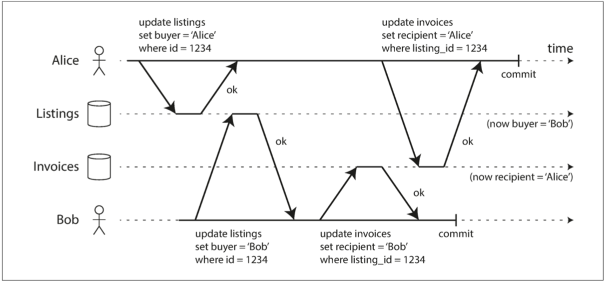

# 脏写

## 概述

**脏写（Dirty Write）**： 来自不同事务的冲突写入可能会混淆在一起。（两个事务同时尝试更新数据库中的相同对象的不同部分）

**读已提交（Read Committed）** 或更强的隔离级别可以防止脏写。

## 发生情景

Alice 和 Bob 两个人同时试图购买同一辆车。购买汽车需要两次数据库写入：

1. 网站上的商品列表需要更新，以反映买家的购买
2. 售发票需要发送给买家

如果没有隔离保障，就会发生上面的情况：

- 买家是 Bob （因为他成功更新了商品列表）
- 但发票却寄送给了 Alice（因为她成功更新了发票表）

## 防止脏写

数据库通过使用 **行锁（row-level lock）** 来防止脏写。