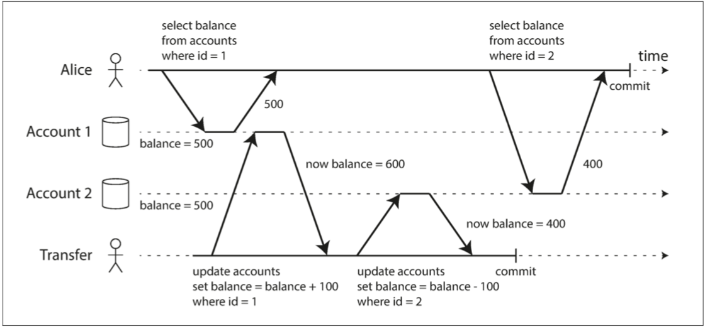

# 读倾斜（不可重复读）

## 概述

**读倾斜（Read Skew）** 也叫**不可重复读（non-repeatable read）** 指的是在同一个事务中，客户端在不同的时间点会看见数据库**一个对象**（数据库行）的不同状态。

**可重复读** 或更强的隔离级别可以防止读倾斜。

读倾斜描述的现象是：在事务的不同时间点，读相同对象（数据库行），结果却可能不相同，两次读取中间有其他事务写入提交，影响读结果。

```{note}
区别于脏读
 - 读倾斜是当前事务读到了已提交的事务的数据，导致多次读取结果不同
 - 脏读是当前事务读取到了未提交事务的数据。

区别于幻读
 - 读倾斜是针对一行记录，多次读取不同字段的结果不同
 - 幻读是是针对多行记录，多次读取结果不同（比如多一行）
```

## 发生情景



Alice 在银行有 1000 美元的储蓄，分为两个账户，每个 500 美元。现在有一笔事务从她的一个账户转移了 100 美元到另一个账户。如果她非常不幸地在事务处理的过程中查看其账户余额列表，她可能会在收到付款之前先看到一个账户的余额（收款账户，余额仍为 500 美元），在发出转账之后再看到另一个账户的余额（付款账户，新余额为 400 美元）。对 Alice 来说，现在她的账户似乎总共只有 900 美元 —— 看起来有 100 美元已经凭空消失了。


## 避免读倾斜

有些情况是不能容忍这种现象的，比如：

- 备份
  - 进行备份需要复制整个数据库，对大型数据库而言可能需要花费数小时才能完成。备份进程运行时，数据库仍然会接受写入操作。因此备份可能会包含一些旧的部分和一些新的部分。如果从这样的备份中恢复，那么不一致（如消失的钱）就会变成永久的。
- 分析查询和完整性检查
  - 有时，你可能需要运行一个查询，扫描大部分的数据库，也可能是定期完整性检查（即监视数据损坏）的一部分。如果这些查询在不同时间点观察数据库的不同部分，则可能会返回毫无意义的结果。

因此必须防止读倾斜，主流方案是使用 [快照隔离](#快照隔离) 技术防止读倾斜，也可以使用 [写时拷贝](#写时拷贝) 防止读倾斜。

{#快照隔离}
### 快照隔离

通常使用 **快照隔离（snapshot isolation）** 技术避免读倾斜。

每个事务都从数据库的 一致快照（consistent snapshot） 中读取 —— 也就是说，事务可以看到事务开始时在数据库中提交的所有数据。即使这些数据随后被另一个事务更改，每个事务也只能看到该特定时间点的旧数据。

快照隔离可以理解为：一个事务可以看到数据库在某个特定时间点冻结时的一致快照。

```{note}
实现快照隔离，数据库可能需要保留一个对象的几个不同的提交版本，因为各种正在进行的事务可能需要看到数据库在不同的时间点的状态。因为它同时维护着单个对象的多个版本，所以这种技术被称为 **多版本并发控制（MVCC, multi-version concurrency control）**。
```

{#写时拷贝}
### 写时拷贝

在 CouchDB、Datomic 和 LMDB 中使用另一种方法。虽然它们也使用 B 树，但它们使用的是一种 仅追加 / 写时拷贝（append-only/copy-on-write） 的变体，它们在更新时不覆盖树的页面，而为每个修改页面创建一份副本。从父页面直到树根都会级联更新，以指向它们子页面的新版本。任何不受写入影响的页面都不需要被复制，并且保持不变。

使用仅追加的 B 树，每个写入事务（或一批事务）都会创建一棵新的 B 树，当创建时，从该特定树根生长的树就是数据库的一个一致性快照。