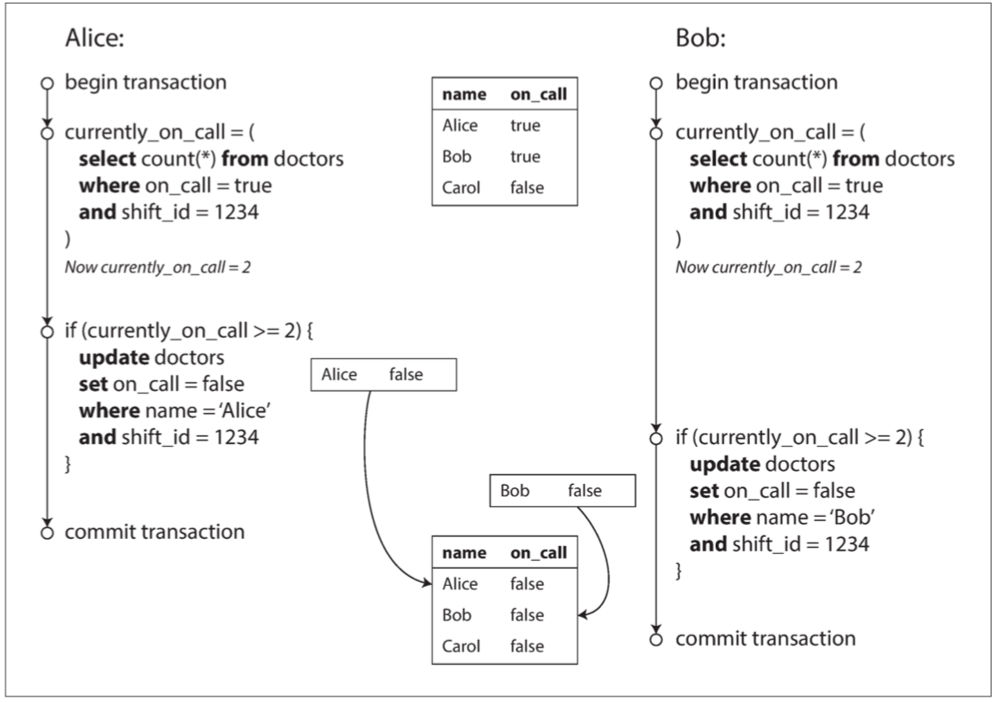

# 写倾斜

## 概述

在医生值班例子： 你正在为医院写一个医生轮班管理程序。医院通常会同时要求几位医生待命，但底线是至少有一位医生在待命。医生可以放弃他们的班次（例如，如果他们自己生病了），只要至少有一个同事在这一班中继续工作。
现在想象一下，Alice 和 Bob 是两位值班医生。两人都感到不适，所以他们都决定请假。不幸的是，他们恰好在同一时间点击按钮下班， 下图说明了接下来的事情。

在两个事务中，应用首先检查是否有两个或以上的医生正在值班；如果是的话，它就假定一名医生可以安全地休班。由于数据库使用快照隔离，两次检查都返回 2 ，所以两个事务都进入下一个阶段。Alice 更新自己的记录休班了，而 Bob 也做了一样的事情。两个事务都成功提交了，现在没有医生值班了。违反了至少有一名医生在值班的要求。

这种异常称为 **写倾斜（Write Skew）**。它既不是 脏写，也不是 丢失更新，因为这两个事务正在更新两个不同的对象（Alice 和 Bob 各自的待命记录）。

可以将写入偏差视为丢失更新问题的一般化：

- 如果两个事务读取相同的对象，然后更新其中一些对象（不同的事务可能更新不同的对象），则可能发生写入偏差
- 在多个事务更新同一个对象的特殊情况下，就会发生脏写或丢失更新（取决于时序）

写倾斜是幻读引起的，因此写倾斜的更多例子和避免方案可以参考[幻读](project:./a5-幻读.md)

