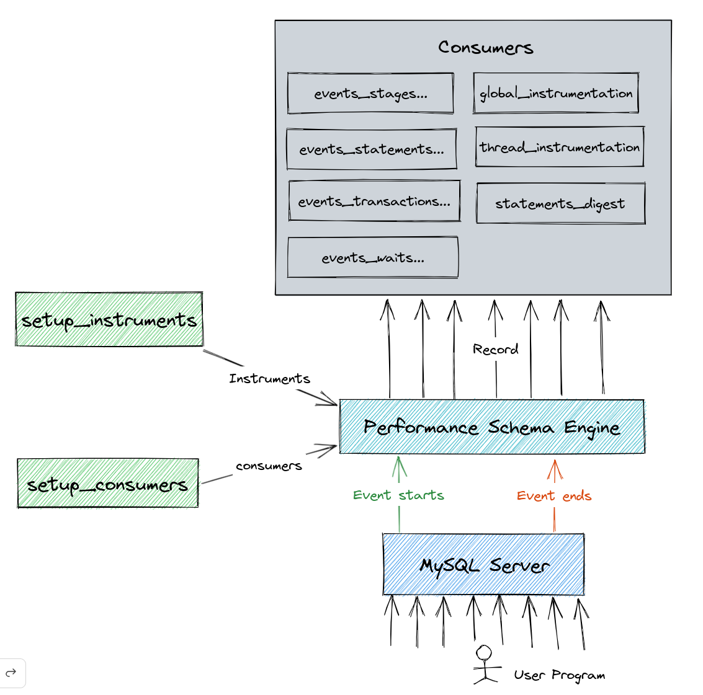

# Mysql自带监控表

## 介绍

在高负载下调优数据库性能是一个迭代循环的过程。每次进行更改以调优数据库的性能时，都需要了解更改是否有什么影响[^1]。

1. 查询速度比以前快吗？
2. 锁是否会减慢应用程序的速度，或者是否已经完全消失了？
3. 内存使用情况改变了吗？
4. 等待磁盘的时间改变了吗？

从哪里去观测这些变化呢？答案就是 Performance Schema。Performance Schema 提供了 MySQL 服务器运行时的资源消耗、资源等待监控[^2]。



为了解 Performance Schema 的工作原理，需要先了解**Instruments**和**消Consumer**这两个概念。

### Instrument

Instrument 就是 MySQL 所定义的一系列事件编码，代表那些可以被监控的 MySQL 的代码块。
比如`wait/lock/meta-data/sql/mdl`代表元数据锁的使用情况，更多定义见`setup_instruments`表。

### Consumer

Consumer 就是用来记录监控结果的那些表。如果启用了`statement/sql/select` instrument, 相应的消费者表中就会记录查询执行总数、未使用索引的次数、花费的时间等信息。

```{note}
Performance Schema 收集的数据保存在内存中。可以通过设置消费者表的最大大小来限制其使用的内存量。
```

## 可以做哪些分析？

## 如何分析

## 性能影响

## 参考

[^1]: [高性能MySQL（第4版）](https://m.douban.com/book/subject/23008813/).
[^2]: [MySQL调优性能监控之 performance schema](https://learnku.com/articles/62427).
