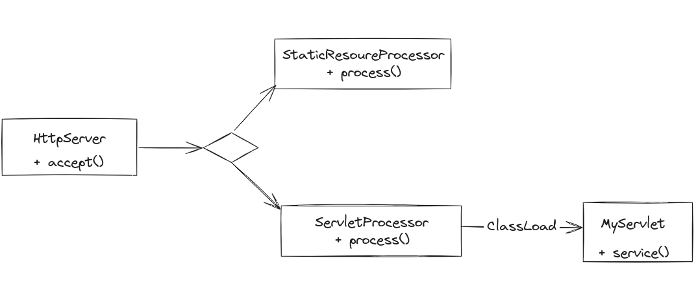
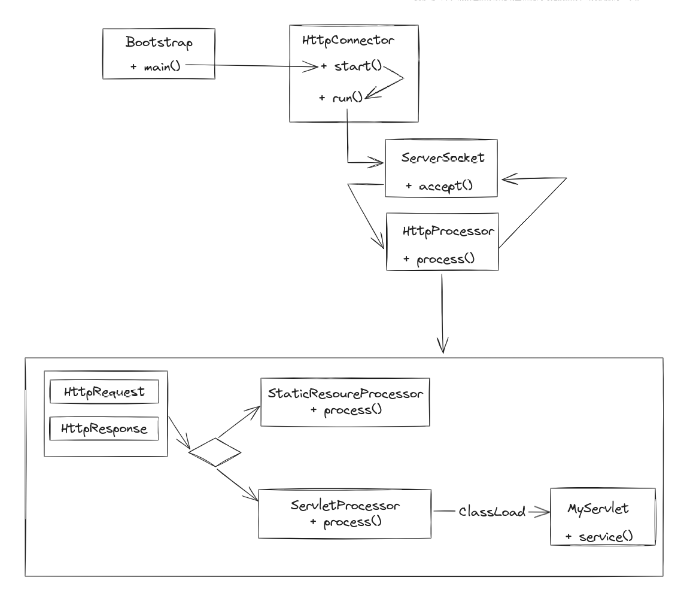

# How-tomcat-works

## 一个简单的请求处理程序


## 引入 `HttpConnector`


## Tomcat 的默认连接器

默认连接器支持 HTTP 1.1 新特性
- 持久连接： `Connection: keep-alive`
- 管道化： 允许客户端发送多个请求到服务器而无需等待之前的响应
- 块编码： 允许服务器将响应分成一系列的块，每个块之间以长度字段进行分隔

默认连接器主要使用了多线程处理请求，每一个 `HttpProcessor` 都在一个独立的线程中运行，
但并不总为每个请求创建新的 `HttpProcessor` 实例，而是使用了池化技术。


## 容器 Container
容器就是一个能够处理 Servlet 请求，并且能够将响应结果返回给客户端的模块。

```{uml}
interface Container
interface Engine extends Container
interface Host extends Container
interface Context extends Container
interface Wrapper extends Container

class StandardEngine implements Engine
class StandardHost implements Host
class StandardContext implements Context
class StandardWrapper implements Wrapper

StandardEngine "1" *-- "many" StandardHost
StandardHost "1" *-- "many" StandardContext
StandardContext "1" *-- "many" StandardWrapper

note top of Engine : 整个 Catalina Servlet 引擎
note bottom of Host : 一个虚拟主机
note bottom of Context : 一个 web 应用
note top of Wrapper : 一个 Servlet 请求(接口)
```

### 管道 Pipelining 


### Container