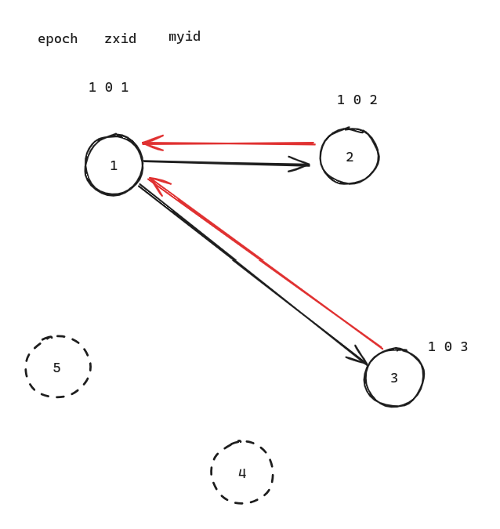
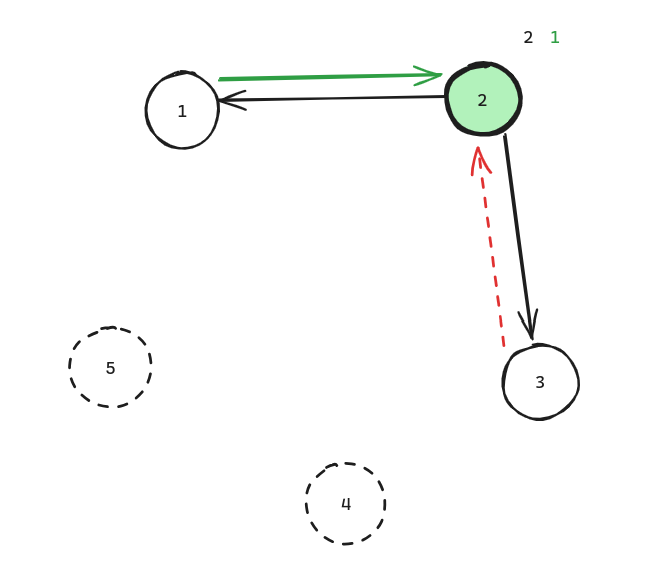
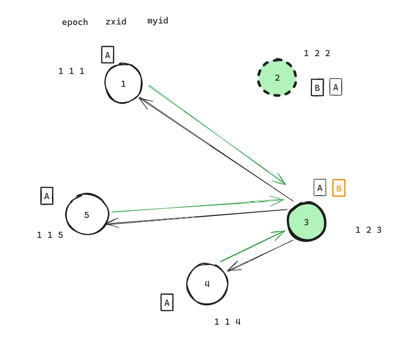
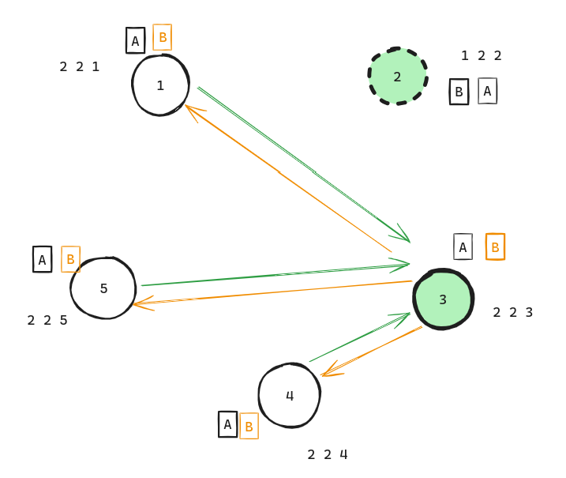
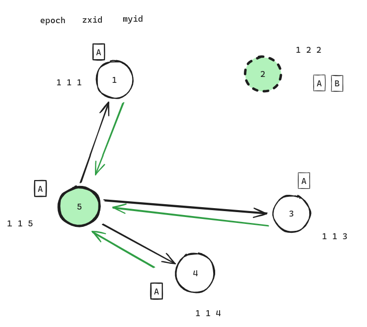
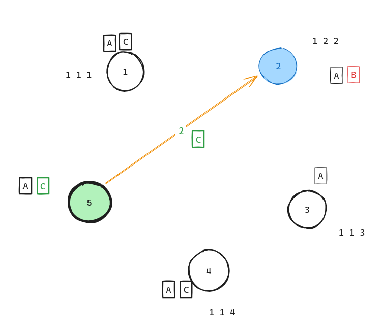

# ZooKeeper ZAB

ZooKeeper Atomic Broadcast

## 对比顺序

epoch -> zxid -> myid

- epoch 是选举轮次，代表当前进行了几次选举
- zxid 是 zk 的事务 ID，是一个递增序列
- myid 是 zk 实例的身份编号，启动时指定

## Leader 选举

第一次启动，epoch 、 zxid 都相同，每个节点先投自己一票，然后从其他节点拉票

4, 5 节点还没有启动，就没有参与到投票，2 号比 3 号先拉到别人的投票（1,2 节点都投票给2号），此事，超过集群半数投票给2号，那么2号成为Leader

## 换代后同步数据

2 号挂了，大家都  epoch 都是 1, 但是 3 号 zxid=2 ，比其他节点都大，3号会成为 Leader

3 号成为 Leader 后，需要让其他节点的zxid追上自己，于时会同步自己多出来的数据`B`给其他节点，从而实现分布式数据的一致性

## 换代后覆盖数据

2 号还没有将 B 同步其他节点就挂了，5号被选举为新Leader

新集群中有新数据 C 了，这个时侯 2 号又活过来了，但是集群中 zxid = 2 的位置现在都是 C，虽然 2 号 zxid = 2 位置已经有数据B，但保证集群数据一致性，zxid = 2 位置会被覆盖为 C

