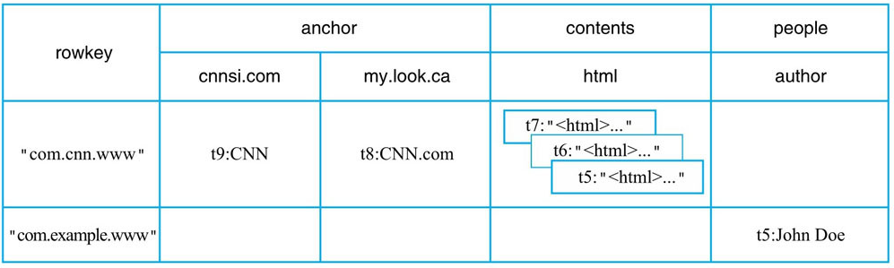
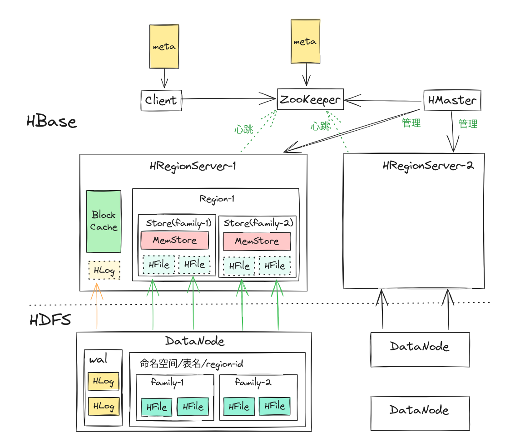
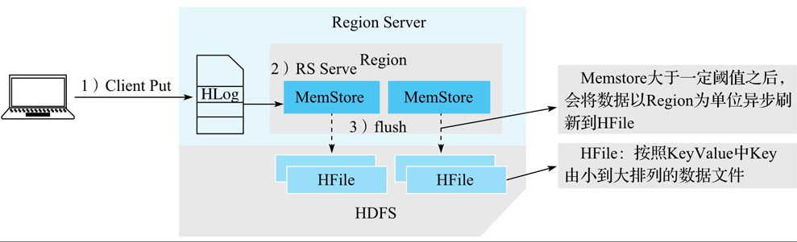
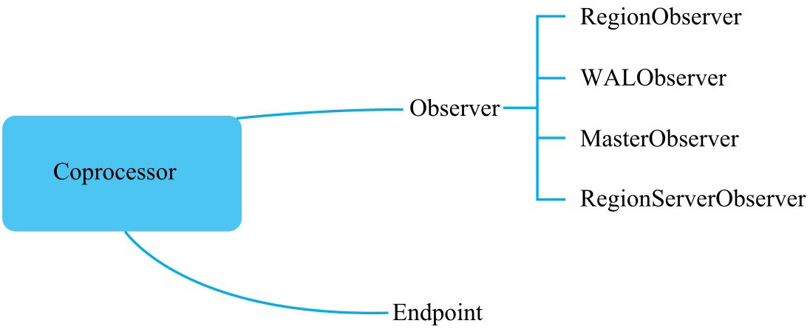

# Hbase

## 数据模型

### 逻辑模型



- table
- row
- family
- column
- cell（带时间戳，支持多版本）

本质上是一个 多维稀疏排序 Map

```Json
{"com.cnn.www","anchor","cnnsi.com","put","t9"} -> "CNN"

{"com.cnn.www","anchor","my.look.ca","put","t8"} -> "CNN.com"
{"com.cnn.www","contents","html","put","t7"} -> "<html>..."
{"com.cnn.www","contents","html","put","t6"} -> "<html>..."
{"com.cnn.www","contents","html","put","t5"} -> "<html>..."
{"com.example.www","people","author","put","t5"} -> "John Doe"
```

### 物理视图

HFile在 HDFS 中的路径
```
/hbase/data/default/t_point_history/fa13562579a4c0ec84858f2c947e8723/family/105baeff31ed481cb708c65728965666

/hbase/data/命名空间/表名/region标识/family名/HFile文件名
```

```
/hbase
    /data
        /<Namespace>                    (Namespaces in the cluster)
            /<Table>                    (Tables in the cluster)
                /<Region>               (Regions for the table)
                    /<ColumnFamily>     (ColumnFamilies for the Region for the table)
                        /<StoreFile>    (StoreFiles for the ColumnFamily for the Regions for the table)
```

```
/hbase
    /WALs
        /<RegionServer>    (RegionServers)
            /<WAL>         (WAL files for the RegionServer)
```

可以看到，不同的 family 直接分布在不同的文件夹下，也就是说 HBase 中的数据是按照列簇存储的，即将数据按照列簇分别存储在不同的目录中

## 体系结构




- Zookeeper 用来管理元数据，选举 master ，维护 RegionServer 运行状态，维护表的元信息，记录 Region 在的分布情况等
- 客户端会在本地缓存 meta 信息
- HMaster 处理用户的各种管理请求(DDL),管理 RegionServer（负载均衡、故障恢复），清理文件
- HRegionServer 主要来处理 IO 请求
- BlockingCache 为读取服务，就是块缓存，块由物理上相邻的多个KV数据组成（默认 64K）。
- HLog 主要为写入服务，就是 Write-Ahead-Log，可以用来故障恢复、集群复制
- Region 一张表会被分片为多个 Region，表中有多少个 family ，Region 中就有多少个 Store
- Store 对应表表中列族
- MemStore 写缓存，用户写入数据时首先会写到 MemStore，当 MemStore 写满之后（缓存数据超过阈值，默认128M）系统会异步地将数据 flush 成一个HFile文件，当HFile文件数超过一定阈值之后系统将会执行 Compact 操作，将这些小文件通过一定策略合并成一个或多个大文件
- HFile 就是保存在 HDFS 上的数据文件

## 数据写入

### 写入步骤



1. 客户端处理
   - 客户端将用户的写入请求进行预处理，并根据集群元数据定位写入数据所在的RegionServer，将请求发送给对应的RegionServer。
2. Region写入
   - RegionServer接收到写入请求之后将数据解析出来，首先写入WAL，再写入对应Region列簇的MemStore。
3. MemStore Flush
   - 当Region中MemStore容量超过一定阈值，系统会异步执行f lush操作，将内存中的数据写入文件，形成HFile。

还可以使用 BulkLoad 启动一个 MapReduce 任务，直接读取写入 HFile，提高性能。

### WAL 持久化

- SKIP_WAL
  - 只写缓存，不写HLog日志。因为只写内存，因此这种方式可以极大地提升写入性能，但是数据有丢失的风险。在实际应用过程中并不建议设置此等级，除非确认不要求数据的可靠性。
- ASYNC_WAL
  - 异步将数据写入HLog日志中。
- SYNC_WAL：
  - **默认值**，同步将数据写入日志文件中，需要注意的是，数据只是被写入文件系统中，并没有真正落盘。HDFS Flush策略详见HADOOP-6313。
- FSYNC_WAL
  - 同步将数据写入日志文件并强制落盘。这是最严格的日志写入等级，可以保证数据不会丢失，但是性能相对比较差。

## 数据读取

- Client-Server读取交互逻辑（设置）
- Server端Scan框架体系
- 过滤淘汰不符合查询条件的 HFile
- 从HFile中读取待查找Key

### Client-Server 读取交互

###  Server 端 Scan

### 淘汰 HFile

### HFile 内查找


### Coprocessor



 - RegionObserver
   - 主要监听Region相关事件，比如get、put、scan、delete以及flush等。
 - RegionServerObserver
   - 主要监听RegionServer相关事件，比如RegionServer启动、关闭，或者执行- Region合并等事件。
 - WALObserver
   - 主要监听WAL相关事件，比如WAL写入、滚动等。
 - MasterObserver
   - 主要监听Master相关事件，比如建表、删表以及修改表结构等。

Endpoint Coprocessor 类似于MySQL中的存储过程。Endpoint Coprocessor允许将用户代码下推到数据层执行。一个典型的例子就是上文提到的计算一张表（设计大量Region）的平均值或者求和，可以使用Endpoint Coprocessor将计算逻辑下推到RegionServer执行。通过Endpoint Coprocessor，用户可以自定义一个客户端与RegionServer通信的RPC调用协议，通过RPC调用执行部署在服务器端的业务代码。


```{note}
- Observer Coprocessor执行对用户来说是透明的，只要HBase系统执行了get操作，对应的preGetOp就会得到执行，不需要用户显式调用preGetOp方法；
- Endpoint Coprocessor执行必须由用户显式触发调用
```

#### 静态加载 Coprocessor

直接在`hbase-site.xml` 中添加：

```
<property>
    <name>hbase.coprocessor.region.classes</name>
    <value>org.myname.hbase.coprocessor.endpoint.SumEndPoint</value>
</property>
```

- hbase.coprocessor.region.classes，配置RegionObservers和Endpoint Coprocessor。
- hbase.coprocessor.wal.classes，配置WALObservers。
- hbase.coprocessor.master.classes，配置MasterObservers。

#### 动态加载 Coprocessor

- 使用 shell
- 使用 HTableDescriptor 的 setValue() 方法
- 使用 HTableDescriptor 的 setValue() 方法

```Java
        String path="hdfs://.../coprocessor.jar";
        HTableDescriptor hTableDescriptor = new HTableDescriptor(tableName);
        hTableDescriptor.setValue("COPROCESSOR$1", 
            path 
            + "|" + RegionObserverExample.class.getCanonicalName()
            + "|" + Coprocessor.PRIORITY_USER);
```

```Java
        Path path = new Path("hdfs://coprocessor_path");
        TableDescriptor hTableDescriptor = new HTableDescriptor(tableName);
        hTableDescriptor.addCoprocessor(
            RegionObserverExample.class.getCanonicalName(),
            path,
            Coprocessor.PRIORITY_USER, null
        );
```

## Compact
