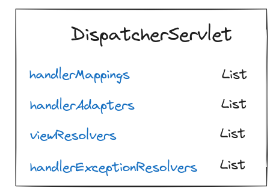
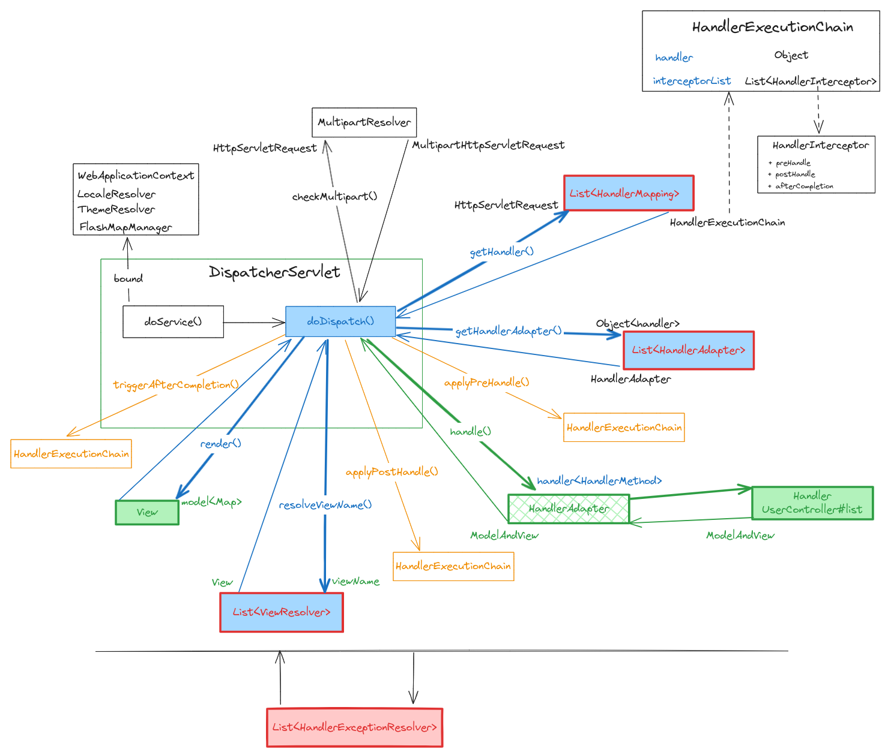

# SpringMVC-DispatcherServlet

# DispatcherServlet 介绍
`DispatcherServlet` 本质上是一个 `HttpServlet`，为请求处理提供了一个共享算法，而实际工作则由可配置的委托组件执行。其核心组件包括：

- 请求映射（`HandlerMapping`）: 根据请求获取其对应的执行链 `HandlerExecutionChain`
- handler适配器（`HandlerAdapter`）: 执行 handler，得到`ModelAndView`
- 异常处理器（`HandlerExceptionResolver`）： 处理异常，得到异常的`ModelAndView`
- 视图解析器（`ViewResolver`）：根据试图名，获取视图`View`

## 请求处理

如上图所示，请求抵达 `DispatcherServlet` 后，将进行如下处理：
1. 绑定 `WebApplicationContext`
2. 绑定 `Local` 解析器 `LocaleResolver`，以便解析客户端使用的 Locale，可能还有他们的时区，以便能够提供国际化的视图。
3. 绑定主题解析器`ThemeResolver`，以便让视图决定使用哪个主题。
4. 绑定`FlashMap`管理器`FlashMapManager`，管理`FlashMap`，可用于将属性从一个请求传递到另一个请求（如重定向时）
5. `multipart` 检查，如果存在`MultipartResolver`，且请求是`multipart`，就将请求包裹在一个 `MultipartHttpServletRequest` 中。
6. 在根据请求，在`handlerMappings`中搜索处理程序处理执行链`HandlerExecutionChain`（包括一个处理程序`handler`和多个`HandlerInterceptor`）。`HandlerMapping` 的一个重要实现是`RequestMappingHandlerMapping`（支持 @RequestMapping 注解的方法）
7. 调用`HandlerInterceptor`的`preHandle`方法。
8. `HandlerAdapter` 调用`handler`，得到`ModelAndView`，例如，调用一个有注解的 `controller` 需要解析注解的问题，`HandlerAdapter` 的主要目的是将 DispatcherServlet 从这些细节中屏蔽掉。
9. 调用`HandlerInterceptor`的`postHandle`方法。
10. 使用`viewResolvers` 将逻辑视图名称解析为实际的 `View`（遍历视图解析器集合，只要遇到一个`ViewResolver`返回的视图不为空，就返回当前视图），并将其渲染到响应。
11. 使用 `View`的渲染方法`render()`,将视图渲染为返回结果，传入的`model`本质上是一个`Map<String, ?>`,可以用作模板渲染。
12. 调用`HandlerInterceptor`的`afterCompletion`方法。
13. 遇到异常时，就调用`HandlerExceptionResolver`的`resolveException`处理异常。

