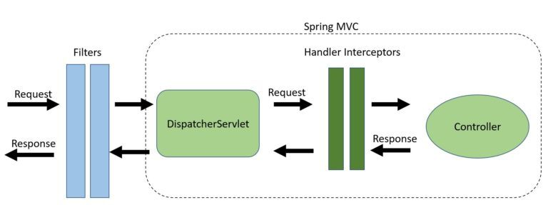

# Spring 拦截器




## Servlet filter

### `@Component @Order` 定义

```Java
@Component
@Order(1) // 数字越小，越优先执行
public class MyFilter implements Filter {
    @Override
    public void doFilter(ServletRequest servletRequest, ServletResponse servletResponse, FilterChain filterChain) throws IOException, ServletException {
        System.out.println("MyFilter");
        // 要继续处理请求，必须添加 filterChain.doFilter()
        filterChain.doFilter(servletRequest,servletResponse);
    }
}
```

### `@WebFilter @ServletComponentScan` 定义

```Java
@WebFilter(urlPatterns = "/*")
public class MyFilter implements Filter {
    @Override
    public void doFilter(ServletRequest servletRequest, ServletResponse servletResponse, FilterChain filterChain) throws IOException, ServletException {
        System.out.println("MyFilter");
        // 要继续处理请求，必须添加 filterChain.doFilter()
        filterChain.doFilter(servletRequest,servletResponse);
    }
}
```

```Java
@SpringBootApplication
@ServletComponentScan("com.xxx.filter")
public class FilterDemoApplication {

    public static void main(String[] args) {
        SpringApplication.run(FilterDemoApplication.class, args);
    }

}
```

### 手动注册`FilterRegistrationBean`

```Java
@Configuration
public class FilterConfig {
    @Bean
    public FilterRegistrationBean registerMyFilter(){
        FilterRegistrationBean<MyFilter> bean = new FilterRegistrationBean<>();
        bean.setOrder(1);
        bean.setFilter(new MyFilter());
        // 匹配"/hello/"下面的所有url
        bean.addUrlPatterns("/hello/*");
        return bean;
    }
    @Bean
    public FilterRegistrationBean registerMyAnotherFilter(){
        FilterRegistrationBean<MyAnotherFilter> bean = new FilterRegistrationBean<>();
        bean.setOrder(2);
        bean.setFilter(new MyAnotherFilter());
        // 匹配所有url
        bean.addUrlPatterns("/*");
        return bean;
    }
}
```


## Interceptor


### 使用

```Java
@Component
public class LoggerInterceptor implements HandlerInterceptor {

    @Override
    public void afterCompletion(HttpServletRequest request, HttpServletResponse response, Object object, Exception arg3)
            throws Exception {

    }

    @Override
    public void postHandle(HttpServletRequest request, HttpServletResponse response, Object object, ModelAndView model)
            throws Exception {

    }

    @Override
    public boolean preHandle(HttpServletRequest request, HttpServletResponse response, Object object) throws Exception {
        String path = (String) request.getAttribute(HandlerMapping.BEST_MATCHING_PATTERN_ATTRIBUTE);
        System.out.println("path : " + path);
        return true;
    }}
```

### 注册

```Java
@Component
public class CustomServiceInterceptorAppConfig implements WebMvcConfigurer {
   @Autowired
   LoggerInterceptor loggerInterceptor;

   @Override
   public void addInterceptors(InterceptorRegistry registry) {
      registry.addInterceptor(loggerInterceptor);
   }
}
```

## 基于 AOP 的 @ControllerAdvice

```Java
@Order(1)
@ControllerAdvice
@Slf4j
public class DecryptRequestBodyAdvice implements RequestBodyAdvice {

    @Override
    public boolean supports(MethodParameter methodParameter, Type targetType, Class<? extends HttpMessageConverter<?>> converterType) {
        Annotation[] annotations = methodParameter.getDeclaringClass().getAnnotations();
        if (annotations.length == 0) {
            return false;
        }
        return Stream.of(annotations).anyMatch(it -> it instanceof DecryptBody)
                || methodParameter.getMethod().isAnnotationPresent(DecryptBody.class);
    }

    @Override
    public Object handleEmptyBody(Object body, HttpInputMessage inputMessage, MethodParameter parameter, Type targetType, Class<? extends HttpMessageConverter<?>> converterType) {
        return body;
    }

    @Override
    public HttpInputMessage beforeBodyRead(HttpInputMessage inputMessage, MethodParameter parameter, Type targetType, Class<? extends HttpMessageConverter<?>> converterType) throws IOException {
        if (null == inputMessage.getBody() || BooleanUtils.isNotTrue(encryptSwitch)) {
            return inputMessage;
        }
        String body;
        try {
            body = IOUtils.toString(inputMessage.getBody(), StandardCharsets.UTF_8.name());
        } catch (Exception e) {
            throw new DecryptBodyFailException("Unable to get request body data," +
                    " please check if the sending data body or request method is in compliance with the specification." +
                    " (无法获取请求正文数据，请检查发送数据体或请求方法是否符合规范。)");
        }
        if (StringUtils.isBlank(body)) {
            throw new DecryptBodyFailException("The request body is NULL or an empty string, so the decryption failed." +
                    " (请求正文为NULL或为空字符串，因此解密失败。)");
        }
        String decryptBody = null;
        EncryptAlgorithm encryptAlgorithm = null;
        encryptAlgorithm = this.getMethodAnnotation(parameter);
        if (null != encryptAlgorithm) {
            decryptBody = doDecr(body, encryptAlgorithm);
        } else {
            encryptAlgorithm = this.getClassAnnotation(parameter.getDeclaringClass());
            if (encryptAlgorithm != null) {
                decryptBody = doDecr(body, encryptAlgorithm);
            }
        }
        if (decryptBody == null) {
            throw new DecryptBodyFailException("Decryption error, " +
                    "please check if the selected source data is encrypted correctly." +
                    " (解密错误，请检查选择的源数据的加密方式是否正确。)");
        }
        try {
            InputStream inputStream = IOUtils.toInputStream(decryptBody, StandardCharsets.UTF_8.name());
            return new DecryptHttpInputMessage(inputStream, inputMessage.getHeaders());
        } catch (Exception e) {
            throw new DecryptBodyFailException("The string is converted to a stream format exception." +
                    " Please check if the format such as encoding is correct." +
                    " (字符串转换成流格式异常，请检查编码等格式是否正确。)");
        }
    }

    @Override
    public Object afterBodyRead(Object body, HttpInputMessage inputMessage, MethodParameter parameter, Type targetType, Class<? extends HttpMessageConverter<?>> converterType) {
        return body;
    }

}

```