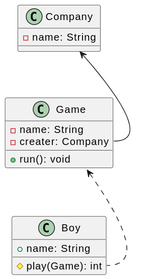
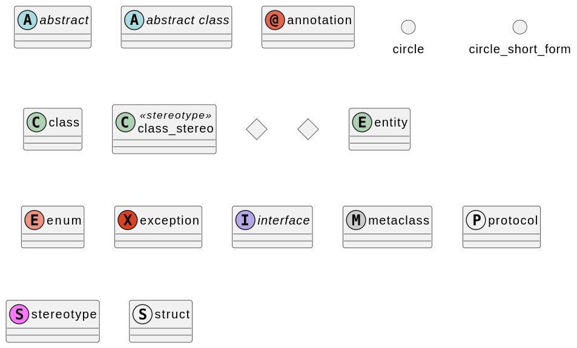
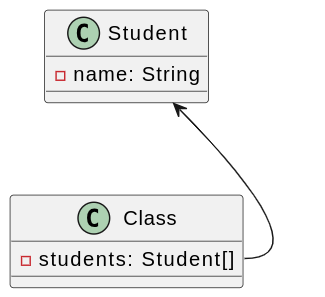
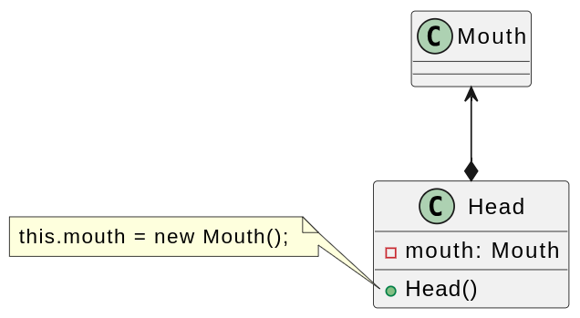
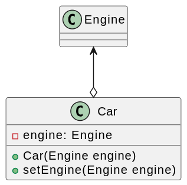
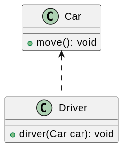
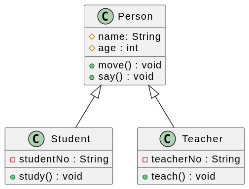
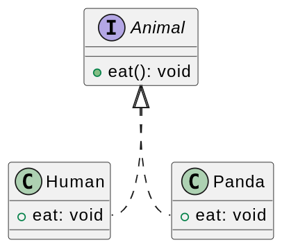

# UML 类图

## 介绍

类封装了数据和行为, 其中类属性表达数据，类方法表达行为。类图主要用来展示类之间的关系，当然也支持描述类属性和方法。其中，类之间的关系主要包含以下四种：

- 关联关系 `-->`(组合`*-->`，聚合`o-->`)
- 依赖关系 `..>` 
- 泛化关系 `--|>`
- 接口与实现关系 `..>`



## 类定义
  
以 [plantuml](https://plantuml.com/zh/class-diagram) 为例子，说明类定义方式。

```
abstract        abstract
abstract class  "abstract class"
annotation      annotation
circle          circle
()              circle_short_form
class           class
class           class_stereo  <<stereotype>>
diamond         diamond
<>              diamond_short_form
entity          entity
enum            enum
exception       exception
interface       interface
metaclass       metaclass
protocol        protocol
stereotype      stereotype
struct          struct
```



| **字符** | **图标(属性)** | **图标(方法)** | **可访问性** |
| --- | --- | --- | --- |
| `-` |  |  | `private` 私有 |
| `#` |  |  | `protected` 受保护 |
| `~` |  |  | `package private` 包内可见 |
| `+` |  |  | `public` 公有 |

## 关联关系

关联（Association）关系是类与类之间最常用的一种关系，它是一种结构化关系，用于表示一类对象与
另一类对象之间有联系，如汽车和轮胎、师傅和徒弟、班级和学生等。

`Class::students --> Student`


### 组合

组合（Composition）关系也表示类之间整体和部分的关系，但是在组合关系中整体对象可
以控制成员对象的生命周期。一旦整体对象不存在，成员对象也将不存在，成员对象与整体
对象之间具有同生共死的关系。在UML中，组合关系用带实心菱形的直线表示。

`Car::engine *--> Engine`



在代码实现聚合关系时，成员对象通常作为构造方法、Setter方法或业务方法的参数注入整体对象中。

### 聚合

聚合（Aggregation）关系表示整体与部分的关系。在聚合关系中，成员对象是整体对象的一部分，
但是成员对象可以脱离整体对象独立存在。在UML中，聚合关系用带空心菱形的直线表示。

`Car::engine o--> Engine`



在代码实现聚合关系时，成员对象通常作为构造方法、Setter方法或业务方法的参数注入整体对象中。

## 依赖关系

依赖（Dependency）关系是一种使用关系，特定事物的改变有可能会影响到使用该事物的其他事物，
在需要表示一个事物使用另一个事物时使用依赖关系。大多数情况下，依赖关系体现在某个类的方法
使用另一个类的对象作为参数

`Driver::driver ..> Car`



## 泛化关系

泛化（Generalization）关系也就是继承关系，用于描述父类与子类之间的关系.

`Student --|> Person`



## 接口与实现关系

类实现了接口，类中的操作实现了接口中所声明的操作。

`Panda::eat ..|> Animal`


