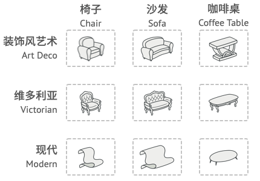
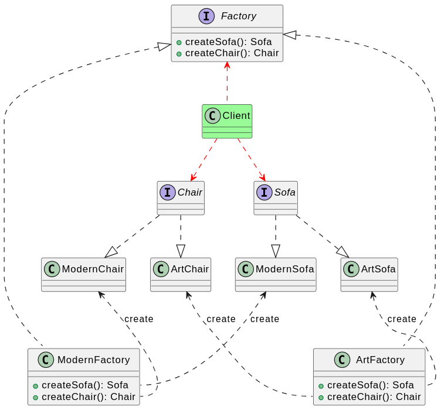

# 抽象工厂模式

## 背景

工厂方法模式通过引入工厂等级结构，解决了简单工厂模式中工厂类职责太重的问题。
但由于工厂方法模式中的每个工厂只生产一类产品，可能会导致系统中存在大量的工厂类，
势必会增加系统的开销。

假设你正在开发一款家具商店模拟器。

1. 你的代码中包括一些类，用于表示一系列相关产品.
   - 例如椅子`Chair`、沙发`Sofa`和咖啡桌`Coffee­Table`。
2. 系列产品的不同变体。
   - 例如，你可以使用现代`Modern`、维多利亚`Victorian`、装饰风艺术`Art­Deco`等
     风格生成椅子、沙发和咖啡桌 。

如果使用工厂方法模式，存在以下问题：

- 需要为每个产品都提供一个产品工厂类，这样类的个数成对增加，这无疑会导致系统越来越庞大，
  从而增加了系统的维护成本和运行开销。
- 由于同一种风格的具体界面组件通常要一起显示，因此需要为每个组件都选择一个具体工厂，
  用户在使用时必须逐个进行设置。如果某个具体工厂选择失误将会导致界面显示混乱，
  虽然可以适当增加一些约束语句，但客户端代码和配置文件都较为复杂。

此时，可以考虑将一些相关的产品组成一个“产品族”，由同一个工厂来统一生产。

## 定义

抽象工厂模式（Abstract Factory Pattern）：提供一个创建一系列相关或相互依赖对象的接口，
而无须指定它们具体的类。

工厂方法模式可以看作是解决创建某一类产品的解决方法，当需要创建多种风格的多种产品时，为避免
创建过多的类，就可以使用抽象工厂模式。比如下面这些场景：

- 支持多种主题的按钮、列表、输入框等
- 支持多种风格的沙发、椅子、餐桌等

## 实现

沙发、椅子是抽象产品类型，Modern、Art 是不同的产品主题，也就是不同的工厂类。

## 评价

优点

- 增加新的产品族很方便，无须修改已有系统，符合开闭原则
- 当一个产品族中的多个对象被设计成一起工作时，它能够保证客户端始终只使用同一个产品族中的对象

缺点

- 增加新的产品等级结构麻烦，需要对原有系统进行较大的修改，甚至需要修改抽象层代码，
  这显然会带来较大的不便，比如新增一个家具床，就需要在抽象工厂中新增加一个创建床的方法，
  并且所有工厂子类都需要去实现这个方法，这违背了开闭原则。
