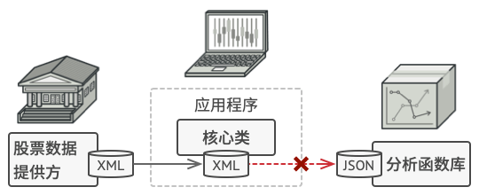
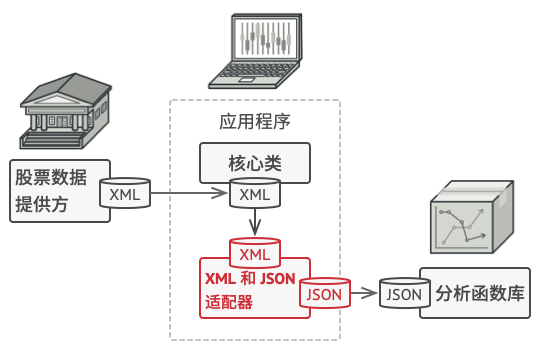

# 适配器模式

## 背景
假如你正在开发一款股票市场监测程序， 它会从不同来源下载 XML 格式的股票数据，
然后向用户呈现出美观的图表。
在开发过程中， 你决定在程序中整合一个第三方智能分析函数库。 但是遇到了一个问题，
那就是分析函数库只兼容 JSON 格式的数据。



这个时候很容易想到使用一个中介来解决兼容问题，将 XML 格式转换为分析函数库支持的 JSON
格式，这就是适配器模式。



## 定义
适配器模式（Adapter Pattern）：将一个接口转换成客户希望的另一个接口，使接口不兼容的那些类可以一起工作，其别名为包装器（Wrapper）。

```uml
interface Target {
    + request(args)
}
class Adapter implements Target {
    - adaptee: Adaptee
    + request(args)
}
note right of Adapter::"request(args)"
    val specialArgs = convert(args);
    adaptee.request(specialArgs);
end note
class Adaptee {
    + request(specialArgs)
}
Adaptee <-- Adapter

class Client #palegreen
Client --[#red]> Target
```

## 实现
要在当前程序中整合一个第三方智能分析函数库，只需要使用一个适配器，进行数据转换即可

```uml
interface MyLib {
    + analysis(Xml)
}
class JsonLibAdapter implements MyLib{
    - lib: ThirdLib
    + analysis(Xml)
}
note right of JsonLibAdapter::"analysis(Xml)"
    val json = convert(xml);
    adaptee.request(json);
end note

class ThirdLib {
    + analysis(Json)
}
ThirdLib <-- JsonLibAdapter

class Client #palegreen
Client --[#red]> MyLib
```

## 评价
优点
1. 将目标类和适配者类解耦。通过引入一个适配器类来重用现有的适配者类，无须修改原有结构。
2. 增加了类的透明性和复用性。将具体的业务实现过程封装在适配者类中，对于客户端类而言是透明的，而且提高了适配者类的复用性，同一个适配者类可以在多个不同的系统中复用。
3. 增加了类的透明性和复用性。将具体的业务实现过程封装在适配者类中，对于客户端类而言是透明的，而且提高了适配者类的复用性，同一个适配者类可以在多个不同的系统中复用。


