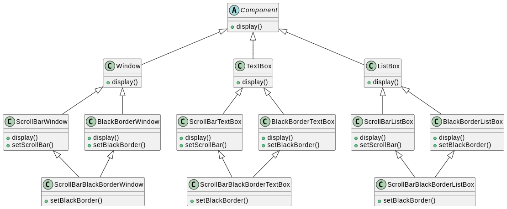
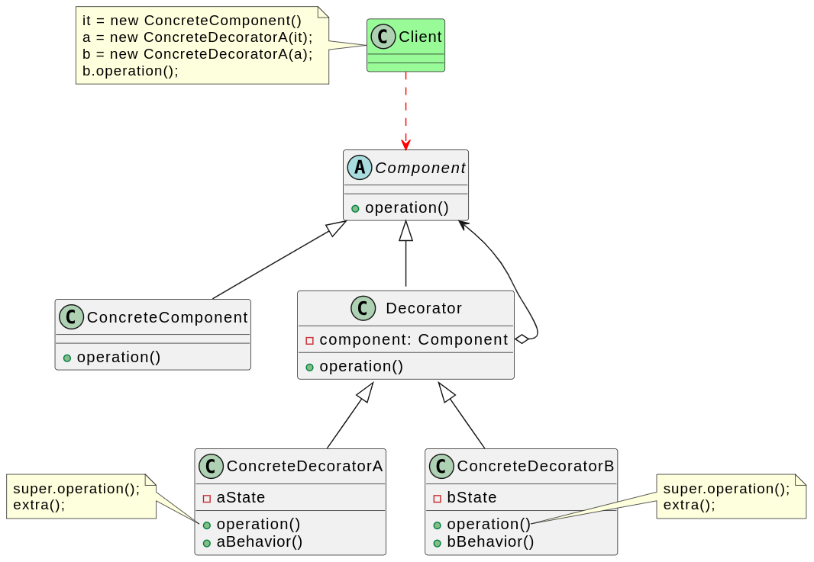
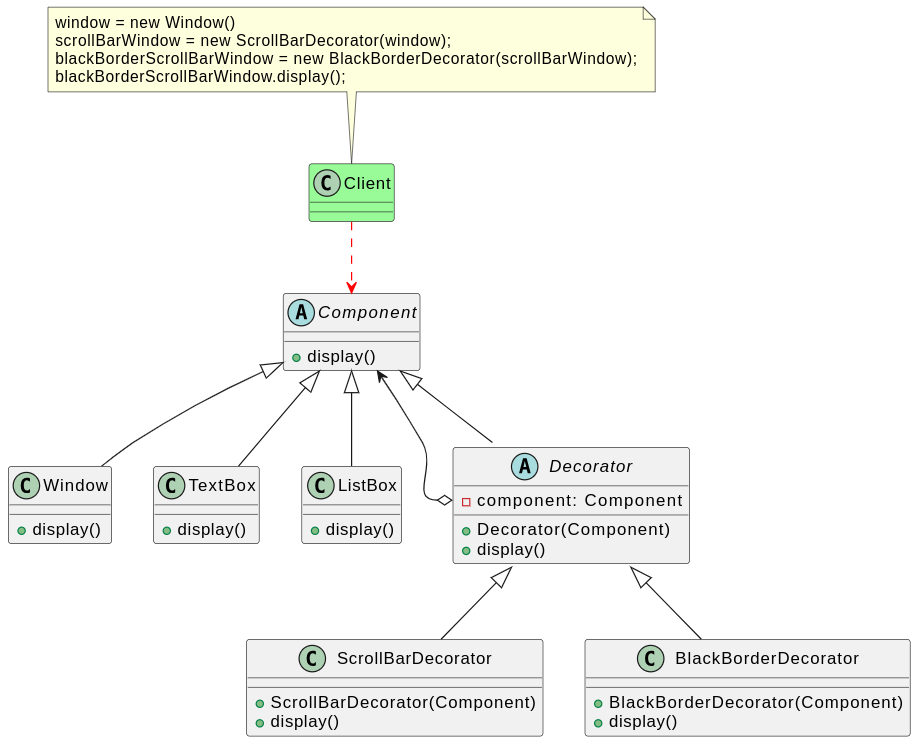

# 装饰器模式

## 背景

开发一套图形界面组件库，该组件库提供了大量基本组件，如窗体、文本框、列表框等。由于在使用该组件库时，用户经常要求定制一些特殊的显示效果，例如带滚动条的窗体、带黑色边框的文本框、既带滚动条又带黑色边框的列表框等，因此经常需要对该构件库进行扩展以增强其功能。常规的设计方式可能如下：

根据需求，很容易设计出上面的层级机构，但存在以下几个问题：

1. 扩展麻烦，某些编程语言不支持多继承，无法实现此结构。
2. 存在很多重复代码。窗体需要设置滚动条，文本框、列表框等都需要设置滚动条。
3. 系统过于庞大，类数目过多。

思考上述缺点，不难想到为  ScrollBar 和 BlackBorder 顶一个父类，将其分别与 Window、TextBox、ListBox 组合，即可更优雅的解决上述需求。这里为 ScrollBar 和 BlackBorder 定义的父类就是装饰器。

## 定义

装饰模式（Decorator Pattern）：动态地给一个对象增加一些额外的职责，就增加对象功能来说，装饰模式比生成子类实现更为灵活。装饰模式是一种对象结构型模式。

装饰模式可以在不改变一个对象本身功能的基础上给对象增加额外的新行为。在现实生活中，这种情况也到处存在。例如一张照片，可以不改变照片本身，给它增加一个相框，使得它具有防潮的功能，而且用户可以根据需要给它增加不同类型的相框，甚至可以在一个小相框的外面再套一个大相框。

装饰模式是一种用于替代继承的技术，它通过一种无须定义子类的方式来给对象动态增加职责，使用对象之间的关联关系取代类之间的继承关系。在装饰模式中引入了装饰类，在装饰类中既可以调用待装饰的原有类的方法，还可以增加新的方法，以扩充原有类的功能

## 实现

为 ScrollBar 和 BlackBorder 抽象为一个父类，作为抽象装饰器，ScrollBar 和 BlackBorder 就作为具体的装饰器实现。

## 评价

### 优点

1. 对于扩展一个对象的功能，装饰模式比继承更加灵活性，不会导致类的个数急剧增加。
2. 可以通过一种动态的方式来扩展一个对象的功能。通过配置文件可以在运行时选择不同的具体装饰类，从而实现不同的行为。
3. 可以对一个对象进行多次装饰。通过使用不同的具体装饰类以及这些装饰类的排列组合，可以创造出很多不同行为的组合，得到功能更为强大的对象。
4. 具体构件类与具体装饰类可以独立变化，用户可以根据需要增加新的具体构件类和具体装饰类，原有类库代码无须改变，符合开闭原则。

### 缺点

1. 层层套娃，会产生很多小对象，优点浪费资源。
2. 层层套娃，容易出错，排错也要像剥洋葱一样，一层一层的，有点麻烦。
