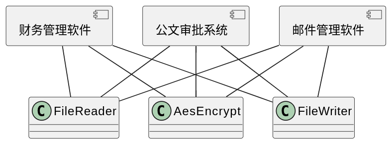
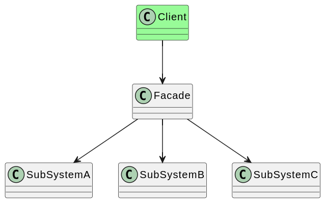
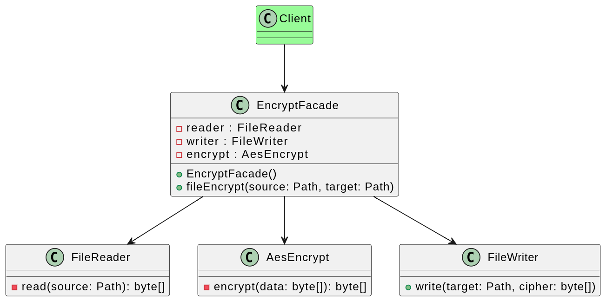

# 外观模式（门面模式）

## 背景

开发一个可应用于多个软件的文件加密模块，该模块可以对文件中的数据进行加密并将加密之后的数据存储在一个新文件中。具体的流程包括3个部分，分别是读取源文件、加密、保存加密之后的文件。其中，读取文件和保存文件使用流来实现，加密操作通过求模运算实现。这3个操作相对独立，为了实现代码的独立重用，让设计更符合单一职责原则，这3个操作的业务代码封装在3个不同的类中。

这个设计一旦真正使用起来，就会发现以下问题：

1. 使用加密模块时，FileReader、AesEncrypt、FileWriter 经常一起出现，而且使用方式也相同，造成很多重复代码。
2. 客户端使用加密模块时，需要提前知晓加密模块提供了哪些类，要如何组合使用这些类。
3. 如果需要更换一个加密类，则所有使用加密模块的客户端都需要修改代码，使得系统扩展性差，难以维护。

如何解决上述问题呢？一种显而易见的方式就是加密对外提供一个统一的抽象接口，客户端无需关系具体实现，这就是门面模式。

## 定义

外观模式（Facade Pattern）：外部与一个子系统的通信通过一个统一的外观角色进行，为子系统中的一组接口提供一个一致的入口。外观模式定义了一个高层接口，这个接口使得子系统更加容易使用。外观模式又称为门面模式，它是一种对象结构型模式。

## 实现

加密模块对外提供一个统一的

如果考虑更强的扩展性，还可以将 EncryptFacade 定义为接口，以便支持数据库读写，为加密算法增加抽象定义和具体实现，以便支持其他加密算法。

## 评价

### 优点

1. 对客户端屏蔽了子系统组件，减少了客户端所需处理的对象数目并使得子系统使用起来更加容易。通过引入外观模式，客户端代码将变得很简单，与之关联的对象也很少。
2. 实现了子系统与客户端之间的松耦合关系，这使得子系统的变化不会影响到调用它的客户端，只需要调整外观类即可。
3. 一个子系统的修改对其他子系统没有任何影响，而且子系统内部变化也不会影响到外观对象。
4. 只是提供了一个访问子系统的统一入口，并不影响客户端直接使用子系统类。

### 缺点

如果设计不当，增加新的子系统可能需要修改外观类的源代码，这违背了开闭原则，所以门面的定义需要经过反复推敲。
