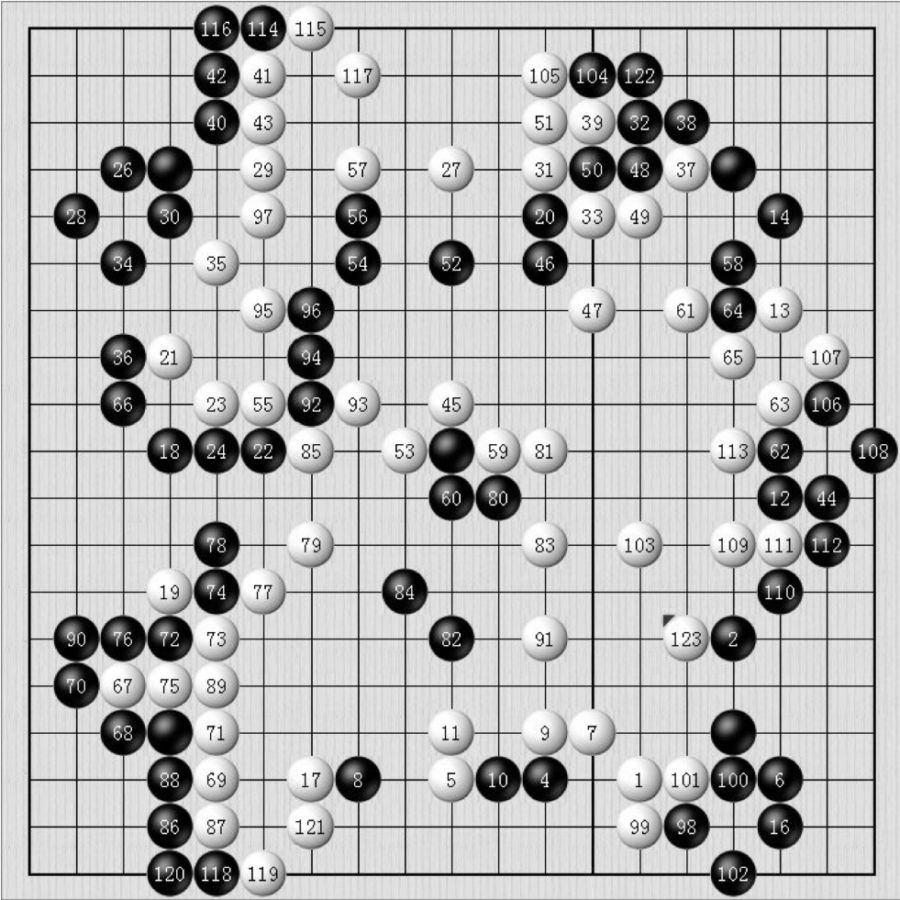
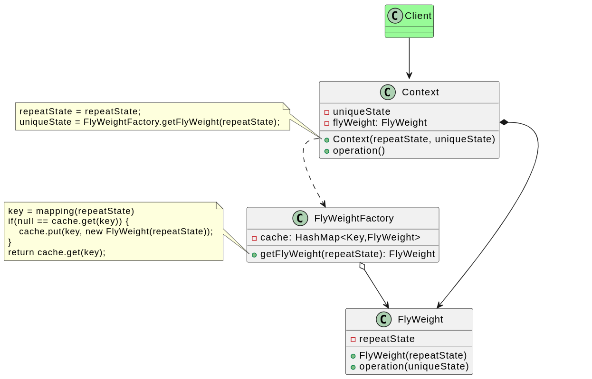
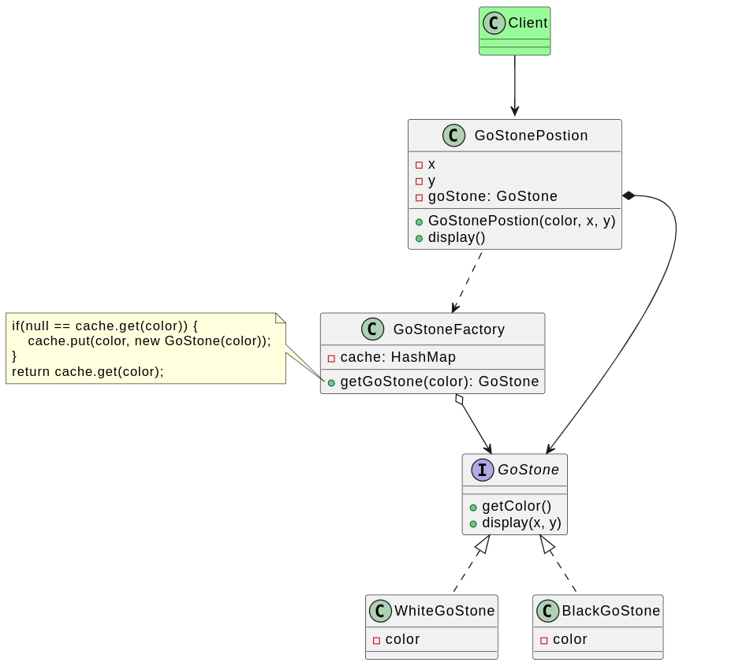

# 享元模式

## 背景

开发围棋软件，发现在围棋棋盘中包含大量棋子，如果将每个棋子都作为一个独立的对象存储在内存中，将导致该围棋软件在运行时所需内存空间较大。如何降低运行代价、提高系统性能？

仔细观察，会发现棋盘中的黑子和白子，它们的形状、大小都一模一样，只是出现的位置不同而已，那么是否可以在内存中复用黑白子呢？这其实就是享元模式的应用场景。

## 定义

**享元模式（Flyweight Pattern）**：运用共享技术有效地支持大量细粒度对象的复用。系统只使用少量的对象，而这些对象都很相似，状态变化很小，可以实现对象的多次复用。由于享元模式要求能够共享的对象必须是细粒度对象，因此它又称为轻量级模式，是一种对象结构型模式。

享元模式以共享的方式高效地支持大量细粒度对象的重用。享元对象能做到共享的关键是区分了内部状态（Intrinsic State）和外部状态（Extrinsic State）。**享元就是共享元数据，元数据就是内部状态集合。**

**内部状态**是存储在享元对象内部并且不会随环境改变而改变的状态，内部状态可以共享。例如字符的内容，不会随外部环境的变化而变化，无论在任何环境下，字符“a”始终是“a”，都不会变成“b”。

**外部状态**是随环境改变而改变的、不可以共享的状态。享元对象的外部状态通常由客户端保存，并在享元对象被创建之后，需要使用的时候，再传入享元对象内部。一个外部状态与另一个外部状态之间是相互独立的。如字符的颜色，可以在不同的地方有不同的颜色，例如有的“a”是红色的，有的“a”是绿色的；字符的大小也是如此，有的“a”是五号字，有的“a”是四号字。而且字符的颜色和大小是两个独立的外部状态，它们可以独立变化，相互之间没有影响，客户端可以在使用时将外部状态注入享元对象中。

## 实现

白子和黑子在棋盘都是重复的，那么黑子和白子就可以作为内部状态，不同棋子的在棋盘的位置不同，那么位置就是外部状态，因此使用享元状态实现围棋游戏如下：

## 评价

### 优点

1. 可以极大减少内存中对象的数量，使得相同或相似对象在内存中只保存一份，从而可以节约系统资源，提高系统性能。
2. 享元模式的外部状态相对独立，而且不会影响其内部状态，从而使得享元对象可以在不同的环境中被共享。

### 缺点

1. 你可能需要牺牲执行速度来换取内存， 因为他人每次调用享元方法时都需要重新计算部分情景数据。
2. 代码会变得更加复杂。 团队中的新成员总是会问： ​ “为什么要像这样拆分一个实体的状态？”。
