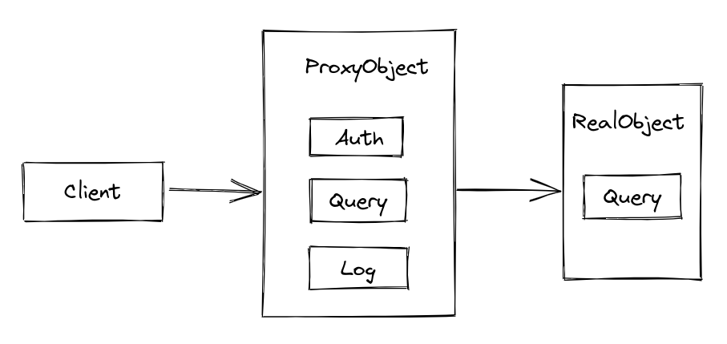
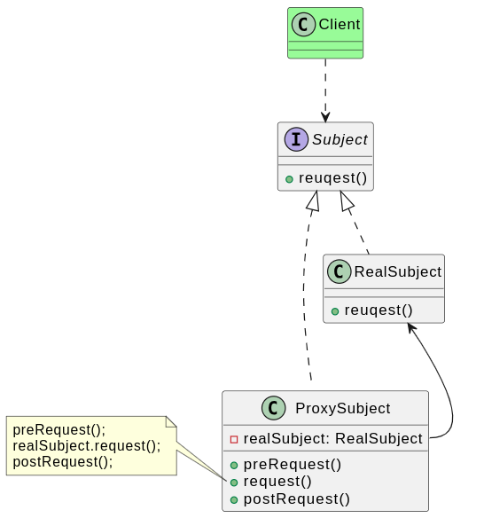
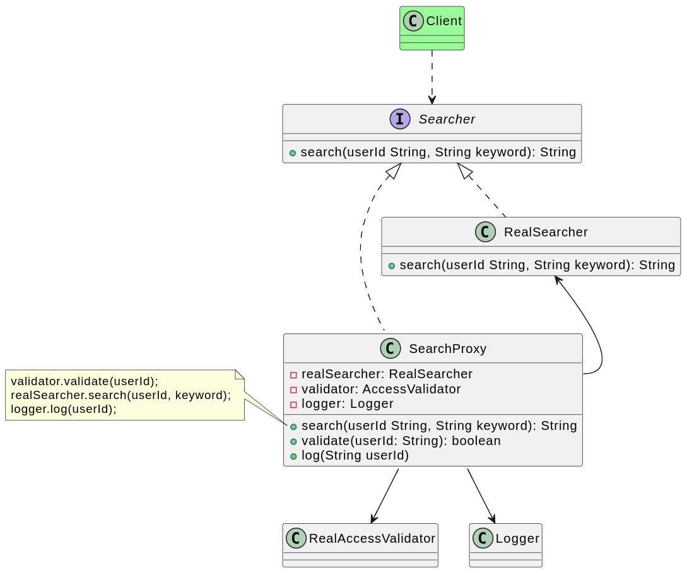

# 代理模式

## 背景

某信息咨询公司的收费商务信息查询系统的开发任务，该系统的基本需求如下：

1. 在进行商务信息查询之前用户需要通过身份验证，只有合法用户才能够使用该查询系统。
2. 在进行商务信息查询时，系统需要记录查询日志，以便根据查询次数收取查询费用。

现在的问题在于开发人员已完成了商务信息查询模块的开发任务，他们希望能够以一种松耦合的方式向原有系统增加身份验证和日志记录功能。这个时候就可以考虑代理模式。

由于某些原因，客户端不想或不能直接访问某个对象，此时可以通过一个被称为“代理”的第三者来实现间接访问，该方案对应的设计模式被称为代理模式。

## 定义

代理模式（Proxy Pattern）：给某一个对象提供一个代理，并由代理对象控制对原对象的引用。代理模式是一种对象结构型模式。

## 实现

在不改动已有的代码基础上，为请求增加认证和日志记录功能，只需为真实的请求对象增加代理对象即可

## 评价

### 优点

1. 代理模式能够协调调用者和被调用者，在一定程度上降低了系统的耦合度，满足迪米特法则。
2. 客户端可以针对抽象主题角色进行编程，增加和更换代理类无须修改源代码，符合开闭原则，系统具有较好的灵活性和可扩展性。
3. 远程代理为位于两个不同地址空间对象的访问提供了一种实现机制，可以将一些消耗资源较多的对象和操作移至性能更好的计算机上，提高系统的整体运行效率。
4. 虚拟代理通过一个消耗资源较少的对象来代表一个消耗资源较多的对象，可以在一定程度上节省系统的运行开销。
5. 保护代理可以控制对一个对象的访问权限，为不同用户提供不同级别的使用权限。

### 缺点

1. 代码可能会变得复杂， 因为需要新建许多类。
2. 服务响应可能会延迟。
