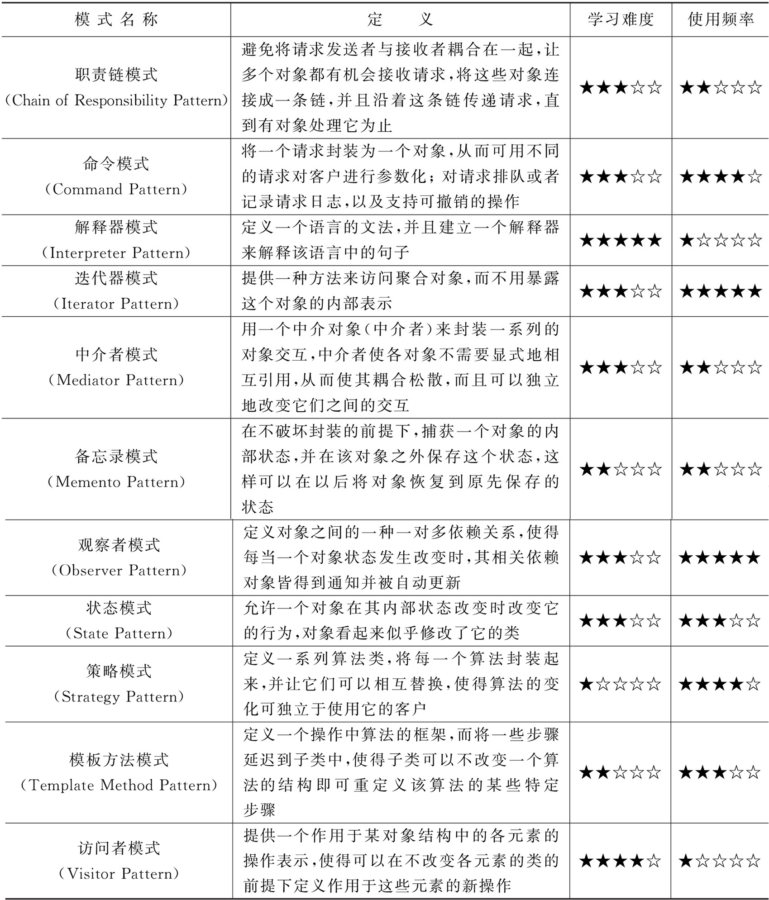

行为型模式
=====================================================================
.. toctree::
   :maxdepth: 1

   1-职责链模式
   2-命令模式
   3-解释器模式
   4-迭代器模式
   5-中介者模式
   6-备忘录模式
   7-观察者模式
   8-状态模式
   9-策略模式
   10-模板方法模式
   11-访问者模式
   

行为型模式(Behavioral Pattern)关注系统中对象之间的交互，研究系统在运行时对象之间的相互通信与协作, 进一步明确对象的职责。行为型模式不仅仅关注类和对象本身, 还重点关注它们之间的相互作用和职责划分。  

