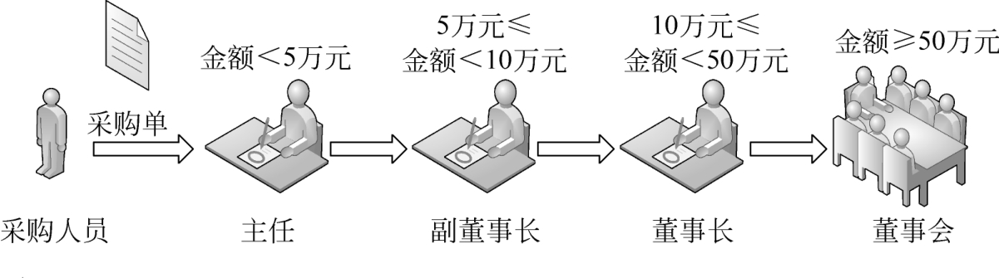

# 职责链模式

亦称： 职责链模式、命令链、CoR、Chain of Command、Chain of Responsibility

## 背景

设计一个采购审批子系统，采购审批是分级进行的，即根据采购金额的不同由不同层次的主管人员来审批。

- 主任可以审批5万元以下（不包括5万元）的采购单
- 副董事长可以审批5万～10万元（不包括10万元）的采购单
- 董事长可以审批10万～50万元（不包括50万元）的采购单
- 50万元及以上的采购单就需要开董事会讨论决定。

采购单分级审批示意图如下所示：



常规的方式就是采用`if else` 来实现逻辑处理，但会导致这个逻辑处理类职责过多，而且后期扩展也不方便，需要增加或减少分支，就必须修改这个类，不符合开闭原则，那如何才能更优雅的处理这个问题呢？ 答案是使用责任链模式。

## 定义

职责链模式（Chain of Responsibility Pattern）：避免将请求发送者与接收者耦合在一起，让多个对象都有机会接收请求，将这些对象连接成一条链，并且沿着这条链传递请求，直到有对象处理它为止。

```{uml}
abstract Handler {
    # next： Handler
    + setNext(next: Handler)
    + handleRequest()
}
Handler <--o Handler: next

class ConcreteHandlerA extends Handler {
    + handleRequest()
}
class ConcreteHandlerB extends Handler {
    + handleRequest()
}
note left of ConcreteHandlerA::"handleRequest()"
    if(needHandle) {
        // current action
        ...
    } else {
        next.handleRequest();
    }
end note

class Client #palegreen
Client ..> Handler
```

## 实现

```{uml}
interface Approval {
    # next: Approval
    # maxProcessAmount: int
    + setNext(next: Approval)
    + process(amount: int)
}
Approval <--o Approval: next
class Director implements Approval {
    + Director(amount: int)
    + process(amount: int)
}
note left of Approval::"process(amount: int)"
    if(amount < this.maxProcessAmount) {
        // current action
        ...
    } else {
        next.process(amount);
    }
end note
class VicePresident implements Approval {
    + VicePresident(amount: int)
    + process(amount: int)
}
class President implements Approval {
    + President(amount: int)
    + process(amount: int)
}

class Client #palegreen
Client ..> Approval
```

## 评价

### 优点

1. 可以控制请求处理的顺序。
2. 单一职责原则。 你可对发起操作和执行操作的类进行解耦。
3. 开闭原则。 你可以在不更改现有代码的情况下在程序中新增处理者。
4. 减少请求发送者和接收者之间的耦合，并允许动态地重新组织和分配责任。

### 缺点

1. 部分请求可能未被处理。
2. 如果建链不当，可能会造成循环调用，将导致系统陷入死循环。
3. 可能导致请求在链中未被处理的情况，因此通常需要在责任链的末端有一个默认的处理器以确保所有请求都被处理。

## 例子

1. **GUI中的事件传播**:
   在图形用户界面（GUI）框架中，如Java的 Swing 或者 JavaScript的 DOM 事件处理，事件（如鼠标点击或按键事件）可以从一个组件传递到另一个组件，直到找到一个合适的事件处理器。

2. **Java中的异常处理**:
   在Java语言中，当一个异常被抛出时，它会沿着方法调用栈向上传递，直到被相应的`catch`块处理。这是责任链模式的一种形式，每个`catch`块都有机会处理异常。

3. **日志框架**:
   日志框架如Log4j或SLF4J允许配置多个日志处理器，每个处理器可以决定是否处理日志消息或将其传递给链中的下一个处理器。

4. **Web开发中的中间件**:
   在Web开发框架中，如Express.js或ASP.NET Core，中间件组件用于处理HTTP请求。每个中间件可以处理请求或将请求传递给下一个中间件。

5. **工作流系统**:
   在工作流或业务流程管理系统中，一个任务（如文档审批）可以在不同的角色或部门之间传递，每个参与者都有机会处理这个任务。

6. **支付处理**:
   在支付处理系统中，一个支付请求可能需要通过多个验证和处理步骤，如欺诈检查、余额验证、支付授权等，责任链模式允许动态地添加或修改处理步骤。

7. **Servlet Filters**:
   在Java的Servlet API中，过滤器（Filters）是一种可以对进入和离开Web应用程序的请求和响应进行预处理和后处理的代码。过滤器可以链式排列，其中一个过滤器完成其工作后，可以决定是否将请求/响应传递到链中的下一个过滤器，直至最终到达目标Servlet。每个过滤器都对请求/响应有处理的机会，这正是责任链模式的体现。

8. **Tomcat Valve**:
   Apache Tomcat中的阀门（Valves）是特定于Tomcat的一种机制，用于在Tomcat容器级别拦截请求和响应。阀门可以被配置成一个责任链，每个阀门按顺序执行，可以对请求进行检查或修改，然后选择是否将请求传递到责任链中的下一个阀门。这种机制允许开发者在不修改Servlet的情况下，对请求进行控制和处理。

9. **Netty ChannelHandler**:
   Netty是一个高性能的网络应用程序框架，ChannelHandler是Netty中的一个组件，用于处理网络事件，如连接打开、数据接收等。在Netty中，ChannelHandler可以形成一个责任链，这称为ChannelPipeline。每个Handler可以处理事件或将事件传递给Pipeline中的下一个Handler。这种设计使得处理网络事件变得非常灵活，因为你可以通过添加、移除或替换Handler来动态改变Pipeline的行为。

所有这些例子都体现了责任链模式的核心思想：使多个对象都有机会处理请求，将这些对象连成一条链，并沿着这条链传递请求，直到被处理。这样做的好处是可以动态地添加或改变处理者，而不需要改变发送请求的代码。
