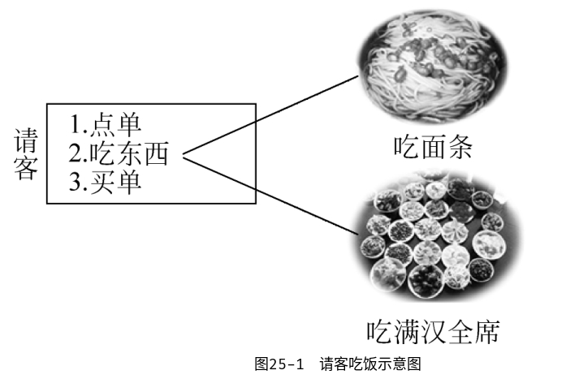
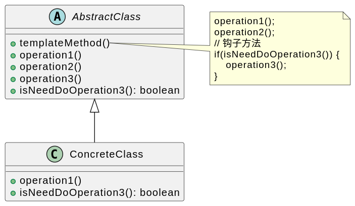

# 模板方法模式

亦称： Template

## 背景

在现实生活中很多事情需要通过几个步骤才能够完成。例如请客吃饭，无论吃什么，一般都包含点单、吃东西、买单等几个步骤。通常情况下这几个步骤的次序是：点单→吃东西→买单。在这3个步骤中，点单和买单大同小异，最大的区别在于第2步——吃什么？吃面条和吃满汉全席可大不相同，如图:

## 定义

**模板方法模式（Template Method Pattern）**：定义一个操作中算法的框架，而将一些步骤延迟到子类中。模板方法模式使得子类可以不改变一个算法的结构即可重定义该算法的某些特定步骤。模板方法模式是一种类行为型模式。

## 评价

模板模式是一种常用的设计模式，它定义了一个算法的骨架，并允许子类为一个或多个步骤提供实现。

### 优点

1. 封装性：模板模式将算法的实现细节封装在模板方法中，使得算法更加清晰、易于理解。
2. 扩展性：模板模式允许子类为一个或多个步骤提供实现，从而扩展了算法的功能。
3. 重用性：模板模式将算法的骨架封装在模板方法中，使得算法可以在不同的场景下重复使用。
4. 灵活性：模板模式允许子类在不改变算法骨架的情况下修改算法的实现，从而提高了算法的灵活性。

### 缺点

1. 限制子类的实现：模板模式将算法的骨架封装在模板方法中，子类只能在指定的步骤中提供实现，不能随意修改算法的结构。
2. 增加了类的数量：模板模式会增加系统中类的数量，增加了系统的复杂度。

## 例子

1. Java 中的 `Servlet`：
   - `Servlet` 是 Java Web 应用程序的基础，它使用模板模式定义了一个标准的 HTTP 请求处理流程，具体的请求处理由子类实现。

2. Spring 框架中的 [`JdbcTemplate`](https://github.com/spring-projects/spring-framework/blob/main/spring-jdbc/src/main/java/org/springframework/jdbc/core/JdbcTemplate.java#L339)：
   - `JdbcTemplate` 是 Spring 框架中用于执行 SQL 语句的模板类，它使用模板模式定义了 SQL 语句的执行流程，具体的 SQL 语句由子类实现。
