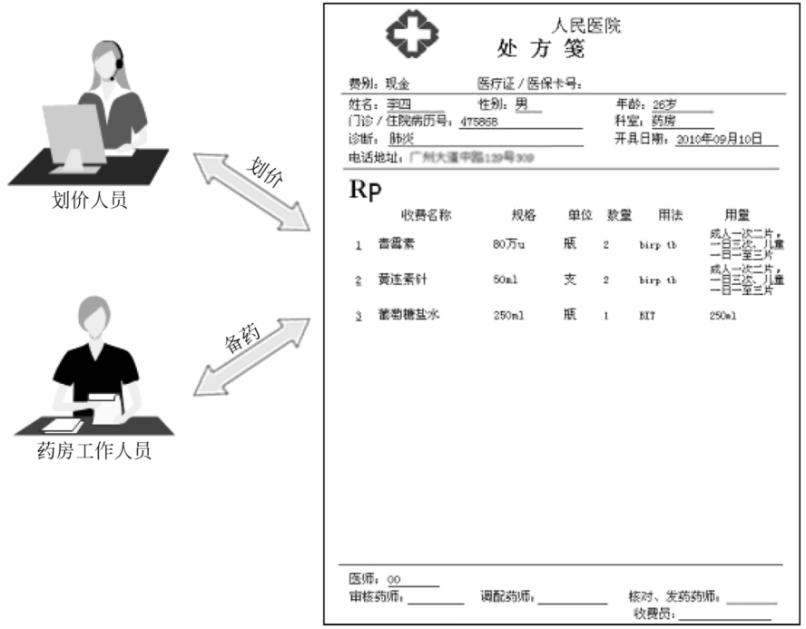

# 访问者模式

## 背景

患者就医时，在医生开具处方单（药单）后，很多医院都存在以下处理流程：

1. 划价人员拿到处方单之后根据药品名称和数量计算总价
2. 药房工作人员根据药品名称和数量准备药品



可以将处方单看成一个药品信息的集合，里面包含了一种或多种不同类型的药品信息。不同类型的工作人员（例如划价人员和药房工作人员）在操作同一个药品信息集合时将提供不同的处理方式，而且可能还会增加新类型的工作人员来操作处方单。

软件开发中，有时也需要处理像处方单这样的集合对象结构。在该对象结构中存储了多个不同类型的对象信息，而且对同一对象结构中的元素的操作方式并不唯一，可能需要提供多种不同的处理方式，还可能需要增加新的处理方式。在设计模式中，有一种模式可以满足上述要求，其模式动机就是以不同的方式操作复杂对象结构，这就是访问者模式。

以员工信息管理系统为例：

- 员工分为正式员工（Full-time Employee）和临时工（Part-time Employee）
- 人力资源部负责汇总每周员工工作时间（对于正式员工，除了记录实际工作时间外，还需记录加班时长或请假时长）
- 财务部负责计算每周员工工资（员工类型不同，计算方式不同）

为实现上述需求，可以使用`if else` 分情况处理，如下所示，但者会导致：

- 分情况处理的这个函数庞大复杂，判断过多，不利于阅读和维护
- 新增一个部门来处理员工集合时，必须修改分支处理逻辑
- 新增一个类型的员工时，也必须修改分支处理逻辑

```Java
public void parse() throws IOException {
    List<Employee> list = new ArrayList<>();
    if (depart == "财务部") {
        for (Employee employee : list) {
            if (employee == "正式工")
                // 计算正式工的工资
                computeA();
            else
                // 计算临时工的工资
                computeB();
        }
    } else if (depart == "人力资源部") {
        for (Employee employee : list) {
            if (employee == "正式工")
                // 记录正式工的工作时间，记录加班时长或请假时长
                sumA();
            else
                // 记录临时工的工作时间
                sumB();
        }
    }
}          
```

如何解决上述问题？如何为同一集合对象中的元素提供多种不同的操作方式？

访问者模式就是一个值得考虑的解决方案，它可以在一定程度上解决上述问题（解决大部分问题）。访问者模式可以为不同类型的元素提供多种访问操作方式，而且可以在不修改原有系统的情况下增加新的操作方式。

## 定义

**访问者模式（Visitor Pattern）**：提供一个作用于某对象结构中的各元素的操作表示，它使得可以在不改变各元素的类的前提下定义作用于这些元素的新操作。

访问者模式建议将新行为放入一个名为访问者的独立类中， 而不是试图将其整合到已有类中。 它包含访问者和被访问元素两个主要组成部分。这些被访问的元素通常具有不同的类型，且不同的访问者可以对它们进行不同的访问操作。

```{uml}
class ObjectStructure
class Client

interface Element {
    + accept(Visitor visitor)
}

class ConcreteElementA implements Element {
     + accept(Visitor visitor)
     + operationA()
}
note right of ConcreteElementA::"accept(Visitor visitor)"
    visitor.visitConcreteElementA(this);
end note

class ConcreteElementB implements Element {
     + accept(Visitor visitor)
     + operationB()
}
note right of ConcreteElementB::"accept(Visitor visitor)"
    visitor.visitConcreteElementB(this);
end note

interface Visitor {
    + visitConcreteElementA(ConcreteElementA elementA)
    + visitConcreteElementB(ConcreteElementB elementB)
}

class ConcreteVisitorA implements Visitor {
    + visitConcreteElementA(ConcreteElementA elementA)
    + visitConcreteElementB(ConcreteElementB elementB)
}

class ConcreteVisitorB implements Visitor {
    + visitConcreteElementA(ConcreteElementA elementA)
    + visitConcreteElementB(ConcreteElementB elementB)
}

Client --> Visitor
Client --> ObjectStructure
ObjectStructure --> Element
```

## 评价

### 优点

1. 增加新的访问操作很方便。使用访问者模式，增加新的访问操作就意味着增加一个新的具体访问者类，实现简单，无须修改源代码，符合开闭原则。
2. 将有关元素对象的访问行为集中到一个访问者对象中，而不是分散在一个个的元素类中。类的职责更加清晰，有利于对象结构中元素对象的复用，相同的对象结构可以供多个不同的访问者访问。
3. 让用户能够在不修改现有元素类层次结构的情况下，定义作用于该层次结构的操作。

### 缺点

1. 增加新的元素类很困难。在访问者模式中，每增加一个新的元素类都意味着要在抽象访问者角色中增加一个新的抽象操作，并在每一个具体访问者类中增加相应的具体操作，这违背了开闭原则的要求。
2. 破坏封装。访问者模式要求访问者对象访问并调用每一个元素对象的操作，这意味着元素对象有时候必须暴露一些自己的内部操作和内部状态，否则无法供访问者访问。
