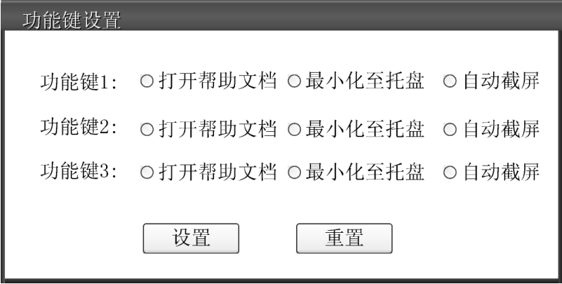

# 命令模式

亦称： 动作、事务、Action、Transaction、Command

## 背景

开发一个桌面版应用程序，该应用程序为用户提供了一系列自定义功能键，用户可以通过这些功能键来实现一些快捷操作。
在设置功能键的时候每个人都有自己的喜好，例如有的人喜欢将第一个功能键设置为“打开帮助文档”，有的人则喜欢将该功能键设置为“最小化至托盘”。为了让用户能够灵活地进行功能键的设置，开发人员提供了一个“功能键设置”窗口，如图：



如何设计才能满足灵活绑定功能键与具体功能之间的关系？

- 很容易想到将不同的功能命令封住为不同的类，如 ShowHelpCmd、MinimizeCmd、ScreenshotCmd，基于面向抽象编程的理念，为这些命令抽象一个接口 Cmd
- 要实现功能键与具体功能灵活组合，很容易想到使用聚合关系，不同的功能对象和不同的 Cmd 实现进行组合，就可以相对优雅的解决上述需求

上面的这种思路就是命令模式。在软件开发中，经常需要向某些对象发送请求（调用其中的某个或某些方法），但是并不知道请求的接收者是谁，也不知道被请求的操作是哪个。此时，特别希望能够以一种松耦合的方式来设计软件，使得请求发送者与请求接收者能够消除彼此之间的耦合，让对象之间的调用关系更加灵活，可以灵活地指定请求接收者以及被请求的操作。命令模式为此类问题提供了一个较为完美的解决方案。

## 定义

命令模式（Command Pattern）：将一个请求封装为一个对象，从而可用不同的请求对客户进行参数化；对请求排队或者记录请求日志，以及支持可撤销的操作。命令模式是一种对象行为型模式，其别名为动作（Action）模式或事务（Transaction）模式。

命令模式可以将请求发送者和接收者完全解耦。发送者与接收者之间没有直接引用关系，发送请求的对象只需要知道如何发送请求，而不必知道如何完成请求。

```{uml}
interface Command {
    + execute()
}
class ConcreteCommandA implements Command {
    - receiver: Receiver
    + execute()
}
class ConcreteCommandB implements Command {
    - receiver: Receiver
    + execute()
}
ConcreteCommandA::receiver --> Receiver
ConcreteCommandB::receiver --> Receiver

class Invoker {
    - command: Command
    + setCommand(cmd: Command)
}
Invoker o-->  Command

class Receiver {
    + action()
}

class Client #palegreen
Client ..> Invoker
Client ..> Command
```

1. Command（抽象命令类）：抽象命令类一般是一个抽象类或接口，在其中声明了用于执行请求的execute（）等方法，通过这些方法可以调用请求接收者的相关操作。
2. ConcreteCommand（具体命令类）：具体命令类是抽象命令类的子类，实现了在抽象命令类中声明的方法。它对应具体的接收者对象，将接收者对象的动作绑定其中。在实现execute（）方法时，将调用接收者对象的相关操作（Action）。
3. Invoker（调用者）：调用者即请求发送者，它通过命令对象来执行请求。一个调用者并不需要在设计时确定其接收者，因此它只与抽象命令类之间存在关联关系。在程序运行时可以将一个具体命令对象注入其中，再调用具体命令对象的execute（）方法，从而实现间接调用请求接收者的相关操作。
4. Receiver（接收者）：接收者执行与请求相关的操作，它具体实现对请求的业务处理。

命令模式的本质是对请求进行封装。一个请求对应于一个命令，将发出命令的责任和执行命令的责任分割开。每个命令都是一个操作：请求的一方发出请求要求执行一个操作；接收的一方收到请求，并执行相应的操作。命令模式允许请求的一方和接收的一方独立开来，使得请求的一方不必知道接收请求的一方的接口，更不必知道请求如何被接收、操作是否被执行、何时被执行，以及是怎么被执行的。

## 实现

```{uml}
interface Cmd {
    + execute()
}
class ShowHelpCmd implements Cmd {
    + helper: HelpHandler
    + execute()
}
class HelpHandler {
    + showHelp()
}
ShowHelpCmd *--> HelpHandler

class MinimizeCmd implements Cmd {
    + helper: WindowHandler
    + execute()
}
class WindowHandler {
    + minimizWindow()
}
MinimizeCmd *--> WindowHandler

class MenuButton {
    - cmd: Cmd
    - name: String
    + setCmd(cmd: Cmd)
    + onClick()
}
note left of MenuButton::"onClick()"
    cmd.execute();
end note
MenuButton --> Cmd

class SettingWindow {
    - buttons: List<MenuButton>
    + addButton()
    - removeButton()
}
SettingWindow *--> MenuButton

class Client #palegreen
Client ..> SettingWindow
Client ..> MenuButton
Client ..> Cmd
```

## 评价

### 优点

1. 降低系统的耦合度。
   - 由于请求者与接收者之间不存在直接引用，因此请求者与接收者之间实现完全解耦，相同的请求者可以对应不同的接收者。同样，相同的接收者也可以供不同的请求者使用，两者之间具有良好的独立性。
2. 新的命令可以很容易地加入系统中。
   - 由于增加新的具体命令类不会影响到其他类，因此增加新的具体命令类很容易，无须修改原有系统源代码甚至客户类代码，满足开闭原则的要求。
3. 可以比较容易地设计一个命令队列或宏命令（组合命令）。
4. 为请求的撤销（Undo）和恢复（Redo）操作提供了一种设计和实现方案。

### 缺点

使用命令模式可能会导致某些系统有过多的具体命令类。因为针对每一个对请求接收者的调用操作都需要设计一个具体命令类，因此在某些系统中可能需要提供大量的具体命令类，这将影响命令模式的使用
