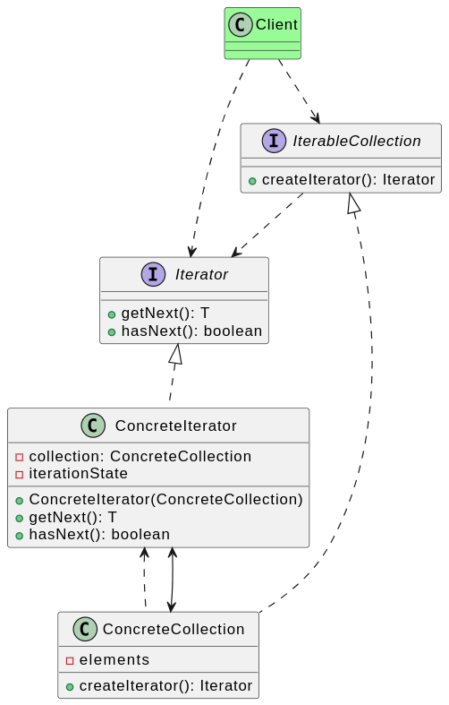
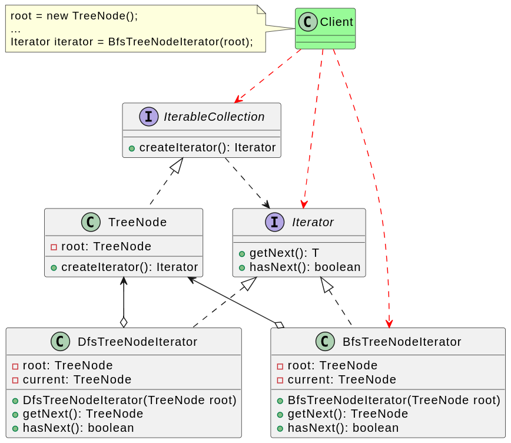

# 迭代器模式

亦称： Iterator

## 背景

集合是编程中最常使用的数据类型之一。集合是存储一组对象的容器，也需要对外提供元素访问和遍历的能力，但是某些情况下，需要提供多种方式来遍历集合，比如树集合，可能需要提供深度优先（DFS） 遍历，也可能需要广度优先（BFS）遍历, 如何才能优雅的为树结构集合提供遍历实现呢？

如果将遍历算法的实现放在集合实现中，那么集合类的职责就多余繁多，不符合单一职责原则，后期需要再加一种遍历方式，就需要修改集合类，不符合开闭原则，因此最好将集合实现类与其遍历方式的实现分离，两者通过抽象进行松耦合，将集合的遍历行为抽取为单独的迭代器对象，这就是迭代器的产生背景。

## 定义

**迭代器模式（Iterator Pattern）**：提供一种方法来访问聚合对象，而不用暴露这个对象的内部表示，其别名为游标（Cursor）。迭代器模式是一种对象行为型模式。

## 实现

## 评价

### 优点

1. 支持以不同的方式遍历一个聚合对象，在同一个聚合对象上可以定义多种遍历方式。在迭代器模式中只需要用一个不同的迭代器来替换原有迭代器即可改变遍历算法，也可以自己定义迭代器的子类以支持新的遍历方式。
2. 迭代器简化了聚合类。由于引入了迭代器，在原有的聚合对象中不需要再自行提供数据遍历等方法，这样可以简化聚合类的设计。
3. 在迭代器模式中，由于引入了抽象层，增加新的聚合类和迭代器类都很方便，无须修改原有代码，满足开闭原则的要求。

### 缺点

1. 如果你的程序只与简单的集合进行交互， 应用该模式可能会过于复杂。
2. 对某些特殊集合使用时，可能会影响效率。
