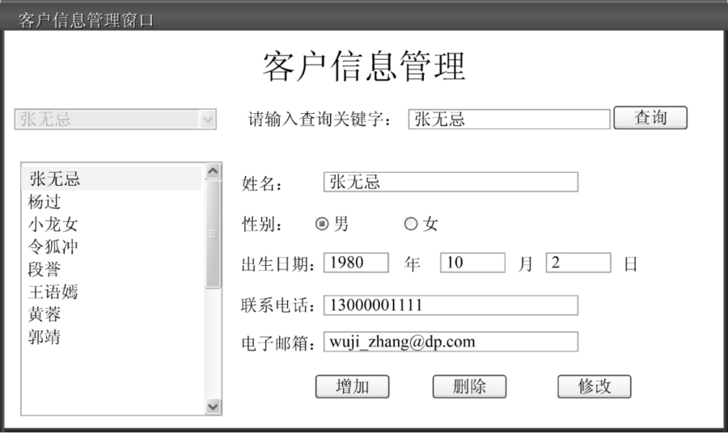

# 中介者模式

## 背景
中介者模式是一种行为设计模式， 能让你减少对象之间混乱无序的依赖关系。 该模式会限制对象之间的直接交互， 迫使它们通过一个中介者对象进行合作。

开发一个如下的窗口程序：


界面组件之间存在较为复杂的交互关系：
- 如果删除一个客户，则将从客户列表（List）中删掉对应的项
- 客户选择组合框（SelectBox）中客户名称也将减少一个；
- 如果增加一个客户信息，则客户列表中将增加一个客户，且组合框中也将增加一项

如果直接按照组件依赖进行程序设计，将得到如下的结构：
```uml

```