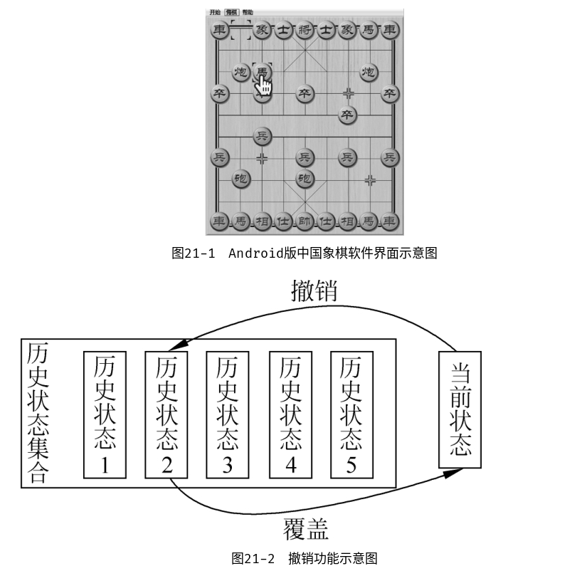
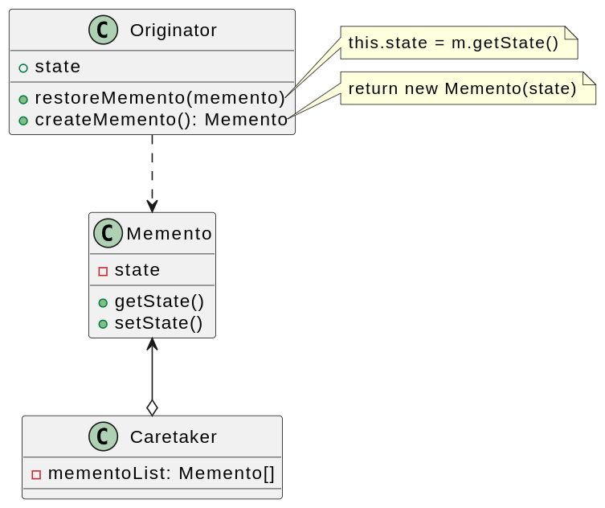
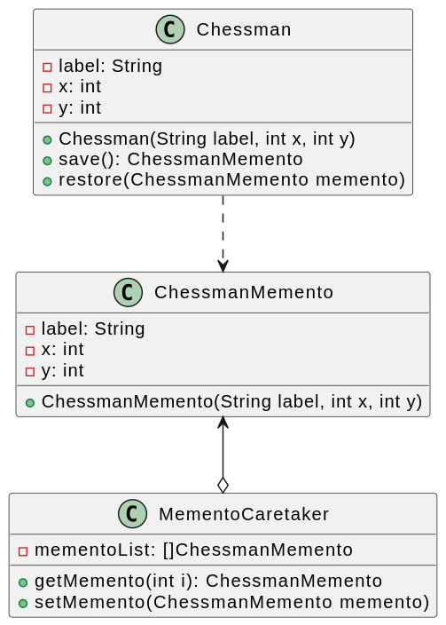

# 备忘录模式

亦称： 快照、Snapshot、Memento

## 背景

如何实现悔棋功能呢？

可以想到的解决方案就是每一次操作都保存一份状态快照，并将这些快照按照顺序存储起来，需要回退时就取出来，恢复到这个状态，而这就是备忘录模式的设计思想。

## 定义

备忘录模式（Memento Pattern）：在不破坏封装的前提下，捕获一个对象的内部状态，并在该对象之外保存这个状态，这样可以在以后将对象恢复到原先保存的状态。它是一种对象行为型模式，其别名为Token。

备忘录模式的核心是备忘录类`Memento`以及用于管理备忘录的负责人类`Caretaker`的设计。

1. **Originator（原发器）**：它是一个普通类，可以创建一个备忘录，并存储其当前内部状态，也可以使用备忘录来恢复其内部状态。一般将需要保存内部状态的类设计为原发器。
2. **Memento（备忘录）**：存储原发器的内部状态，根据原发器来决定保存哪些内部状态。备忘录的设计一般可以参考原发器的设计，根据实际需要确定备忘录类中的属性。需要注意的是，除了原发器本身与负责人类之外，备忘录对象不能直接供其他类使用。原发器的设计在不同的编程语言中实现机制会有所不同。
3. **Caretaker（负责人）**：负责人又称为管理者，他负责保存备忘录，但是不能对备忘录的内容进行操作或检查。在负责人类中可以存储一个或多个备忘录对象，他只负责存储对象，而不能修改对象，也无须知道对象的实现细节。

## 实现

## 评价

### 优点

1. 它提供了一种状态恢复的实现机制，使得用户可以方便地回到一个特定的历史步骤。当新的状态无效或者存在问题时，可以使用暂时存储起来的备忘录将状态复原。
2. 备忘录实现了对信息的封装。一个备忘录对象是一种原发器对象状态的表示，不会被其他代码所改动。备忘录保存了原发器的状态，采用列表、堆栈等集合来存储备忘录对象可以实现多次撤销操作。

### 缺点

1. 资源消耗过大。如果需要保存的原发器类的成员变量太多，就不可避免地需要占用大量的存储空间，每保存一次对象的状态都需要消耗一定的系统资源。
