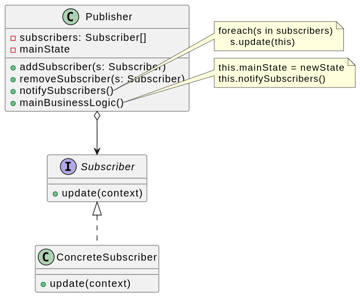
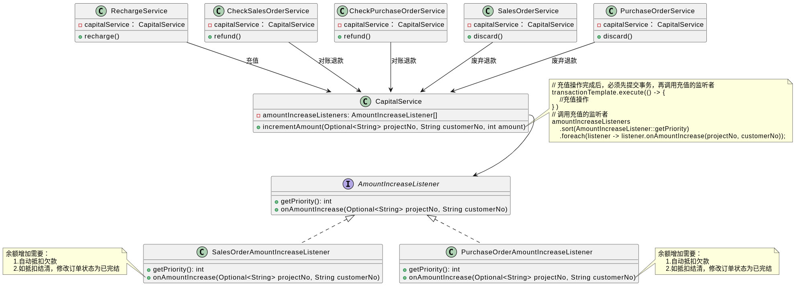

# 观察者模式

亦称： 事件订阅者、监听者、Event-Subscriber、Listener、Observer

## 背景

“红灯停，绿灯行”， 通信号灯是汽车的观察目标，而汽车是观察者。随着交通信号灯的变化，汽车的行为也将随之变化，一盏交通信号灯可以指挥多辆汽车。一个对象的状态或行为的变化将导致其他对象的状态或行为也发生改变，它们之间将产生联动，正所谓“触一而牵百发”。

为了更好地描述对象之间存在的这种一对多（包括一对一）的联动，观察者模式应运而生。
它定义了对象之间一对多的依赖关系，让一个对象的改变能够影响其他对象

## 定义

**观察者模式（Observer Pattern）**：定义对象之间的一种一对多依赖关系，使得每当一个对象状态发生改变时，其相关依赖对象皆得到通知并被自动更新。

观察者模式也称为：

- 发布-订阅（Publish/Subscribe）模式
- 模型-视图（Model/View）模式
- 源-监听器（Source/Listener）模式
- 从属者（Dependents）模式

## 评价

### 优点

1. **解耦**:
   观察者模式可以解耦观察者和主题之间的关系。主题只知道观察者列表的接口，而不需要了解具体的观察者实现，这意味着观察者和主题可以独立变化而不影响对方。

2. **动态关联**:
   新的观察者可以随时添加到系统中，并开始接收主题的通知，这为动态关联提供了便利。

3. **实时更新**:
   观察者模式允许在状态变化时立即通知所有观察者，这对于需要实时更新的场景（如用户界面）非常有用。

4. **重用性和抽象性**:
   观察者和主题之间的抽象性允许重用它们，因为它们并不是紧密耦合的。

5. **符合开闭原则**:
   该模式允许系统扩展新的观察者类型而不修改主题的代码，这符合面向对象设计的开闭原则。

### 缺点

1. **内存泄漏的风险**:
   如果观察者没有正确地注销，可能会导致内存泄漏，特别是在使用事件驱动的编程语言或框架时。

2. **实现复杂性**:
   管理观察者和主题之间的关系可能会增加系统的复杂性，需要额外的代码来管理订阅和取消订阅逻辑。

3. **更新的开销**:
   如果有大量的观察者，通知所有观察者可能会导致显著的性能开销。

4. **不一致的状态**:
   如果观察者在收到通知时需要很长时间来处理更新，可能会导致系统中的不一致状态，尤其是在多线程环境中。

5. **意外的更新**:
   由于观察者模式通常是隐式的通知机制，所以可能会导致一些意外的更新，这可能会引起难以跟踪的bug。

6. **难以确保更新顺序**:
   在某些情况下，更新通知的顺序可能很重要，但在观察者模式中，确保特定的通知顺序可能会很困难。

## 例子

1. **GUI事件监听器**:
   在各种编程框架中，比如Java的AWT或Swing库，观察者模式被用来监听和响应用户界面事件。例如，当用户点击一个按钮时，按钮对象（主题）会通知所有注册了的监听器对象（观察者），然后这些监听器对象执行相应的事件处理代码。

2. **模型-视图-控制器（MVC）**:
   MVC架构模式中的模型（Model）组件通常使用观察者模式来通知视图（View）组件数据已经改变，这样视图可以相应地更新其显示内容。

3. **发布-订阅系统**:
   在发布-订阅（Pub-Sub）模式中，发布者发出事件而不需要知道哪些订阅者会接收消息，订阅者可以订阅或取消订阅特定类型的消息。这是观察者模式的一个变种，广泛应用于消息队列和事件流处理中。

4. **Web框架中的钩子和事件**:
   许多Web框架（如Node.js的Express或Python的Django）允许开发者定义钩子（hooks）或事件监听器，用于在处理HTTP请求的生命周期中的特定时刻接收通知。

5. **响应式编程**:
   响应式编程框架，如RxJava或ReactiveX，基于观察者模式，允许开发者以声明方式组合和操作数据流，并响应数据流的变化。

6. **JavaScript中的事件处理**:
   JavaScript中常见的事件处理也是观察者模式的一个例子。例如，可以给DOM元素添加事件监听器来响应用户交互，如点击或键盘输入。

观察者模式使得主题和观察者之间的耦合度降低，主题不需要知道观察者的具体实现细节，只需要维护一个观察者列表，并在状态变化时通知这些观察者。观察者模式在实现数据和视图分离、实现事件驱动程序时非常有用。

## 实际使用

### 余额增加后抵扣欠款

在某销售系统中，可以进行欠款支持订单，但是当账户余额增加时，需要自动抵扣欠款订单的欠款

