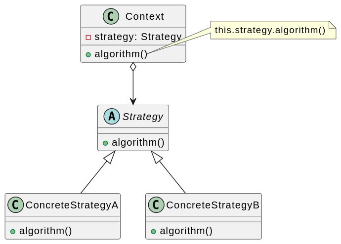

# 策略模式

## 背景

俗话说：条条大路通罗马。在很多情况下，实现某个目标的途径不止一条，例如在外出旅游时可以根据实际情况（目的地、旅游预算、旅游时间等）来选择一种最适合的出行方式。
在制订旅行计划时：

- 如果目的地较远、时间不多，但不差钱，可以选择坐飞机去旅游；
- 如果目的地虽远，但假期长，且需控制旅游成本时可以选择坐火车或汽车；
- 如果从健康和环保的角度考虑，而且有足够的毅力，自行车游或者徒步旅游也是个不错的选择。
  
在软件开发中，也常常会遇到类似的情况，实现某一个功能有多条途径。每一条途径对应一种算法，此时可以使用一种设计模式来实现灵活地选择解决途径，也能够方便地增加新的解决途径。本章将介绍一种为了适应算法灵活性而产生的设计模式——策略模式。

例如设计一套影院售票系统，在该系统中需要为不同类型的用户提供不同的电影票打折方式，具体打折方案如下：

1. 学生凭学生证可享受票价8折优惠。
2. 年龄在10周岁及以下的儿童可享受每张票减免10元的优惠（原始票价需大于或等于20元）。
3. 影院VIP用户除享受票价半价优惠外还可进行积分，积分累积到一定额度可换取电影院赠送的礼品。

该系统在将来可能还要根据需要引入新的打折方式。

常规的设计方案就是根据当前用户类型不同，使用 `if else` 或者 `switch case` 进行折后价格计算。但这种方案有以下缺点：

1. 折后价格计算方法非常庞大，它包含各种打折算法的实现代码，在代码中出现了较长的if…else…语句，不利于测试和维护。
2. 增加新的打折算法或者对原有打折算法进行修改时必须修改折后价格计算方法的源代码，违反了开闭原则，系统的灵活性和可扩展性较差。
3. 算法的复用性差。如果在另一个系统（例如商场销售管理系统）中需要重用某些打折算法，只能通过对源代码进行复制、粘贴来重用，无法单独重用其中的某个或某些算法。

那如何解决这些问题了？ 既然折后价格计算方案过于庞大复杂，那就可以考虑将其分解，将算法的定义和使用分离，这就是策略模式的思想。

## 定义

**策略模式（Strategy Pattern）**：定义一系列算法类，将每一个算法封装起来，并让它们可以相互替换。策略模式让算法独立于使用它的客户而变化，也称为政策模式（Policy）。策略模式是一种对象行为型模式。

策略模式是对算法的封装，它把算法的责任和算法本身分割开，委派给不同的对象管理。策略模式通常把一个系列的算法封装到一系列具体策略类里面，作为抽象策略类的子类

## 评价

策略模式是一种常用的设计模式，它定义了一系列算法，并将每个算法封装起来，使它们可以互相替换。以下是策略模式的优缺点：

### 优点

1. 可扩展性：策略模式可以方便地增加新的算法，而不需要修改现有的代码，从而提高了系统的可扩展性。
2. 可维护性：策略模式将每个算法封装起来，使得代码更加清晰、易于维护。
3. 灵活性：策略模式可以根据不同的需求选择不同的算法，从而提高了系统的灵活性。
4. 可测试性：策略模式将每个算法封装起来，使得单元测试更加容易，从而提高了系统的可测试性。

### 缺点

1. 增加了类的数量：策略模式会增加系统中类的数量，增加了系统的复杂度。
2. 需要客户端了解策略：客户端需要了解所有的策略，才能选择合适的策略。如果策略过多，会增加客户端的复杂度。
3. 策略切换的开销：在运行时切换策略会有一定的开销，可能会影响系统的性能。

总之，策略模式具有可扩展性、可维护性、灵活性和可测试性等优点，但也存在增加类的数量、客户端需要了解所有的策略、策略切换的开销等缺点。在具体应用时，需要根据实际情况进行权衡和选择。
