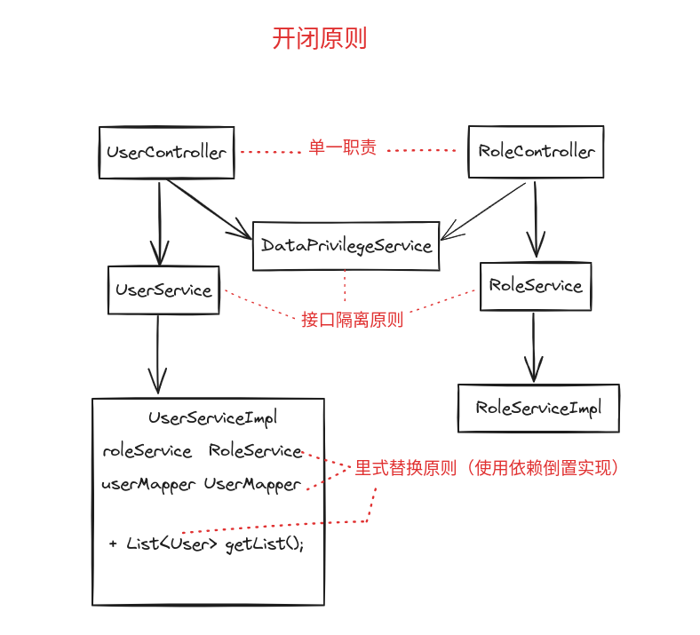
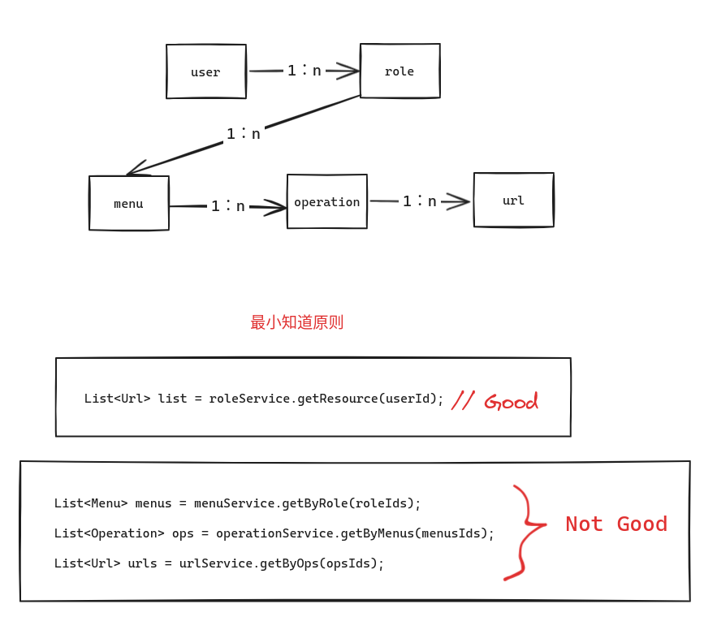
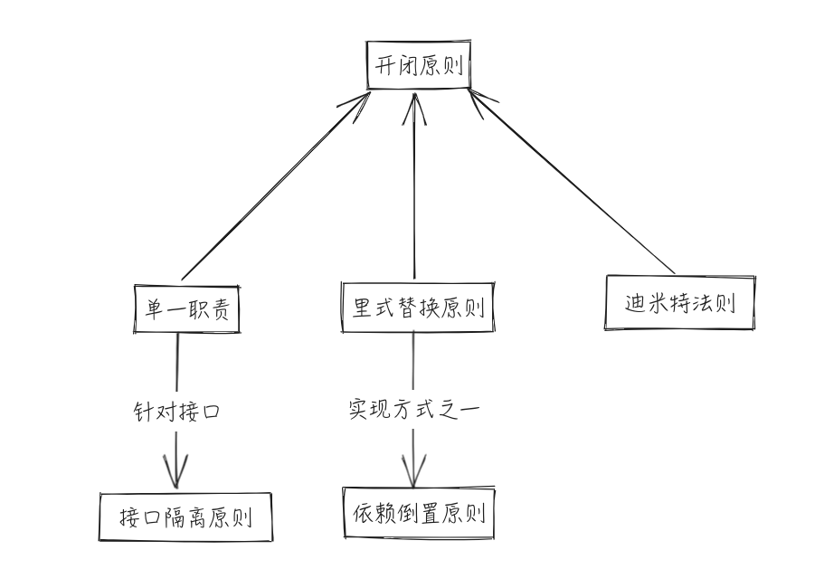

# 设计模式的六大原则

## 0. 日常开发中的原则



- 用户相关的 Http 接口就写在 `UserController` 中，角色相关的 Http 接口就写在 `RoleController` 中，这是我们日常就已经遵守的规则，一个类只负责一个功能领域单相应职责，这其实就是**单一职责原则**
- 和用户相关的操作可能涉及用户的 CURD 操作，也可能涉及数据权限的校验操作，那么我们一般会将不同操作定义成不同的接口，也就是面向接口编程，使用多个专门接口，客户端需要什么特性才实现对应接口，这就是**接口隔离原则**
- 我们的逻辑代码一般都是写在实现类中，比如在`UserServiceImpl`中需要使用角色功能时，只是定义个`RoleService roleService`，具体的方法代码都是调用`RoleService`的方法，将来使用微服务架构时，直接注入`RoleServiceRpcImpl`即可，无须修改现有的`UserServiceImpl`中的代码， 也就是细节依赖于抽象，针对接口编程，而不是针对实现编程，这其是就是利用**依赖倒置原则**实现**里式替换原则**。




- 在编写代码时，如果要查询这个用户有哪些权限资源，我们应该将获取资源的操作封装在`RoleService`中，对`UserServiceImpl`隐藏哪些复杂单关系和实现细节，因为用户只和角色直接关联，也就是不要和“陌生人”说话，只与你的直接朋友通信，这就是**迪米特法则(最小知道原则)**

- 所有的原则都是为实现**开闭原则**



## 1.单一职责原则

一个类只负责一个功能领域的相应职责。换而言之，就一个类而言，应该只有一个引起它变换的原因。

## 2.开闭原则

一个软件实体应该对扩展开放，对修改关闭。也就是说软件实体应该在尽量不修改源码情况下进行扩展。

开闭原则可以看作使用设计模式的目标（也是使用面向对象设计的目标），大部分设计模式都符合开闭原则。
为满足开闭原则，需要对系统进行抽象化设计。比如 Java 中使用接口定义抽象行为，而使用具体的实现类
来实现具体的操作细节，客户端可以使用接口进行编程，需要改变具体行为时，只需要新增一个接口实现即可。

## 3.里式替换原则

所有引用基类（父类）的地方必须能透明地使用其子类的对象。

里氏代换原则是实现开闭原则的重要方式之一。由于使用基类对象的地方都可以使用子类对象，
因此在程序中尽量使用基类类型来对对象进行定义，而在运行时再确定其子类类型，用子类对象来替换父类对象。
在运用里氏代换原则时，应该将父类设计为抽象类或者接口，让子类继承父类或实现父接口，
并实现在父类中声明的方法。程序运行时，子类实例替换父类实例，可以很方便地扩展系统的功能，
无须修改原有子类的代码，增加新的功能可以通过增加一个新的子类来实现。

## 4.依赖倒置原则

抽象不应该依赖于细节，细节应该依赖于抽象。换言之，要针对接口编程，而不是针对实现编程，

如果说开闭原则是面向对象设计的目标的话，那么依赖倒转原则就是面向对象设计的主要实现机制之一，
它是系统抽象化的具体实现。

依赖倒转原则要求在程序代码中传递参数时或在关联关系中，尽量引用层次高的抽象层类，而不要用具体类，
比如，即使用接口和抽象类进行：

- 变量类型声明
- 参数类型声明
- 方法返回类型声明
- 数据类型的转换等

在实现依赖倒转原则时，需要针对抽象层编程，而将具体类的对象通过依赖注入（Dependency Injection，DI）
的方式注入其他对象中。依赖注入（DI）是一种实现依赖倒置的方式，它是指将依赖关系从代码内部移动到外部容器中，
通过容器来动态地注入依赖对象，从而实现松耦合的设计。常用的注入方式有3种：构造注入、设值注入（Setter注入）
和接口注入。

```{note}
Spring 只支持构造注入和设置注入，接口注入是指通过实现在接口中声明的业务方法来传入具体类的对象。
这些方法在定义时使用的是抽象类型，在运行时再传入具体类型的对象，由子类对象来覆盖父类对象。

[Dependency injection #Interface injection](https://en.wikipedia.org/wiki/Dependency_injection#Interface_injection)
```

## 5.接口隔离原则

使用多个专门的接口，而不使用单一的总接口，即客户端不应该依赖那些它不需要的接口。

把接口理解为角色时，接口隔离可以理解为“角色隔离”原则。接口是为客户端服务的，因此也可以理解为
“定制服务”原则。

## 6.迪米特法则(最小知道原则)

一个软件实体应当尽可能少地与其他实体发生相互作用。

迪米特法则还有几种定义形式：不要和“陌生人”说话，只与你的直接朋友通信等。在迪米特法则中，
对于一个对象，其“朋友”包括以下几类：

1. 当前对象本身（this）
2. 以参数形式传入到当前对象方法中的对象
3. 当前对象的成员对象
4. 如果当前对象的成员对象是一个集合，那么集合中的元素也都是朋友
5. 当前对象所创建的对象
